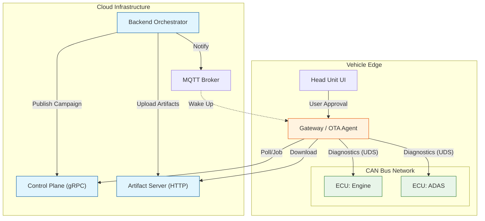
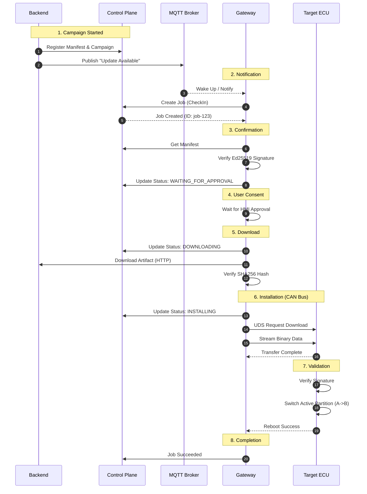

# Automotive OTA Simulation Platform

> A high-fidelity, production-grade simulation of an Over-The-Air (OTA) software update system for Software Defined Vehicles (SDV).

## Overview

This project simulates a complete end-to-end OTA architecture, mirroring the complexity of real-world automotive systems. It is designed to demonstrate:

* **Separation of Concerns**: Distinct Control Plane, Data Plane, and Event Plane.
* **Automotive Constraints**: Simulation of low-speed CAN bus networks, binary delta patching, and resource-constrained ECUs.
* **Safety & Security**: Implementation of The Update Framework (TUF) principles, including manifest signing, artifact verification, and A/B partition rollback.

## 🏗️ System Architecture

The system is divided into two primary contexts: the **Cloud Infrastructure** and the **Vehicle Edge**.



### Component Deep Dive

| Component                 | Tech Stack    | Responsibility                                                                                                                           |
| :------------------------ | :------------ | :--------------------------------------------------------------------------------------------------------------------------------------- |
| **Backend**         | Python        | Orchestrates campaigns, generates `bsdiff4` binary deltas, signs manifests using Ed25519 keys.                                         |
| **Control Plane**   | gRPC (Python) | The authoritative source of truth. Handles job creation, state tracking, and policy enforcement (e.g., "Is vehicle allowed to update?"). |
| **Gateway**         | Python, Flask | The Master OTA Agent. It bridges the internet (HTTP/gRPC) and the internal vehicle network (CAN). Manages the update state machine.      |
| **Artifact Server** | HTTP          | A simple CDN simulation hosting encrypted/signed firmware binaries and delta patches.                                                    |
| **ECUs**            | Python        | Simulated target devices with Dual-Bank (A/B) storage. They receive binary streams over virtual CAN and simulate flashing/booting.       |

---

## 🔄 OTA Workflow

The following sequence diagram illustrates the "Happy Path" of a successful firmware update.



---

## 🛡️ Security & Resilience

### Trust Chain

1. **Root of Trust**: The Backend holds the private signing keys.
2. **Manifest Signing**: Every update campaign generates a Manifest containing hashes of all artifacts, signed with the Backend's private key.
3. **Gateway Verification**: The Gateway has the public key pinned. It validates the Manifest signature before initiating *any* downloads.
4. **Artifact Integrity**: Downloaded files are hashed and compared against the verified Manifest.

### A/B Partitioning & Rollback

To prevent "bricking" vehicles, ECUs implement an A/B banking strategy:

* **Slot A**: Current Active Firmware.
* **Slot B**: Update Target.
* **Rollback**: If the simulated new firmware fails to "boot" (simulated via chaos testing flags), the ECU watchdog automatically swaps back to Slot A and reports failure.

---

## 🚀 Getting Started

### Prerequisites

* docker
* docker compose

### Running the Simulation

1. **Start Services**:
   ```bash
   docker compose up --build
   ```
2. **Access Dashboard**:
   Open [http://localhost:8080](http://localhost:8080) to view the Vehicle HMI.
   * Observe the "Update Available" notification.
   * Click "Install Now" to approve.
3. **Monitor Progress**:
   The Dashboard will show real-time progress as the Gateway downloads artifacts and streams them to the ECUs.

### Directory Structure

* `backend/`: Cloud services (Orchestrator, Signer).
* `control-plane/`: gRPC Server definition and implementation.
* `gateway/`: Vehicle-side logic (OTA Agent, HMI, CAN Bridge).
* `ecu/`: Simulated hardware targets.
* `traces/`: Shared volume for simulation logs (jsonl).
* `ota.proto`: Unified gRPC protocol definition.

## 🐛 Troubleshooting

**"Not in waiting state" Error**

* **Cause**: The Gateway failed to create a Job in the Control Plane, often due to a protocol mismatch.
* **Fix**: Ensure `ota.proto` is synchronized across all services and rebuild using `docker compose up --build`.

**Logs**

* Streaming structure logs are available in `traces/simulation_trace.jsonl`.
