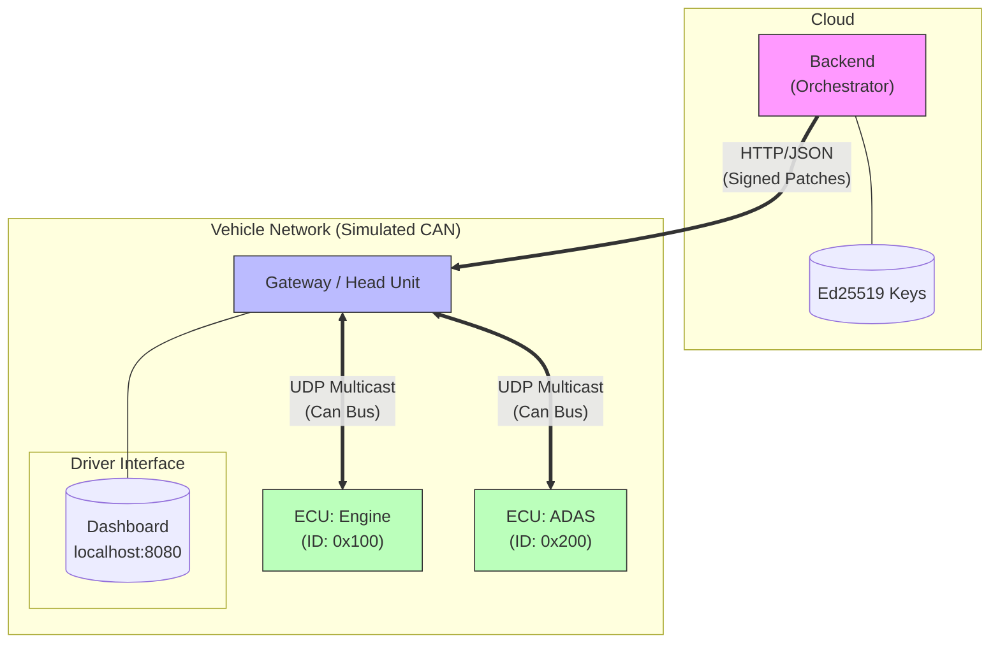

# Automotive OTA RPC Simulation 🚗⚡

> **A high-fidelity simulation of a secure, resilient, and efficient automotive Over-The-Air (OTA) software update system.**

This project simulates the complete lifecycle of a firmware update in a Software Defined Vehicle (SDV). It moves beyond simple HTTP requests to implement realistic automotive patterns, including **A/B Dual-Bank Updates**, **Binary Delta Compression**, and **Simulated CAN Bus** communication.

## 🌟 Key Features

### 1. 🛡️ Security & Safety

- **Ed25519 Signatures**: All firmware is digitally signed by the Cloud Backend. ECUs independently verify signatures before flashing.
- **Driver-in-the-Look**: Updates require explicit approval via the **Head Unit UI**, preventing unexpected downtime.
- **State Enforcement**: ECUs enforce a strict state machine (`IDLE` -> `PROGRAMMING` -> `VERIFIED` -> `ACTIVATED`).

### 2. 🔄 Resilience (A/B Rollback)

- **Dual-Slot Partitioning**: ECUs maintain Active (Slot A) and Inactive (Slot B) partitions.
- **Automatic Rollback**: If the new firmware causes a boot failure (simulated via Fault Injection), the ECU automatically reverts to the previous working slot.

### 3. 📉 Efficiency (Delta Updates)

- **Binary Diffing**: Uses `bsdiff4` to generate tiny patches between versions (e.g., 4KB patch for a 1MB file).
- **Gateway Reassembly**: The Vehicle Gateway buffers the patch, reconstructs the full binary using a cached base image, and then streams the full OS to the ECU.

### 4. 🚌 Realistic Transport (CAN Bus)

- **Virtual CAN**: Replaces internal HTTP calls with **UDP Multicast**, simulating a real Controller Area Network.
- **ISO-TP Lite**: Implements fragmentation and reassembly to transport large firmware blobs over small CAN frames.

---

## 🏗️ Architecture Matrix

| Component              | Role                                                 | Tech Stack               | Transport              |
| :--------------------- | :--------------------------------------------------- | :----------------------- | :--------------------- |
| **Backend**      | Cloud Orchestrator, Key Management, Delta Generation | Python, Ed25519, bsdiff4 | HTTP (to Gateway)      |
| **Gateway**      | Head Unit UI, Telemetry, Protocol Bridge (HTTP->CAN) | Flask, Python-CAN        | HTTP (WAN) / CAN (LAN) |
| **ECU (Engine)** | target Device, A/B Slots, Signature Verification     | Python, Can-Bus Listener | CAN Bus (UDP)          |
| **ECU (ADAS)**   | Target Device, A/B Slots, Signature Verification     | Python, Can-Bus Listener | CAN Bus (UDP)          |

### System Diagram



---

## 🚀 Getting Started

### 1. Launch the Simulation

Everything runs in Docker containers.

```bash
docker compose up --build
```

### 2. Access the Head Unit

Open your browser to the **Head Unit Dashboard**:
👉 **[http://localhost:8080](http://localhost:8080)**

You will see:

- **Vehicle Status**: Current firmware versions.
- **Update Available**: Notification from the Cloud.

### 3. Trigger the Update

1. (Optional) Check **"Simulate Bad Firmware"** to test the Rollback mechanism.
2. Click **"Install Now"**.

### 4. Observe the Flow

Watch the **Activity Log** in the Dashboard or the terminal:

1. **Approval**: Backend receives authorization.
2. **Delta Patch**: Cloud sends a small Patch to Gateway.
3. **Reconstruction**: Gateway logs "Patch Applied!".
4. **CAN Flash**: Gateway streams frames ("CAN TX -> Engine").
5. **Completion**: ECUs verify signature and switch slots.

---

## 🧪 Testing & Verification

### Run End-to-End Test

We provide a script to automate the driver interaction and verify logs:

```bash
python test_ui.py
```

### Fault Injection (Rollback)

To test resilience:

1. Enable **"Simulate Bad Firmware"** in the UI.
2. Approve the update.
3. Observe logs:
   - ECU: `CRITICAL: Firmware integrity check failed!`
   - ECU: `Boot loop detected. Rolled back.`
   - Backend: `FAILED: Boot loop detected`.

---

## 📂 Project Structure

- `/backend`: Cloud orchestrator logic. Generates keys, creates patches, manages campaigns.
- `/gateway`: The brain of the vehicle. Bridges HTTP to CAN, handles UI, buffers patches.
- `/ecu`: The targets. Pure Python scripts running CAN listeners with Ed25519 verification and A/B slots.
- `docker-compose.yml`: Defines the network and secrets.

---

## 🔧 Technical Details

- **CAN Simulation**: Uses `python-can` with `udp_multicast` interface. This allows containers to "broadcast" frames to each other without a physical CAN adapter.
- **Fragmentation**: Since CAN frames are small (even simulated), we implemented a basic protocol to split large JSON payloads into chunks, similar to ISO-TP.
- **Delta Algorithm**: `bsdiff4` is used. We simulate a "Version 1" cache on the Gateway so it can apply the patch to known good firmware before flashing "Version 2".

Source course: [Udemy - Automotive Over-the-Air Update (OTA)](https://www.udemy.com/course/automotive-over-the-air-update-ota/learn/lecture/36675604#overview)
