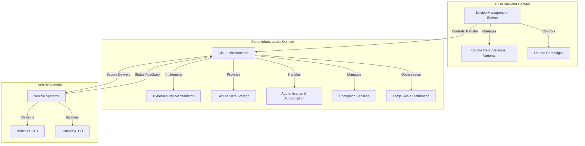
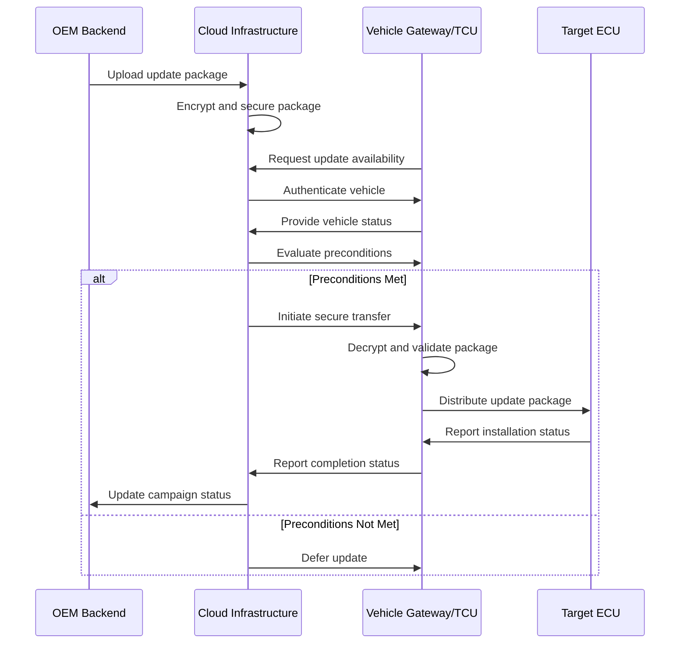

# Over-The-Air (OTA) Update Architecture Documentation

## Introduction

Over-The-Air (OTA) update systems represent a complex infrastructure designed to deliver software updates to vehicles safely, reliably, and correctly. While the high-level view often depicts simple vehicle-to-cloud connectivity, the underlying architecture must address numerous technical and operational challenges to ensure successful update delivery across diverse vehicle fleets and conditions.

## High-Level Architecture Overview

The OTA system architecture consists of three fundamental domains that work in concert to manage and deliver updates. The OEM backend serves as the central management hub, responsible for maintaining update data, software versions, vehicle variants, and update campaigns. This backend system forms the foundation for all update orchestration activities.

The cloud infrastructure operates as the intermediary layer, handling software distribution while implementing multiple cybersecurity mechanisms. This domain provides secure data storage, authentication, authorization, encryption, and large-scale update orchestration capabilities. The cloud serves as the critical bridge between backend management systems and vehicle endpoints.

On the vehicle side, embedded devices, specifically Electronic Control Units (ECUs), receive and process updates from the cloud. The vehicle domain includes specialized components that manage communication with cloud systems and coordinate update activities across multiple vehicle ECUs.

## Core Components and Responsibilities

### OEM Backend System

The OEM backend or device management system serves as the authoritative source for all update-related information and control. This system maintains comprehensive records of software packages, defines which variants, versions, and regional configurations should receive updates, and ensures correct file delivery to appropriate vehicles. The backend's device management capabilities are critical for preventing misconfiguration errors that could lead to misflashing, potentially causing vehicle malancies or safety risks. Even minor parameter value errors can have significant real-world impacts, making precise configuration management essential.

### Cloud Infrastructure

The cloud infrastructure forms the central nervous system of OTA operations, providing the computational and networking resources necessary for large-scale update distribution. This domain implements robust cybersecurity mechanisms to protect update integrity and vehicle security. The cloud handles secure data storage, manages authentication and authorization processes, provides encryption services for data protection, and orchestrates update distribution across vehicle fleets. The cloud continuously collects status feedback from vehicles and ECUs, aggregates progress data, and provides control mechanisms to stop or reinitialize update campaigns when necessary.

### Vehicle-Side Components

Vehicle architectures typically include a gateway ECU or Telematics Control Unit (TCU) that serves as the primary interface to cloud systems. This gateway component manages all communication with the cloud infrastructure and coordinates the flashing process for other ECUs within the vehicle. The gateway downloads update packages, distributes them to target ECUs, collects update status responses, and reports results back to backend systems. It's important to note that OTA updates are not applied directly through infotainment systems alone; rather, the gateway/TCU manages the entire update process across multiple vehicle ECUs.

## Functional Areas

The OTA architecture encompasses four key functional areas that work together to ensure successful update delivery:

### Device Management

Device management responsibilities include maintaining software packages, defining update eligibility based on vehicle variants, versions, and regional configurations, and ensuring correct file delivery to target vehicles. This functional area must maintain precise configuration data to prevent delivery errors that could result in vehicle malfunctions. The system must track which vehicles require which updates and manage the complex mapping between software versions and vehicle configurations.

### Process Control

Process control governs the initiation and execution of updates, including defining update mechanisms, sequencing, and operational logic. This functional area evaluates update preconditions before triggering updates, assessing factors such as vehicle state, power availability, and network stability. Process control ensures that updates only proceed when conditions are appropriate for safe and successful installation.

### Administration

Administration functions provide oversight and management capabilities for OTA operations. This includes dashboard visibility for OEMs, fleet managers, and users, showing targeted vehicle counts, completion status, and encountered issues. Administrative interfaces enable campaign management, monitoring, and intervention when necessary.

### Client Access

Client access defines how different stakeholders interact with the OTA system. Update triggers may be initiated by OEMs, fleet managers, or vehicle users, depending on system design and permissions. The system must manage access control and ensure appropriate authorization for different types of update initiation.

## Security and Communication

Secure communication between the cloud and vehicle is fundamental to OTA system integrity. The architecture implements encryption and decryption mechanisms to protect data during transmission. The backend controls how software is transferred to the cloud and how update packages are delivered to target vehicles. The cloud infrastructure implements multiple cybersecurity mechanisms, including authentication and authorization processes to ensure that only authorized vehicles receive updates and that update packages remain intact and unmodified during transmission.

## Vehicle-Side Architecture

Within the vehicle, the OTA update process is managed through a hierarchical architecture centered around the gateway ECU or Telematics Control Unit. This component serves as the primary coordinator for all update activities, acting as the intermediary between cloud systems and the various ECUs throughout the vehicle.

The gateway/TCU is responsible for downloading update packages from the cloud, validating their integrity, and distributing them to the appropriate target ECUs. During the update process, the gateway collects status responses from each ECU, monitoring progress and detecting any issues that arise during installation. Once updates are complete or if errors occur, the gateway aggregates this information and reports comprehensive status back to the backend systems.

This architecture ensures that update activities are properly coordinated across multiple vehicle systems, preventing conflicts and maintaining vehicle stability throughout the update process. The gateway's central role also enables consistent status reporting and error handling across the entire vehicle fleet.

## Failure Handling and Status Management

The OTA system must robustly handle failure scenarios to ensure vehicle safety and system reliability. When an update does not complete successfully, the backend must track the failure, report status to administrative dashboards, and determine appropriate recovery actions. The system can retry updates, pause campaigns, or initiate rollback procedures depending on the nature and severity of the failure.

Dashboards provide comprehensive visibility into update operations, showing how many vehicles were targeted for updates, how many completed successfully, and how many encountered issues. This visibility enables OEMs and fleet managers to monitor campaign progress and intervene when necessary.

The cloud infrastructure continuously collects status feedback from vehicles and ECUs, aggregating this data to provide real-time progress information. This feedback loop enables the system to respond quickly to issues, stop problematic campaigns, or reinitialize updates when conditions improve. The ability to monitor and control update campaigns in real-time is essential for maintaining fleet-wide update success rates.

## Summary

OTA architecture represents a sophisticated three-domain system encompassing device management at the OEM backend, cloud-based update distribution and control, and vehicle-side update management. Each domain introduces unique technical challenges and constraints that must be addressed to ensure safe, reliable, and correct update delivery.

The system's success depends on precise device management, robust process control, comprehensive security measures, and effective failure handling. Through careful coordination between backend systems, cloud infrastructure, and vehicle components, OTA enables seamless software updates while maintaining vehicle safety and operational integrity. The architecture's complexity reflects the critical nature of its function and the diverse requirements of modern vehicle software management.