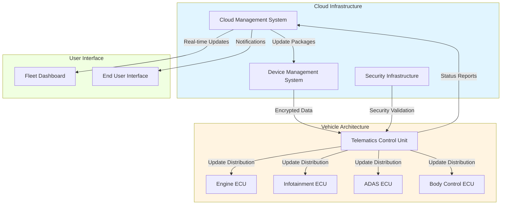
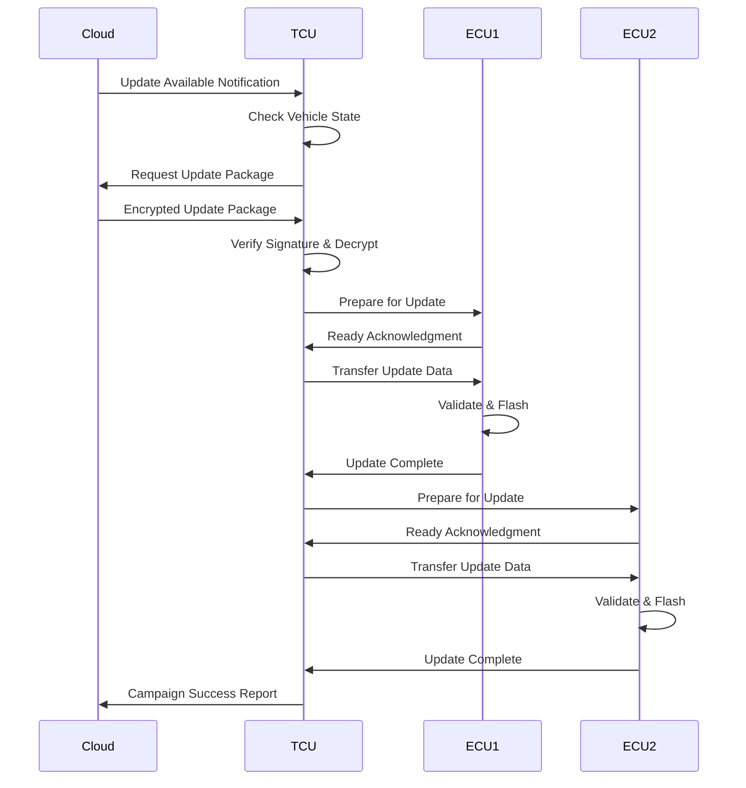
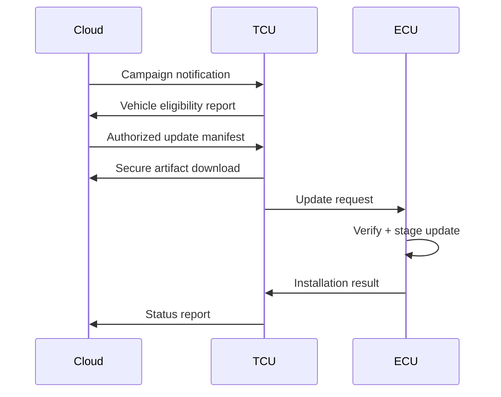
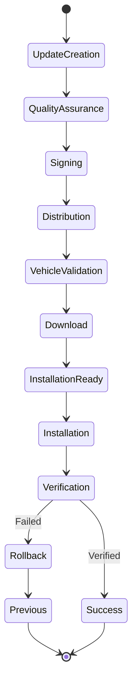

# OTA Architecture and Update Processes in Vehicles

Over-the-Air (OTA) software updating has become a foundational capability of modern vehicles. It enables manufacturers to deploy functional enhancements, safety improvements, and cybersecurity fixes remotely, at fleet scale, without physical intervention. In contemporary software-defined vehicles, OTA is no longer an auxiliary feature; it is a regulated, safety-critical system tightly coupled with vehicle lifecycle management, homologation, and cybersecurity governance.

This chapter presents a comprehensive, code-free description of automotive OTA architecture and update processes, rewritten from an expert systems perspective. The focus is on structure, responsibilities, data flows, security guarantees, and operational realities. Where helpful, architectural relationships are illustrated using Mermaid diagrams.

---

## 1. Conceptual Overview of Automotive OTA Architecture

An automotive OTA system is a distributed system spanning cloud infrastructure and embedded in-vehicle platforms. Its purpose is to securely transport software artifacts from the manufacturer to specific vehicle targets, ensure their correctness and authenticity, and apply them without compromising vehicle availability or safety.

At a high level, OTA architecture consists of five logical domains:

* Backend cloud and orchestration services
* Device and fleet configuration management
* Vehicle gateway and connectivity layer
* Target ECUs and in-vehicle networks
* End-to-end security and compliance framework

These domains are tightly integrated but intentionally decoupled to allow independent evolution and certification.

### High-Level Architecture

This separation ensures scalability in the cloud, determinism in the vehicle, and strong security boundaries between external networks and safety-critical domains.

---

## Core Architectural Components

### Cloud Management System: The Control Center

The Cloud Management System operates as the intelligence layer coordinating all OTA activities across the vehicle fleet. Its responsibilities extend far beyond simple file distribution, encompassing sophisticated campaign management, phased rollout strategies, and real-time analytics.

**Campaign Management** enables manufacturers to define update deployment strategies with fine-grained control over target populations, rollout schedules, and success criteria. A typical campaign might begin with a limited pilot deployment to early adopter vehicles, gradually expanding to larger populations as confidence builds. Geographic and temporal scheduling ensures updates occur during optimal windows—avoiding high-traffic periods and respecting regional time zones.

**Data Management and Storage** requirements are substantial. A single ECU firmware image might range from several megabytes to hundreds of megabytes. Multiplied across dozens of ECUs and hundreds of vehicle variants, the cloud infrastructure must efficiently store, version, and distribute petabytes of update data. Content delivery networks and edge caching strategies reduce latency and bandwidth costs while improving download reliability.

**Analytics and Telemetry** provide critical feedback loops. Real-time monitoring detects anomalies during rollouts, triggering automatic campaign suspension if failure rates exceed thresholds. Long-term analytics inform future development by identifying which vehicle populations experience issues and which updates deliver measurable improvements in customer satisfaction or vehicle performance.

### Device Management System: Configuration Intelligence

The Device Management System solves one of OTA's most complex challenges: ensuring compatibility across an incredibly diverse vehicle population. Modern automotive manufacturers may support dozens of models across multiple generations, each with numerous trim levels, optional equipment packages, and regional variants.

**Configuration Database** maintains detailed records for every vehicle, including hardware revisions, installed software versions, regional market, and historical update records. This data enables precise targeting—ensuring that vehicles receive updates compatible with their specific configuration while avoiding potentially harmful mismatches.

**Variant Management** becomes particularly critical when updates involve dependencies across multiple ECUs. For instance, updating advanced driver assistance features might require synchronized updates to camera ECUs, radar processors, and central computing platforms. The Device Management System orchestrates these multi-component updates, ensuring that all prerequisites are met before installation proceeds.

**Regional Compliance** considerations add another layer of complexity. Different markets impose varying regulatory requirements on vehicle software, from emissions control calibrations to data privacy protections. The system maintains region-specific update packages and ensures that vehicles receive only compliant software for their operating region.

### Telematics Control Unit: The Vehicle Gateway

The TCU occupies a unique position as the bridge between external connectivity and internal vehicle networks. This strategic placement brings both capabilities and responsibilities that fundamentally shape OTA architecture.

**Connectivity Management** involves orchestrating multiple communication technologies. Modern TCUs typically support cellular connectivity (4G/LTE with migration toward 5G), Wi-Fi for high-bandwidth downloads when vehicles are parked at home, and potentially V2X communication for future cooperative update scenarios. The TCU intelligently selects appropriate connectivity based on availability, cost, and urgency.

**Update Coordination** requires careful timing. Updates cannot simply install whenever they arrive—the TCU must consider vehicle state, ensuring that safety-critical systems remain available and that update installations occur during appropriate conditions. Many systems defer major updates until the vehicle is parked, connected to external power, and will remain stationary for sufficient time to complete installation.

**Power Management** presents particular challenges for battery-electric vehicles. A large update campaign might require sustained processing and storage access, consuming significant energy. The TCU must balance update completion against maintaining sufficient battery charge for vehicle operation, sometimes spreading installations across multiple ignition cycles.

### Electronic Control Units: Distributed Processing

The transition from centralized to distributed vehicle computing has profound implications for OTA architecture. Rather than updating a single monolithic system, modern OTA must coordinate updates across dozens of semi-autonomous processors, each with different capabilities, constraints, and update requirements.

**Domain Controllers** represent intermediate aggregation points in vehicle architecture. Rather than dozens of individual ECUs each connecting directly to the TCU, domain controllers aggregate related functions—a body domain controller might manage updates for door modules, lighting systems, and climate control. This hierarchical approach reduces complexity and network traffic.

**Safety-Critical Systems** require special consideration during updates. ECUs controlling braking, steering, or other safety functions must maintain availability even during update operations. This often necessitates redundant processors or carefully orchestrated update sequences that ensure at least one processing path remains operational throughout the update process.

**Update Granularity** varies significantly across ECU types. Infotainment systems might receive frequent updates with new features and refinements. In contrast, safety-critical ECUs typically receive updates less frequently, focused primarily on addressing identified issues rather than adding new functionality. This differential update cadence optimizes network utilization and minimizes unnecessary risk.

### Security Infrastructure: Trust and Protection

Security represents the foundational requirement for automotive OTA systems. Unlike conventional software updates where failures primarily affect convenience, compromised vehicle updates could endanger occupants and other road users. The security infrastructure must therefore implement multiple overlapping protective layers.

**Cryptographic Foundation** begins with robust key management. Public key infrastructure enables update packages to be signed by manufacturer private keys and verified by vehicles using corresponding public keys embedded during production. Key rotation strategies and hardware security modules protect these critical cryptographic materials throughout their lifecycle.

**Code Signing and Verification** ensures that only authorized software executes on vehicle ECUs. Every update package carries digital signatures that ECUs verify before installation. This verification chain often extends beyond simple signature checks to include hash validation, ensuring bit-perfect integrity of the received update.

**Secure Boot Chains** protect against persistent compromises. Even if an attacker somehow installed malicious software, secure boot mechanisms verify the integrity of each software component during system initialization, refusing to execute unauthorized code. This creates a chain of trust from hardware roots through bootloaders to application software.

**Threat Modeling** informs security architecture decisions. Manufacturers must consider various attack scenarios: adversaries attempting to inject malicious updates, denial-of-service attacks disrupting update distribution, privacy breaches exposing vehicle location or usage data, and supply chain compromises affecting update infrastructure. Defense strategies must address each identified threat vector.

---

## 2. Cloud OTA Backend and Orchestration

The cloud backend is the control plane of the OTA system. It does not merely host files; it governs eligibility, rollout strategy, security policy enforcement, and auditability.

### Core Responsibilities

The backend is responsible for:

* Storing signed software artifacts and metadata
* Managing update campaigns and rollout waves
* Resolving vehicle eligibility based on configuration
* Enforcing security and regulatory constraints
* Collecting telemetry and update status reports

Critically, the backend never assumes a homogeneous fleet. Every decision is conditioned on vehicle identity, software bill of materials (SBOM), region, homologation status, and operational state.

### Campaign-Oriented Distribution

Updates are deployed as campaigns rather than ad-hoc pushes. A campaign defines:

* Target vehicle population
* Software components and versions
* Preconditions and blocking conditions
* Rollout schedule and throttling
* Fallback and abort policies

This model allows controlled exposure, canarying, and rapid containment of faults.

---

## 3. Device and Fleet Management Layer

The Device Management System (DMS) is the system of record for vehicles. It translates abstract update campaigns into concrete, vehicle-specific instructions.

### Vehicle Identity and Configuration

Each vehicle is represented as a digital twin containing:

* VIN and cryptographic identity
* ECU topology and software versions
* Hardware variants and optional features
* Regional and regulatory constraints
* Update history and failure states

This digital twin is continuously reconciled with telemetry from the vehicle, ensuring decisions are made on authoritative data.

### Variant and Regional Resolution

OTA systems must handle extreme variability. Two vehicles of the same model year may differ in:

* ECU suppliers
* Memory sizes
* Sensor sets
* Legal feature enablement

The DMS resolves this variability by mapping updates to compatibility matrices. Vehicles that do not fully satisfy prerequisites are automatically excluded, preventing misdeployment by design.

---

## 4. Telematics Control Unit (TCU)

The Telematics Control Unit is the vehicle's OTA gateway. It is the only externally reachable ECU in most architectures and therefore forms a critical trust boundary.

### Functional Role

The TCU performs the following functions:

* Secure communication with cloud services
* Download and storage of update artifacts
* Verification of authenticity and integrity
* Coordination of update execution
* Reporting of status and diagnostics

The TCU does not directly modify safety-critical ECUs. Instead, it orchestrates updates via authenticated in-vehicle communication channels.

### Connectivity Abstraction

Modern TCUs support multiple bearers, including cellular, Wi-Fi, and Ethernet. OTA logic is intentionally abstracted from the physical transport, enabling seamless fallback between networks without affecting update semantics.

---

## 5. Electronic Control Units (ECUs)

ECUs are the execution targets of OTA updates. Each ECU has a sharply defined responsibility and safety classification.

### ECU Autonomy

From an OTA perspective, ECUs are autonomous entities that:

* Accept or reject update requests
* Verify cryptographic authenticity
* Enforce internal safety rules
* Manage their own flash memory
* Decide reboot and activation timing

This autonomy is essential for safety certification. The TCU coordinates but does not override ECU safety logic.

### Update Granularity

OTA updates can target:

* Application software only
* Calibration data
* Firmware including bootloader
* Feature enablement flags

Granularity is a deliberate design choice balancing flexibility, risk, and certification cost.

---

## 6. Security Architecture and Trust Model

Security is not a layer added to OTA; it is the organizing principle.

### Root of Trust

Every OTA system is anchored in a hardware-backed root of trust, typically implemented using:

* Hardware Security Modules (HSMs)
* Secure elements
* Trusted Platform Modules (TPMs)

This root of trust protects cryptographic keys and enforces secure boot.

### End-to-End Security Guarantees

OTA systems guarantee the following properties [Verified]:

* Authenticity: only manufacturer-approved software executes
* Integrity: software cannot be modified in transit or storage
* Confidentiality: update contents are protected against eavesdropping
* Freshness: replayed or outdated updates are rejected

These guarantees are enforced jointly by the cloud, TCU, and ECUs.

---

## 7. OTA Update Process Flow

The OTA process is a state machine with explicit transitions, timeouts, and rollback paths.

### End-to-End Update Flow

Each step is logged and auditable, supporting regulatory compliance and forensic analysis.

---

## 8. Update Initiation and Triggers

Updates may be initiated by several mechanisms:

* Manufacturer-triggered campaigns
* User-approved requests
* Automated safety or security triggers
* Regulatory compliance updates

Regardless of trigger, the same validation and authorization pipeline applies. There are no privileged shortcuts.

---

## 9. Update Package Distribution

OTA systems typically use differential updates to minimize bandwidth and time. Delta artifacts are generated against known base versions and are only applicable when strict version matching is satisfied.

This approach reduces network load while preserving deterministic outcomes. Full image updates are reserved for recovery or major architectural changes.

---

## 10. Flashing, Activation, and Rollback

### Atomic Update Principles

OTA flashing is designed to be atomic. Either the update completes successfully, or the system returns to a known-good state.

Most ECUs implement:

* Dual-bank (A/B) partitions
* Inactive-slot flashing
* Post-reboot health checks
* Automatic rollback on failure

### Rollback Guarantees

Rollback mechanisms guarantee that a failed update cannot brick the vehicle under normal conditions [Verified]. This is a non-negotiable safety requirement in production systems.

---

## 11. Status Reporting and Observability

After each update phase, the vehicle reports structured status information, including:

* Progress state
* Error codes and diagnostics
* ECU-specific results
* Activation confirmation

This data feeds dashboards used by fleet operators, quality teams, and incident response units.

### Observability Pipeline

Observability is continuous, not post hoc. Vehicles remain observable throughout their operational life.

---

## 12. Technical and Operational Challenges

### Configuration Explosion

The combinatorial explosion of vehicle variants is the primary scaling challenge. OTA systems address this through strict configuration modeling and automated compatibility checks.

### Cybersecurity Threats

OTA pipelines are high-value attack surfaces. Mitigation requires layered defenses, continuous monitoring, and adherence to standards such as ISO/SAE 21434 and Uptane.

### Regional Compliance

Regulations such as UNECE R156 impose explicit requirements on OTA governance, auditability, and rollback. OTA architecture must be designed to satisfy these constraints from inception.

### Failure Handling

Network interruptions, power loss, and unexpected vehicle state changes are normal conditions, not edge cases. OTA systems are explicitly designed to tolerate these scenarios.

---

## 13. Conclusion

The OTA architecture in automotive systems is a sophisticated framework that integrates cloud-based management with in-vehicle embedded devices to deliver secure, efficient, and reliable software updates. By leveraging key components such as the Cloud Management System, Device Management System, TCU, ECUs, and robust security infrastructures, manufacturers can ensure that vehicles remain up-to-date with the latest functionalities and security measures.

However, the implementation of OTA systems comes with significant technical challenges, including managing diverse vehicle configurations, ensuring update integrity, handling regional compliance, and mitigating failure risks. Addressing these challenges through advanced technical solutions, comprehensive device management, and stringent security protocols is essential for the successful deployment of OTA services.

As the automotive industry continues to evolve with increasing software complexity and connectivity, the importance of a robust OTA architecture cannot be overstated. Embracing these technologies not only enhances vehicle performance and safety but also significantly improves the overall user experience, driving the future of connected and autonomous vehicles.

# References

- **UNECE Regulation No. 156**: [UNECE R156 Documentation](https://unece.org/transport/documents/2021/03/standards/un-regulation-no-156-software-update-and-software-update)
- **ISO/SAE 21434**: Road Vehicles – Cybersecurity Engineering
- **GDPR**: General Data Protection Regulation
- **CCPA**: California Consumer Privacy Act
- **Uptane Framework**: [Uptane Documentation](https://uptane.github.io/)
- **ISO 26262**: Road Vehicles – Functional Safety
- **OTA Market Reports**: Industry forecasts and market analysis reports (2020–2022)
