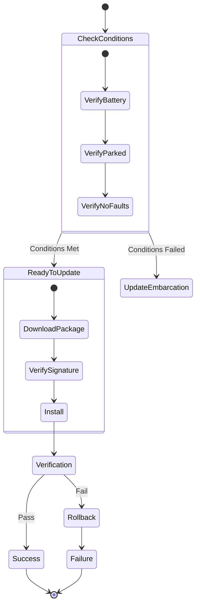

# Vehicle State in OTA Updates

## Importance of Vehicle Preconditions

In the realm of Over-The-Air (OTA) updates, the state of the vehicle is paramount to ensuring that updates are executed seamlessly without compromising user experience or vehicle safety. OTA updates allow Original Equipment Manufacturers (OEMs) to remotely deploy software enhancements, bug fixes, and new features directly to the vehicle's electronic control units (ECUs). However, the initiation and execution of these updates depend on a set of predefined vehicle preconditions. These preconditions serve as safeguards to maintain vehicle operability and safety during the update process.

Preconditions determine whether an OTA update can proceed and outline the necessary criteria that must be satisfied. They also define failure conditions to handle scenarios where updates might otherwise lead to operational issues or safety hazards. By categorizing OTA updates based on their impact on vehicle operability—namely **Drivable** and **Non-Drivable** updates—OEMs can tailor the update process to minimize disruption and ensure a positive user experience.

!!! info "Overview: Update States"


## Drivable Updates

Drivable updates are designed to enhance or fix non-critical systems within the vehicle without interrupting its functionality. These updates typically target components that do not directly influence the vehicle's core operations, allowing the vehicle to remain fully operational throughout the update process.

### Characteristics of Drivable Updates

- **Seamless Integration:** Drivable updates occur in the background without affecting the vehicle's primary functions. The driver can continue using the vehicle normally while the update proceeds.
- **Non-Intrusive Notifications:** Drivers receive notifications about the update status, but these do not necessitate immediate action or disrupt the driving experience.
- **Examples:**
  - Infotainment System Bug Fixes
  - UI/UX Enhancements
  - Map Data Updates

### Execution Flow of Drivable Updates

1. **Automatic Update Enabled:**
   - The vehicle's settings allow for automatic updates.
   - The update is pushed directly to the infotainment system and installed without requiring user intervention.

!!! example "Code: Automatic Drivable Update Logic"
    ```python
    class DrivableUpdateManager:
        def **init**(self, auto_update_enabled):
            self.auto_update_enabled = auto_update_enabled

        def initiate_update(self):
            if self.auto_update_enabled:
                self.download_update()
                self.install_update()
                self.notify_driver("Drivable update installed successfully.")
            else:
                self.prompt_driver()

        def download_update(self):
            # Code to download update in the background
            pass

        def install_update(self):
            # Code to install update without interrupting vehicle functions
            pass
    ```

2. **Automatic Update Disabled:**
   - The system prompts the driver via the vehicle touchscreen or a connected mobile application, requiring manual approval to proceed with the update.

!!! example "Code: Driver Prompt Logic"
    ```python
    def prompt_driver(self):
        # Display prompt on vehicle touchscreen or send app notification
        driver_response = get_driver_response()
        if driver_response == "approve":
            self.download_update()
            self.install_update()
            self.notify_driver("Drivable update installed successfully.")
        else:
            self.notify_driver("Drivable update postponed.")
    ```

3. **Failure Handling:**
   - If the update process encounters any issues, the system automatically rolls back to the previous stable software version.

!!! example "Code: Rollback Mechanism"
    ```python
    def install_update(self):
        try:
            # Code to install update
            perform_installation()
        except UpdateError as e:
            self.rollback_update()
            self.notify_driver(f"Update failed: {e}. Reverting to previous version.")

    def rollback_update(self):
        # Code to revert to the previous software version
        restore_backup()
    ```

## Non-Drivable Updates

Non-drivable updates target critical software components that directly influence the vehicle's core functionalities. These updates require the vehicle to remain stationary and non-operational during the update process to prevent severe malfunctions or safety hazards.

### Characteristics of Non-Drivable Updates

- **Operational Restriction:** The vehicle cannot be driven or operated during the update process.
- **Firmware Replacements:** Updates often involve replacing firmware in essential ECUs (Engine, Transmission, Brakes).
- **Predefined Safety Conditions:** Strict conditions must be met before initiating the update.

## Preconditions for Non-Drivable Updates

Ensuring the safety and integrity of non-drivable updates involves adhering to a comprehensive set of preconditions.

### 1. Vehicle Should Not Be in Operation

- **Stationary State:** The vehicle must be completely stationary and switched off.
- **Process Abortion:** If the vehicle is inadvertently started, the update must be aborted immediately.

!!! example "Code: Vehicle State Check"
    ```python
    class NonDrivableUpdateManager:
        def **init**(self, vehicle_status):
            self.vehicle_status = vehicle_status

        def check_vehicle_state(self):
            if self.vehicle_status.is_operational():
                raise UpdatePreconditionError("Vehicle must be off for non-drivable updates.")

        def initiate_update(self):
            self.check_vehicle_state()
            # Proceed with update
    ```

### 2. Power Supply and Battery Health

- **Sufficient Charge:** The vehicle must have an adequate battery charge (e.g., > 70%).
- **EV Charging State:** For electric vehicles, updates should not be performed while the vehicle is actively charging (high voltage lockout).

!!! example "Code: Power Requirements Check"
    ```python
    def check_power_requirements(self):
        if self.vehicle_status.battery_level < self.required_battery_level:
            raise UpdatePreconditionError("Insufficient battery level for update.")
        if self.vehicle_status.is_charging():
            raise UpdatePreconditionError("Cannot perform update while charging.")
    ```

### 3. No Active Fault Codes on ECUs

- **Fault-Free State:** The vehicle's ECUs must be free of active fault codes (DTCs) before initiating an update.

!!! example "Code: ECU Fault Check"
    ```python
    def check_ecu_faults(self):
        active_faults = self.vehicle_status.get_active_faults()
        if active_faults:
            self.initiate_remote_diagnostics(active_faults)
            raise UpdatePreconditionError("Active faults detected. Update cannot proceed.")
    ```

### 4. Secure Communication with OEM Backend

- **Stable Connection:** A reliable and secure connection with the OEM backend is essential.

!!! example "Code: Secure Connection Check"
    ```python
    def establish_secure_connection(self):
        if not self.communication_manager.is_secure():
            raise UpdatePreconditionError("Secure connection to OEM backend failed.")
    ```

## Failure Strategies in OTA Updates

Despite meticulous planning, issues may arise. Implementing robust failure management strategies is crucial.

### 1. Rollback Mechanism

If an update fails at any stage, the system should automatically revert to the previous stable software version (`A/B Partition Switch`).

### 2. Driver Notifications

If an update fails due to violations of preconditions (e.g., low battery, active faults), the system notifies the driver with a clear message explaining the issue.

### 3. OEM Backend Monitoring

All update attempts, along with their outcomes, are logged in the OEM backend system for comprehensive monitoring.

### 4. User Confirmation

For non-drivable updates, the system requires explicit user confirmation before proceeding.

!!! example "Code: User Confirmation Workflow"
    ```python
    def prompt_user_confirmation(self):
        user_response = get_user_confirmation("Critical update available. Approve installation?")
        if user_response == "approve":
            self.schedule_update()
        else:
            self.notify_driver("Critical update postponed.")
    ```

## Conclusion

The efficacy of OTA updates is intrinsically linked to the meticulous management of vehicle preconditions. By discerning updates into **Drivable** and **Non-Drivable** categories, OEMs can tailor the update process to align with the vehicle's operational state, thereby safeguarding user experience and vehicle safety.
