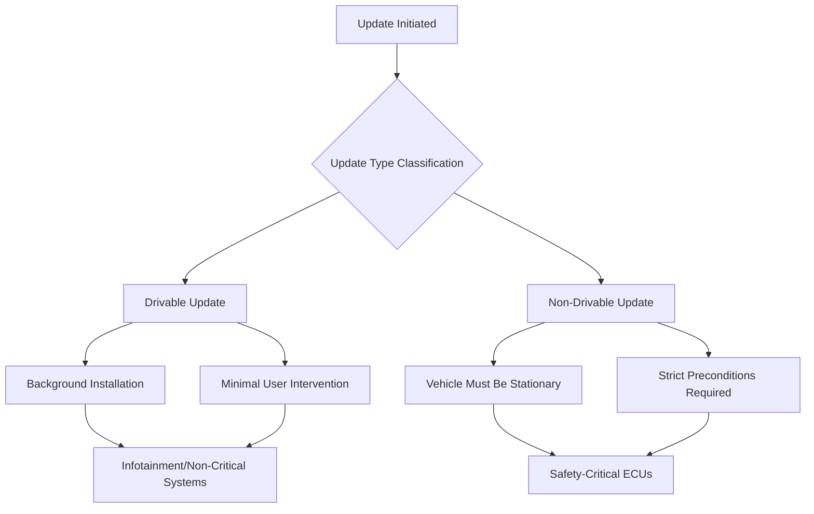
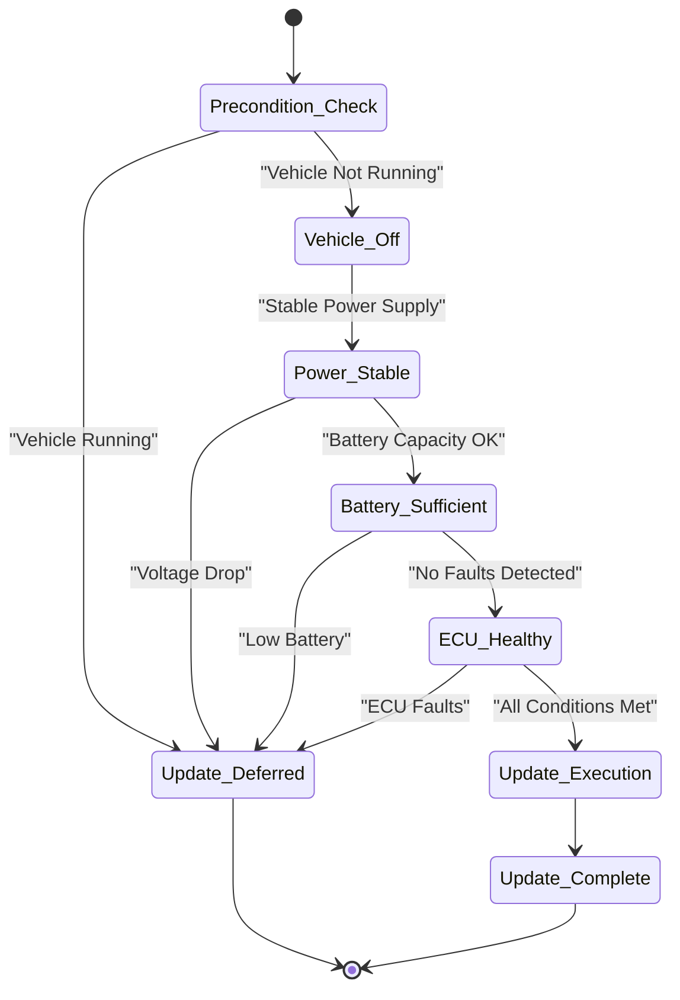
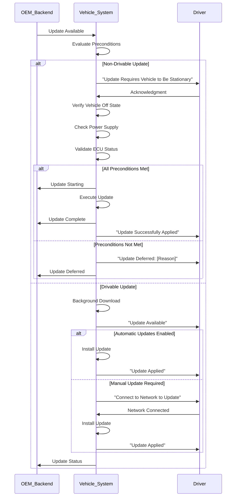

# OTA Update Architecture: Vehicle State Preconditions and Execution Requirements

## Introduction to OTA Update Preconditions

Vehicle state preconditions represent a fundamental component of any robust Over-The-Air (OTA) update system. When an update is initiated from the OEM backend, the vehicle must comprehensively evaluate whether the update can be safely executed based on current conditions, established criteria, and potential failure scenarios. These preconditions serve as critical safeguards that prevent updates from adversely affecting vehicle safety or compromising the user experience. The execution of OTA updates must always prioritize driver convenience and operational safety, ensuring that the update process never interferes with the vehicle's primary function of safe transportation.

## Classification of OTA Updates

OTA updates can be systematically categorized into two distinct classifications based on their impact on vehicle operability: drivable updates and non-drivable updates. This classification determines the level of vehicle state validation required and the communication protocols necessary with the driver. The distinction between these categories is essential for establishing appropriate precondition checks and ensuring update safety throughout the process.

## Drivable Updates: Process and Requirements

Drivable updates constitute a category of updates that can be applied while the vehicle remains fully operational without affecting drivability or critical vehicle functions. These updates typically execute in the background and may require minimal or no direct user intervention. A common implementation involves minor infotainment bug fixes or feature enhancements that can be downloaded and installed without interrupting vehicle operation. The user typically receives a notification indicating that the system has been updated, often accompanied by release notes describing the implemented changes or fixes.

When automatic updates are disabled in the vehicle configuration, the system may prompt the user through the infotainment display to establish connectivity via Wi-Fi or mobile network. Once connectivity requirements are satisfied, the update process can proceed autonomously. Following a system or infotainment restart, the user receives confirmation that the update was successfully applied. In scenarios where a drivable update encounters failure during installation, the system is generally designed to automatically revert to the previous software version, maintaining system stability and functionality.

## Non-Drivable Updates: Critical Safety Considerations

Non-drivable updates comprise the majority of OTA updates for safety-critical systems and require the vehicle to remain stationary and non-operable throughout the update process. These updates are mandatory for systems such as engine management units or other powertrain-related ECUs, which cannot be safely updated while the vehicle is in operation. During the flashing process, ECUs may undergo resets, temporarily disable functions, or enter programming modes that render vehicle operation either unsafe or impossible.

The execution of non-drivable updates demands rigorous precondition enforcement and thorough validation prior to deployment. These updates typically involve replacing substantial portions of firmware with newer versions that incorporate updated functionality, security enhancements, or critical fixes. The duration of firmware updates can be significant, often ranging from fifteen to thirty minutes or more, depending on package size and system architecture complexity. Throughout this extended period, the vehicle must maintain a safe and stable state to prevent any compromise of vehicle integrity or user safety.

## Vehicle State Precondition Validation

The evaluation of vehicle state preconditions involves multiple critical parameters that must be satisfied before update execution can commence. The primary precondition requires that the vehicle is not in running state. If the vehicle is started during a critical update phase, the update process must be immediately aborted or handled according to predefined severity protocols. In certain circumstances where safety warnings were explicitly acknowledged by the user, rollback functionality may not be available, necessitating alternative recovery procedures.

## Power and Battery Management Requirements

Stable power supply represents another critical precondition for successful OTA update execution. If battery voltage drops below established safe thresholds during the update process, the operation may fail and require recovery or complete reinitialization procedures. For electric vehicles, the decision to perform OTA updates during active charging periods depends on specific system design and power management strategies implemented by the OEM. Sufficient battery capacity must be verified before initiating any update process, as low battery levels constitute a common reason for update deferral.

The power management subsystem must continuously monitor voltage levels and battery state of charge throughout the update process. Any deviation from acceptable parameters must trigger appropriate safeguard procedures, which may include update suspension, notification to the driver, or controlled shutdown of the update process. These power-related preconditions are essential for preventing incomplete updates that could leave the vehicle in an inoperable or unsafe state.

## ECU Integrity and Diagnostic Considerations

The operational status of vehicle ECUs plays a significant role in determining update feasibility. Vehicles in factory condition typically present the most reliable environment for update execution. However, customer-installed modifications, wiring alterations, or aftermarket equipment can potentially interfere with update processes and introduce additional risk factors. The presence of such modifications may prevent successful communication with target ECUs or compromise the integrity of the update process.

Remote diagnostic capabilities serve as an essential tool for identifying conditions that could impede successful update execution. The diagnostic system can detect abnormal conditions and inform the driver that the update cannot proceed, along with specific reasons for the failure. This proactive approach prevents unnecessary update attempts that could result in system instability or require extensive recovery procedures. The integration of diagnostic checks into the precondition validation process ensures that updates are only attempted when the vehicle systems are in a state conducive to successful completion.

## User Communication and Safety Protocols

Clear and effective communication with the driver is essential throughout the OTA update process, particularly for non-drivable updates. The vehicle must provide comprehensive notification to the user before initiating a non-drivable update, including detailed instructions to ensure that all update conditions are properly met. This communication must include warnings about potential risks associated with update interruption and explicit acknowledgment requirements when necessary.

The update scheduling, execution status, and failure outcomes must be continuously reported back to the OEM backend systems. This reporting enables comprehensive dashboard functionality that tracks the number of vehicles that have successfully updated, those currently in progress, and any that have encountered failure conditions. The bidirectional communication flow ensures that both the vehicle and OEM maintain awareness of update status throughout the entire process, enabling appropriate response actions when anomalies or failures occur.

## Conclusion

The comprehensive evaluation of vehicle state preconditions forms the foundation of safe and reliable OTA update execution. The systematic approach to classifying updates, validating vehicle conditions, managing power requirements, and maintaining clear user communication ensures that OTA updates enhance vehicle functionality without compromising safety or user experience. These considerations establish the basic framework of vehicle state preconditions that must be thoroughly evaluated before executing any OTA update process, ensuring the integrity and reliability of the vehicle's software systems throughout its operational lifecycle.