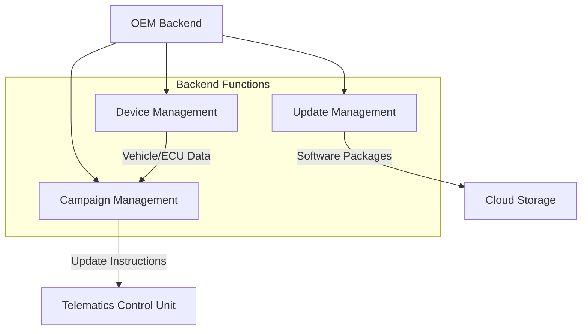
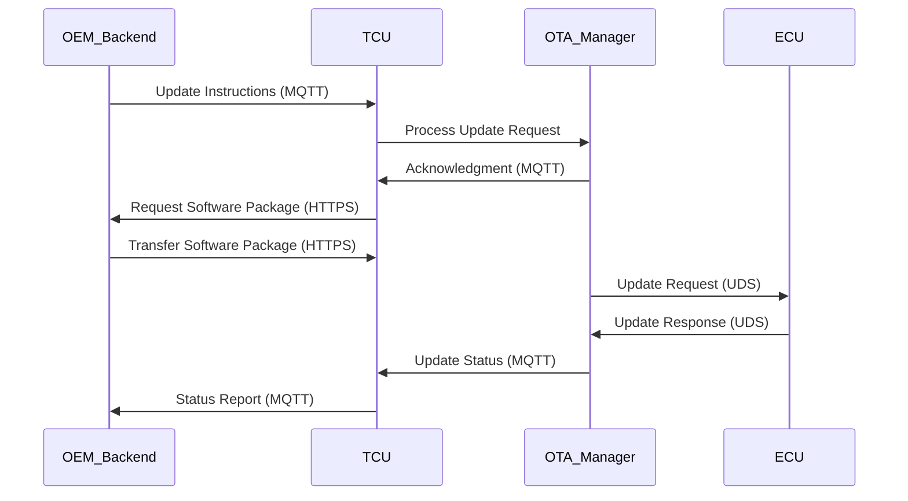

# OTA Architecture Documentation

## Introduction and Overview

The OTA (Over-The-Air) architecture represents a foundational template for automotive software update implementations. This architecture establishes a comprehensive framework for delivering software updates from the OEM backend to vehicle electronic control units (ECUs) through secure communication channels. While specific OEM implementations may vary in design details, the core architectural components and their interactions remain consistent across most automotive OTA solutions. The architecture encompasses three primary domains: the OEM backend infrastructure, the vehicle gateway system, and the target ECUs requiring updates.

## OEM Backend Architecture

The OEM backend serves as the central control hub for all OTA-related activities within the automotive ecosystem. This backend infrastructure is strategically divided into three primary functional blocks, each handling distinct aspects of the update lifecycle. The update management block maintains responsibility for software version control, update package creation and validation, and release management processes. This component ensures that all software packages meet quality standards and compatibility requirements before distribution to the vehicle fleet.

The device management block maintains comprehensive vehicle identity records, ECU inventories, variant configurations, regional specifications, and compatibility mappings. This functional area ensures that updates are delivered only to compatible vehicles and ECUs, preventing mismatched software installations that could compromise vehicle functionality or safety. The device management system continuously updates its database with vehicle configuration changes, ECU replacements, and fleet composition modifications.

Campaign management constitutes the third critical backend component, orchestrating the strategic rollout of software updates across the vehicle fleet. This system enables OEMs to select target vehicles based on various criteria, schedule update deployments during optimal time windows, and monitor progress throughout the update lifecycle. Campaign management provides granular control over update distribution, allowing for phased rollouts, targeted updates for specific vehicle populations, and rapid response to critical software issues.

## Vehicle-Side Components

The Telematics Control Unit (TCU) serves as the primary gateway ECU responsible for managing OTA operations within the vehicle architecture. While modern vehicles may incorporate multiple gateway ECUs, this architecture treats the TCU as the central coordinator for all OTA-related activities. The TCU facilitates communication between the OEM backend and internal vehicle systems, routing update instructions and data payloads to appropriate target ECUs based on their communication protocols and network topologies.

The OTA manager functions as a software component within the vehicle, coordinating all OTA-related activities on the vehicle side. This logical component may be implemented as a single entity or distributed across multiple subcomponents depending on system complexity and design requirements. The OTA manager receives update instructions from the OEM backend, validates update packages, manages update execution sequences, and handles error conditions during the update process. This component serves as the central orchestrator for vehicle-side update operations, ensuring proper sequencing and validation of update steps.

## Communication Protocols and Data Flow

The communication infrastructure between the OEM backend and vehicle employs two primary protocols, each optimized for specific types of data transfer. MQTT serves as the preferred protocol for control signaling, status updates, acknowledgments, and lightweight messaging between the backend and the OTA manager. This publish-subscribe protocol enables efficient real-time communication with minimal bandwidth requirements, making it ideal for maintaining continuous connectivity and status synchronization between backend systems and vehicle fleets.

HTTPS provides the secure transport mechanism for larger data payloads, particularly software packages and update files. This protocol ensures encrypted transmission of substantial data volumes from the OEM backend or cloud storage to the TCU. The dual-protocol approach optimizes communication efficiency by using lightweight messaging for control operations while leveraging secure, reliable transport for bulk data transfers. This separation of concerns enables the OTA system to maintain responsive control signaling while ensuring secure delivery of software packages.

## User Interaction and Consent Management

The OTA update process incorporates user consent mechanisms to ensure updates occur at appropriate times and under suitable conditions. The OTA manager interacts with the Human-Machine Interface (HMI) to request user consent when required by system design or regulatory requirements. Users receive notifications about available updates and can decide on the appropriate timing for update execution based on their convenience and current vehicle state. This user-centric approach respects vehicle usage patterns while ensuring timely software maintenance.

User authentication and authorization processes may occur through either the vehicle HMI or OEM-provided mobile applications, depending on manufacturer implementation choices. The architecture supports both vehicle-side and backend-initiated update triggers. HMI-based notifications are generated directly by the OTA manager within the vehicle, providing immediate feedback about update availability and status. Mobile application triggers are initiated through the OEM backend, allowing users to remotely monitor and manage update operations through connected mobile devices.

## ECU Update Mechanisms

The TCU employs UDS (Unified Diagnostic Services) tester functionality to communicate with other ECUs during the update process. Acting as a diagnostic master, the TCU sends update requests and receives responses from target ECUs using standardized diagnostic protocols. This approach ensures compatibility with existing automotive diagnostic infrastructure while providing reliable communication for update operations.

Different ECUs may utilize various communication protocols depending on their design and network connectivity. Some ECUs communicate over CAN (Controller Area Network) buses, while others leverage Ethernet-based communication for higher bandwidth requirements. The TCU, functioning as a gateway, intelligently routes update data using the appropriate transport mechanism for each target ECU. This protocol-agnostic approach enables the OTA system to update diverse ECU populations within a single vehicle architecture.

## Special Cases and TCU Self-Update

A special scenario arises when the TCU itself requires a software update. In this situation, the TCU incorporates its own dedicated update mechanism, typically implemented as a UDS server or specialized update handler. This self-update capability allows the TCU to update its own firmware independently of other ECUs, ensuring continuous operation and security of the gateway functionality. The TCU update process must maintain system integrity throughout the update sequence, preserving communication capabilities and basic vehicle functions.

TCU update strategies may employ single-bank or dual-bank memory architectures, each offering distinct advantages for update reliability and system availability. Single-bank architectures require careful update sequencing to maintain system functionality during the update process, while dual-bank architectures enable seamless updates by maintaining active and inactive memory partitions. The selection of update strategy depends on factors such as memory constraints, update frequency requirements, and system availability specifications.

## System Integration and Component Interactions

The OTA architecture demonstrates how OEM backend systems, vehicle-side components, communication protocols, and target ECUs collaborate to deliver reliable software updates. The OEM backend provides centralized control and management capabilities, while the TCU serves as the vehicle-side gateway coordinating update operations. The OTA manager orchestrates vehicle-side activities, ensuring proper sequencing and validation of update steps. Communication protocols enable efficient and secure data exchange between backend and vehicle systems.

This architectural framework establishes the foundation for most automotive OTA solutions, providing a scalable and secure approach to vehicle software maintenance. The modular nature of the architecture allows for customization based on specific OEM requirements while maintaining core principles of security, reliability, and user control. As vehicle software complexity continues to increase, this architecture provides the necessary infrastructure for managing software updates throughout the vehicle lifecycle.