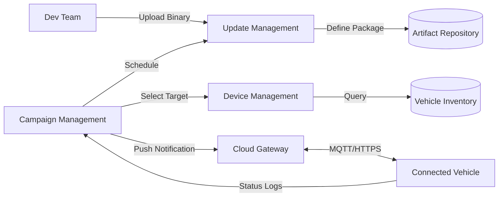

# OEM Backend Overview

The **OEM Backend** acts as the command center for the entire OTA ecosystem. It facilitates the seamless management of software updates, device configurations, and campaign executions. It serves as the bridge between software development teams and the vehicle fleet.

## Core Components

The backend is composed of three primary pillars:

1. **Update Management:** Organizing binaries and defining update packages.
2. **Device Management:** Tracking vehicle inventory, hardware versions, and software states.
3. **Campaign Management:** Orchestrating the rollout of updates to the fleet.

!!! info "Backend Architecture Workflow"


## 1. Update Management

**Update Management** handles the lifecycle of the software binary itself.

### Key Responsibilities

- **Ingestion:** Receiving firmware images (HEX, BIN) from engineering teams.
- **Metadata:** Associating version numbers, checksums, and release notes.
- **Compatibility:** Defining which Hardware IDs (HWIDs) are compatible with this software.

!!! example "Code: Binary Upload Workflow"
    ```python
    import boto3

    def upload_firmware(file_path, version, target_ecu):
        """
        Uploads firmware binary to secure S3 bucket with metadata.
        """
        s3 = boto3.client('s3')
        bucket = 'oem-firmware-repo'
        key = f"{target_ecu}/{version}/{file_path.name}"
        
        # Upload with tagging (Metadata)
        s3.upload_file(
            file_path, 
            bucket, 
            key, 
            ExtraArgs={'Tagging': f"Version={version}&ECU={target_ecu}"}
        )
        print(f"Uploaded: {key}")
    ```

### Best Practices

- **Immutable Artifacts:** Once a version is released, it should never be overwritten.
- **Digital Signatures:** All binaries must be signed *before* upload or by a secure signing service upon ingestion.

## 2. Device Management

**Device Management** maintains the "Digital Twin" of every vehicle in the fleet.

### Key Responsibilities

- **Inventory:** Storing the VIN, Model, Trim, and Year.
- **BOM Tracking:** Knowing exactly which ECU hardware revisions are in each VIN.
- **State Tracking:** Monitoring the current software version of every ECU in the car.

!!! example "Config: Vehicle Inventory Schema (YAML)"
    ```yaml
    vehicle_id: "VIN1234567890ABC"
    model: "Model-X"
    year: 2024
    ecus:
      - name: "PCM"
        hardware_id: "HW-PCM-001"
        current_software: "v2.0.1"
        last_seen: "2023-10-27T10:00:00Z"
      - name: "IVI"
        hardware_id: "HW-IVI-005"
        current_software: "v3.1.0"
        last_seen: "2023-10-27T10:05:00Z"
    ```

## 3. Campaign Management

**Campaign Management** acts as the scheduler and orchestrator. It answers "Who gets What, When?"

### Key Responsibilities

- **Targeting:** Selecting a subset of vehicles (e.g., "All 2023 Model-S in California").
- **Scheduling:** Determining rollout speed (canary deployment -> 10% -> 100%).
- **Rules:** Setting constraints (e.g., "Do not update if battery < 80%").

### Example Workflow

1. **Creation:** Admin creates "Winter Battery Patch" campaign.
2. **Selection:** Filter vehicles with `BMS_Version < 2.0` AND `Region == Cold_Climate`.
3. **Execution:** Backend sends "Update Available" limits notifications via MQTT.
4. **Monitoring:** Admin dashboard tracks Success/Fail rates.

!!! example "Code: Campaign Creation (Node.js)"
    ```javascript
    const createCampaign = async () => {
        const campaign = {
            name: "Winter Battery Patch",
            targetCriteria: {
                ecu: "BMS",
                maxVersion: "1.9.9",
                regions: ["CA", "NY", "NORWAY"]
            },
            rolloutStrategy: {
                type: "PHASED",
                phases: [
                    { percent: 5, waitHours: 24 },  // Canary
                    { percent: 100, waitHours: 0 }  // General Availability
                ]
            }
        };

        await db.collection('campaigns').insertOne(campaign);
    };
    ```

## Integration Flow

The power of the backend lies in the integration of these modules.

1. **Dev** uploads `v2.0` to **Update Management**.
2. **Device Management** identifies 50,000 vehicles running `v1.9`.
3. **Campaign Management** creates a job to update those 50,000 vehicles.
4. Vehicles download the binary and report status back to **Device Management**.

## Security Considerations

- **Encryption:** TLS 1.3 for all transport.
- **Access Control:** Role-Based Access Control (RBAC) ensuring only authorized engineers can approve a campaign.
- **Audit Trails:** Every action (upload, campaign start, vehicle update) is immutably logged.

## Scalability

Handling millions of connected vehicles requires cloud-native patterns:

- **Load Balancing:** Distributing MQTT connections.
- **CDN:** Using Content Delivery Networks to cache firmware binaries at the edge (reducing latency).
- **Serverless:** Using functions (Lambda/Azure Functions) to process status reports asynchronously.
