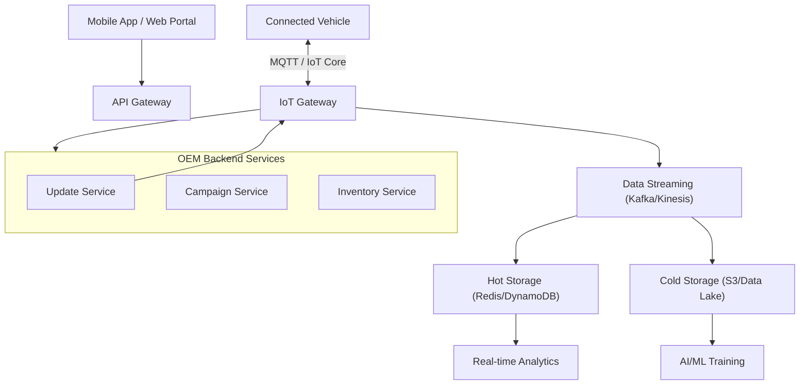

# Automotive Cloud Providers

Cloud computing is the backbone of the connected vehicle ecosystem. It provides the scalable infrastructure needed to store petabytes of telemetry data, manage million-vehicle fleets, and securely deliver OTA updates. This document analyzes the major players in the automotive cloud space.

## Cloud Architecture in Automotive

A typical automotive cloud functions as a "Hybrid Cloud," often combining edge computing (on-vehicle or near-tower) with centralized hyperscale cloud resources.

!!! info "Typical Automotive Cloud Stack"

## Major Cloud Providers Comparison

Each major cloud provider offers a dedicated suite of tools ("Accelerators" or "Industry Clouds") tailored for automotive.

| Feature | AWS (Amazon Web Services) | Microsoft Azure | Google Cloud Platform (GCP) |
| :--- | :--- | :--- | :--- |
| **IoT Platform** | **AWS IoT Core** (Industry Standard) | **Azure IoT Hub** | **Cloud IoT Core** (Being Deprecated*) |
| **Automotive Solution** | **AWS for Automotive** | **Azure Mobility** | **Android Automotive OS** (Integration) |
| **Strengths** | Market Leader, massive scalability, AWS FleetWise | Strong Enterprise integration, Digital Twins | Data/AI leadership, integration with Maps/Android |
| **Key Customers** | BMW, VW, Toyota, Rivian | GM, Renault-Nissan-Mitsubishi | Ford, Volvo, Renault |
| **Edge Compute** | AWS Greengrass | Azure IoT Edge | Google Distributed Cloud Edge |

> **Note on GCP:** While Google Cloud IoT Core is being deprecated, Google focuses heavily on the *data* side and the in-vehicle OS (**Android Automotive OS**) rather than just the pipe.

### 1. AWS (Amazon Web Services)

AWS is currently the dominant player. Its service **AWS IoT FleetWise** is specifically designed to collect, transform, and transfer vehicle data to the cloud efficiently.

- **Ecosphere:** Massive partner implementation network.
- **Serverless:** Heavy use of Lambda and DynamoDB for scalable backends.

### 2. Microsoft Azure

Azure leverages its strong relationship with enterprise IT. Its "Digital Twin" technology allows OEMs to create precise virtual replicas of vehicles for simulation and testing.

- **Integration:** Seamless active directory and security integration.
- **Focus:** Strong on the "Mobility as a Service" (MaaS) layer.

### 3. Google Cloud (GCP)

Google's strength lies in AI/ML and the Android ecosystem.

- **AAOS:** Many OEMs are adopting Android Automotive OS for the infotainment, making GCP the natural backend extension.
- **Data:** BigQuery is powerful for analyzing fleet telemetry.

## Specialized Providers

### 4. Airbiquity

A specialized software company focusing purely on OTA and data management.

- **Product:** OTAmatic.
- **Focus:** Carrier-grade reliability and complex dependency management.

### 5. Tekion

Focuses on the retail/dealer side but integrating increasingly with the OEM operational backend for a unified "Consumer-to-Factory" view.

## Challenges

1. **Vendor Lock-in:** Migrating an OTA pipeline from AWS IoT to Azure IoT is extremely difficult due to proprietary protocols and architecture.
2. **Data Sovereignty:** Storing map or user data in specific regions (e.g., GDPR in Europe, tough data laws in China) requires multi-region cloud strategies.
3. **Cost:** Ingesting terabytes of sensor data daily is expensive. Efficient "Edge Filtering" (discarding useless data before upload) is critical.

## Conclusion

While AWS leads in raw infrastructure adoption, the choice of cloud provider often depends on the OEM's broader software strategy (e.g., Are they using Android Automotive? Are they a Microsoft Enterprise shop?). The future trend is **Multi-Cloud**, utilizing specific strengths of different providers (e.g., AWS for IoT pipe, GCP for AI analytics).
