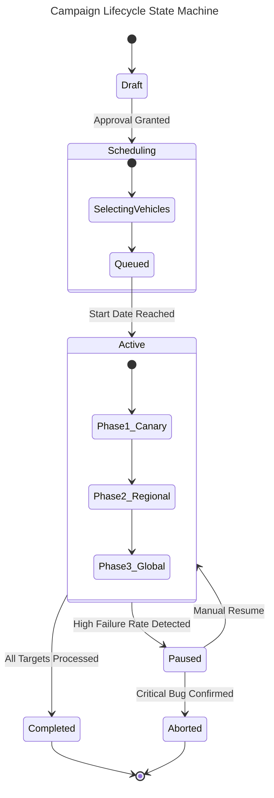

# Campaign Management in OTA

**Campaign Management** is the strategic layer of the OTA process. It transforms a static "Update Package" into a dynamic "Rollout" that reaches thousands or millions of vehicles. It addresses the logistics of deployment: who gets the update, when they get it, and what happens if something goes wrong.

## The Campaign Lifecycle

An update campaign is not a single event but a process with distinct stages.



## 1. Manufacturing Data & Targeting

Before an update can be sent, the system must know *detailed* information about every vehicle. This "As-Built" data is generated during manufacturing.

### Key Data Points

- **VIN (Vehicle Identification Number):** The primary key.
- **Hardware Revision:** Is the radar sensor Rev A or Rev B? (Crucial for driver compatibility).
- **Software Version:** What is currently running?

```json
{
    "vin": "1HGCM82633A004352",
    "model": "Civic_Type_R",
    "build_date": "2023-05-20",
    "ecus": [
    {
        "name": "Radar",
        "hw_id": "BOSCH-MRR-EVO14",
        "sw_version": "1.4.0"
    },
    {
        "name": "Gateway",
        "hw_id": "CONTI-GW-002",
        "sw_version": "2.1.0"
    }
    ]
}
```

## 2. Campaign Strategy

Strategies define *how* the update moves through the fleet.

### Types of Campaigns

1. **General Release:** Standard feature update for everyone.
2. **Recall / Critical Security:** Urgent, mandatory update. Often overrides user scheduling preferences.
3. **Beta / Pilot:** Targeted at a small group of "Early Access" internal users.

### Rollout Phasing (The "Blast Radius" Control)

To prevent bricking the entire fleet, updates are rolled out in rings.

- **Ring 0 (Test Fleet):** 10-50 Internal vehicles.
- **Ring 1 (Canary):** 1,000 Customer vehicles (randomly selected or volunteers).
- **Ring 2 (Regional):** 10,000 vehicles (e.g., "Germany only").
- **Ring 3 (Global):** Remainder of the fleet.

## 3. Creating a Campaign

A campaign definition bundles the **What** (Software), **Who** (Target Vehicles), and **How** (Strategy).

```python
# example "Code: Campaign Definition (Python Class)"
class Campaign:
    def **init**(self, name, priority, update_package):
            self.id = generate_uuid()
            self.name = name
            self.priority = priority  # LOW, NORMAL, CRITICAL
            self.package = update_package
            self.phases = []

        def add_phase(self, target_criteria, rollout_percent, wait_time_hours):
            self.phases.append({
                "criteria": target_criteria,
                "percent": rollout_percent,
                "wait": wait_time_hours
            })
            
    # Usage
    winter_update = Campaign("Winter Optimization", "NORMAL", "Pkg_v2.4")
    
    # Phase 1: 5% of fleet, wait 24 hours to check for complaints
    winter_update.add_phase(criteria="Model_Y", rollout_percent=5, wait_time_hours=24)
    
    # Phase 2: 100% of fleet
    winter_update.add_phase(criteria="Model_Y", rollout_percent=100, wait_time_hours=0)
```

## 4. Execution & Monitoring

Once active, the Campaign Manager monitors the "**Health Metrics**" of the deployment.

### Key Metrics

- **installation_success_rate:** target > 99.5%
- **download_failure_rate:** High failures might indicate CDN issues.
- **rollback_rate:** Ideally 0%. If this spikes, the campaign must automatically PAUSE.

```python
# example "Alerting Logic: Automatic Kill Switch"
def monitor_campaign_health(campaign_id):
    stats = get_realtime_stats(campaign_id)

    failure_rate = stats.failures / stats.attempts
    
    if failure_rate > 0.02:  # 2% Failure Threshold
        print(f"[ALERT] High failure rate ({failure_rate:.1%}) detected!")
        pause_campaign(campaign_id)
        notify_admin_team()
```

## 5. User Interaction

The campaign settings dictate how the update appears to the user.

- **Silent:** Background update (e.g., map data). User never knows.
- **Banner:** "Update Available" icon appears. User chooses when to install.
- **Forced:** "Critical Safety Update. Will install at 2:00 AM." (Rare, used for recalls).

## Conclusion

Effective Campaign Management balances **Speed** (getting features to users) with **Safety** (preventing widespread issues). By utilizing phased rollouts, real-time monitoring, and automatic kill-switches, OEMs can manage the complex logistics of updating millions of vehicles confidently.
