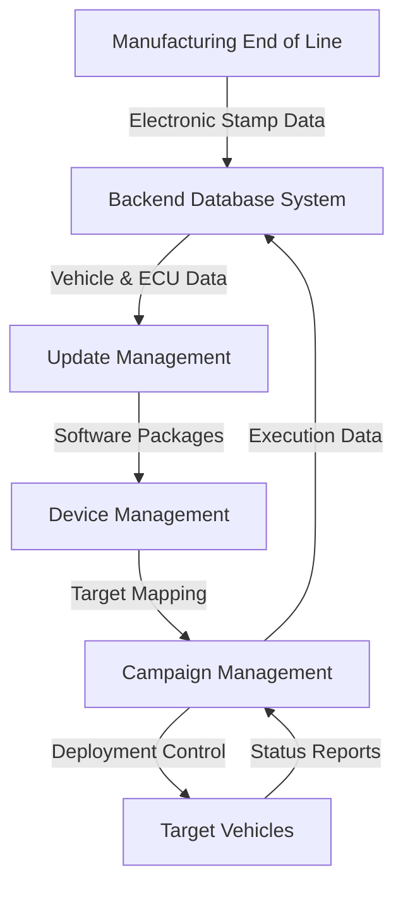
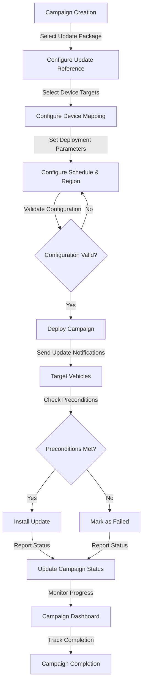

# OTA Backend System Documentation

## System Overview

The OTA Backend system serves as the central infrastructure for managing over-the-air software updates in automotive environments. This system integrates manufacturing data, update packages, device targeting, and campaign orchestration into a cohesive platform that enables controlled and traceable software deployments throughout the vehicle lifecycle. The architecture consists of three primary management interfaces: Update Management, Device Management, and Campaign Management, all built upon a comprehensive database foundation that maintains complete vehicle and ECU historical records.

## System Architecture

The OTA Backend architecture establishes a clear separation of concerns between data ingestion, package management, device targeting, and campaign orchestration. The system begins with data export from the manufacturing End of Line process, where vehicle and ECU information flows into enterprise database systems. This foundational data supports three distinct management layers that work in concert to deliver updates to target vehicles.

## Manufacturing Data Integration

The data journey begins at the manufacturing End of Line process, where vehicle manufacturers export comprehensive vehicle data to backend systems. This export includes both mechanical and electronic information, with the electronic stamp serving as a critical component for traceability. The electronic stamp contains essential identifiers including the Vehicle Identification Number (VIN), engine number, chassis number, and production timestamps. These identifiers are intrinsically linked to the vehicle order and establish the foundation for all subsequent update operations.

From an electronics perspective, the database captures detailed ECU-related information including hardware part numbers, software version numbers, and calibration identifiers. It is important to note that calibration data applies selectively to certain ECUs rather than all hardware components. For instance, systems such as ABS, body control modules, and other ECUs have their hardware numbers, software numbers, and calibration versions recorded along with the vehicle production timestamp. The database maintains a complete historical record of this information, which is critical for compliance, diagnostics, and update targeting accuracy.

## Update Management System

The Update Management interface provides the primary mechanism for software teams to introduce new software packages into the OTA ecosystem. Engineering teams upload software packages accompanied by essential metadata including software name, issue description, communication protocol, vehicle model type (petrol, diesel, or electric), and the binary or flash files. This structured approach ensures that each update package is properly categorized and documented before deployment consideration.

Once uploaded, these files are stored in the cloud infrastructure with an update management entry created to track the package. The system supports multiple concurrent update entries, each corresponding to different software changes or components. In large OEM environments, dozens of update entries may be active simultaneously, reflecting the complex and continuous nature of automotive software development. Each entry maintains records of the software name, communication type, vehicle model applicability, and binary file reference, creating a comprehensive inventory of available updates.

## Device Management System

Device Management establishes the critical link between available software updates and the specific vehicles that require them. This system defines which vehicle variants, models, and ECUs are eligible for each update package. The interface presents all vehicle variants supported by the OEM, enabling precise targeting based on vehicle characteristics and current software states.

The device management process involves selecting the target vehicle model, identifying the specific ECU to be updated, and determining the currently installed software version. This information is then mapped to the new software version uploaded through the Update Management system. The resulting device management dataset includes serial numbers or VIN ranges, vehicle models, ECU identifiers, software types, and version mappings. When Update Management and Device Management are configured together, the system establishes a clear definition of what software will be changed and on which specific vehicles.

## Campaign Management Orchestration

Campaign Management provides the orchestration layer that controls the actual deployment of updates to target vehicles. Each campaign is assigned a meaningful name defined by the OEM, typically reflecting the affected ECU or function. The system supports two primary deployment modes: immediate campaigns for urgent updates such as security patches, and scheduled campaigns that allow updates to be planned weeks or months in advance.

The campaign configuration process references the relevant Update Management entry and Device Management configuration, ensuring that only properly vetted software reaches appropriately targeted vehicles. Campaigns can be geographically constrained to specific regions such as Europe, and configured with defined rollout durations to control deployment pace. The cloud backend continuously updates campaign status, tracking progress through states including completed, in progress, or failed. Campaign failures may occur due to various factors including unmet vehicle preconditions, user deferrals, connectivity issues, or power constraints.

## Campaign Workflow Process

The campaign management workflow demonstrates the systematic approach to update deployment, from initial configuration through final status reporting. This process ensures proper validation, targeting, and monitoring throughout the update lifecycle.

## Status Monitoring and User Interaction

Campaign Management provides comprehensive visibility into update deployment progress through a centralized dashboard. The dashboard displays real-time information about the number of vehicles targeted, successfully updated, and encountering issues. This visibility enables operations teams to monitor campaign health and respond to problems as they arise.

The system also offers granular control over user notifications and interactions. OEMs can define the frequency of update alerts sent to vehicle owners and determine whether to request feedback when users postpone or decline updates. This flexibility allows manufacturers to balance update urgency with customer experience considerations. The notification system can be configured differently for various campaign types, with security updates potentially requiring more persistent communication than feature enhancements.

## Database Architecture and Traceability

All update, device, and campaign data is stored in backend database systems, typically SQL-based or equivalent enterprise solutions. This centralized storage enables full traceability of software changes throughout the vehicle lifecycle. The database maintains historical records of all software versions, update deployments, and vehicle states, creating an audit trail that supports compliance requirements and diagnostic activities.

The database architecture supports complex queries necessary for update targeting, allowing the system to identify vehicles with specific ECU configurations, software versions, or geographic locations. This capability is essential for precise update targeting and for understanding the impact of software changes across the vehicle fleet. The historical nature of the database also enables trend analysis and long-term planning for future update strategies.

## Risk Management and Configuration Controls

The OTA Backend system incorporates significant emphasis on configuration accuracy and risk management. The process of configuring updates and selecting vehicle variants requires extreme care, as incorrect software selection or misconfiguration can have serious consequences that may be difficult to recover once a campaign is deployed. The system therefore includes validation steps and controls to minimize the risk of erroneous deployments.

The separation between Update Management, Device Management, and Campaign Management creates natural checkpoints in the deployment process. Each layer must be properly configured before proceeding to the next, reducing the likelihood of errors propagating through the system. Additionally, the ability to create test campaigns and monitor their execution before full deployment provides an additional safety mechanism for protecting the vehicle fleet from problematic updates.

## System Integration and Data Flow

The complete data flow through the OTA Backend system demonstrates the integration between manufacturing, update management, and deployment systems. The process begins with vehicle production data flowing from the End of Line process into the backend database, where it establishes the foundation for all future update activities. This data then flows through the Update Management system where new software packages are introduced, continues through Device Management where targeting rules are established, and culminates in Campaign Management where actual deployments are orchestrated.

Throughout this flow, the database serves as the central repository that maintains consistency and traceability. Status information flows back from vehicles through the campaign management system, providing real-time feedback on deployment progress and issues. This bidirectional data flow ensures that the system maintains an accurate understanding of vehicle states and can respond appropriately to changing conditions during update deployments.

The OTA Backend system thus provides a comprehensive, controlled, and traceable infrastructure for managing automotive software updates throughout the vehicle lifecycle, balancing the need for rapid software deployment with the critical requirements for safety, reliability, and customer experience.