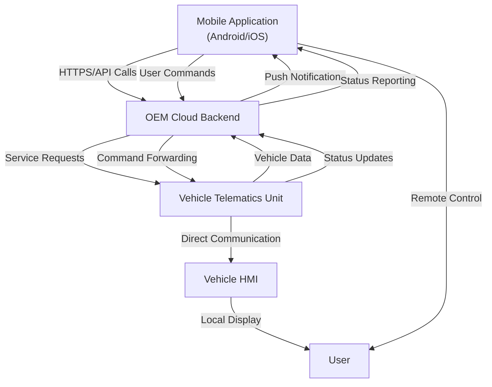
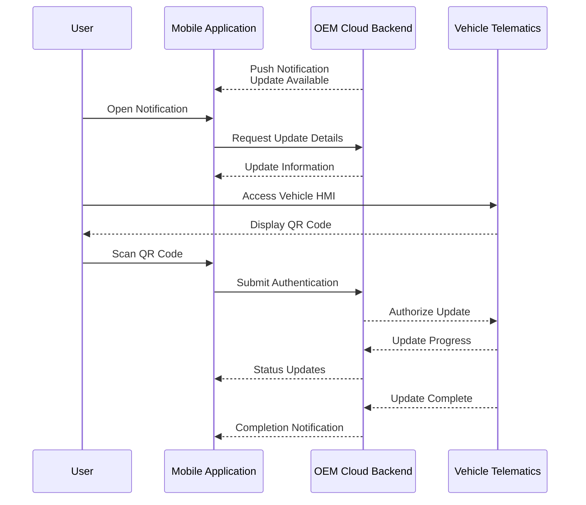

# OEM Mobile Applications in OTA HMI Systems

## Introduction to OEM Mobile Applications

OEM mobile applications represent a critical component in modern connected vehicle ecosystems, typically deployed on both Android and iOS platforms. These applications serve as essential extensions of Over-The-Air (OTA) update capabilities, enabling users to monitor and control vehicle functions directly from their smartphones. While the vehicle HMI provides in-vehicle update notifications and controls, mobile applications extend this functionality beyond the physical confines of the vehicle, creating a seamless bridge between the user and their vehicle regardless of location.

The strategic importance of these applications lies in their ability to enhance customer engagement and drive feature adoption. Through OEM mobile applications, users can access a comprehensive suite of features including navigation status monitoring, vehicle performance data analysis, behavior analysis, and in fleet use cases, robust fleet management functionality. This transformation of the mobile application from a simple remote control to a sophisticated vehicle management interface represents a significant evolution in automotive user experience.

## System Architecture and Integration

The architectural foundation of OEM mobile applications is built upon tight integration with OEM backend cloud platforms. These applications function as sophisticated client interfaces that consume cloud services and present them to customers through user-friendly interfaces. The cloud platform serves as the authoritative source for determining feature availability, while the mobile application acts as the access point for customers to interact with these services.

This architectural pattern ensures that the mobile application remains lightweight while leveraging the computational power and data storage capabilities of the cloud infrastructure. The separation of concerns between service logic in the cloud and presentation in the mobile application enables rapid feature deployment and consistent service delivery across different vehicle models and regions.

## Comprehensive Feature Capabilities

OEM mobile applications provide an extensive range of features that transform the vehicle ownership experience. Using Hyundai BLUELINK as a representative example, these applications typically encompass safety services, security features, remote vehicle control capabilities, location-based services, alert mechanisms, AI-driven functions, and customer relationship management capabilities.

The safety services portfolio includes emergency assistance, roadside assistance, panic notifications, and stolen vehicle recovery services. Security features encompass vehicle tracking and immobilization capabilities. Remote control functions extend to engine start and stop operations, climate control activation, and door locking and unlocking mechanisms. Voice-based commands enable hands-free operation, while cabin pre-conditioning ensures optimal comfort before vehicle entry.

Diagnostic capabilities form another critical component, with applications handling diagnostic trouble codes and providing predictive diagnostics. These features collectively position the mobile application as an indispensable tool for vehicle management and user convenience.

## OTA Update Workflow and User Interaction

The mobile application plays a pivotal role in the OTA update ecosystem, serving as both a notification channel and an authorization interface. When new software or navigation updates become available, users receive notifications directly through the mobile application, ensuring timely awareness of available updates regardless of their proximity to the vehicle.

The update approval process incorporates sophisticated authentication mechanisms to ensure security and user consent. In some implementations, users authenticate updates by scanning a QR code displayed on the vehicle infotainment screen. This two-factor authentication approach leverages both the vehicle HMI and the mobile application, creating a secure authorization workflow that prevents unauthorized updates while maintaining user convenience.

Throughout the update process, the mobile application maintains continuous communication with the OEM backend, providing real-time status updates and reporting completion status back to the cloud platform. This bidirectional communication ensures that both the user and the OEM maintain visibility into the update process from initiation through completion.

## Cloud Backend Integration and Service Delivery

The integration between OEM mobile applications and cloud backend platforms forms the technological foundation for modern connected vehicle services. This relationship enables the delivery of AI-based and IoT-driven services that would be impossible to implement through standalone vehicle systems. The cloud platform serves as the central nervous system, processing data, executing business logic, and coordinating service delivery across the entire vehicle ecosystem.

Service delivery through this integrated architecture follows a clear pattern where the cloud platform determines service availability and functionality, while the mobile application provides the user interface for service access. This includes not only OTA update notifications and vehicle status reporting but also extends to comprehensive service interactions that span the entire ownership lifecycle.

The mobile application's role in reporting update completion status back to the OEM backend creates a closed feedback loop that enables manufacturers to monitor update success rates, identify potential issues, and maintain accurate records of vehicle software versions across their fleet. This data flow is essential for regulatory compliance, warranty management, and continuous service improvement.

## Market Differentiation and Customer Engagement

OEM mobile applications have evolved into powerful tools for market differentiation and customer engagement in the competitive automotive landscape. These applications serve as the primary interface through which customers experience the value of connected vehicle technologies, making them crucial for brand positioning and customer retention strategies.

The maturity of OEM mobile applications in the market demonstrates their established role in connected vehicle ecosystems. These applications are no longer considered optional accessories but have become standard expectations for modern vehicle ownership. Their widespread availability across Android and iOS platforms ensures broad accessibility, while their integration with cloud services enables continuous feature enhancement without requiring vehicle hardware updates.

The strategic value of these applications extends beyond their functional capabilities to encompass their role in building long-term customer relationships. By providing daily value through features like remote climate control, vehicle status monitoring, and security services, these applications create regular touchpoints that strengthen the connection between customers and automotive brands.

## Conclusion

OEM mobile applications represent a mature and essential component of modern OTA and connected vehicle systems. Their role extends far beyond simple update notification to encompass comprehensive vehicle management, safety services, security features, and customer engagement capabilities. Through tight integration with cloud backend platforms, these applications enable the delivery of sophisticated services that enhance the vehicle ownership experience while providing manufacturers with valuable data and customer engagement opportunities.

The technical architecture of these applications, with their clear separation between cloud service logic and mobile presentation, enables scalable and maintainable solutions that can evolve independently of vehicle hardware. This architectural approach, combined with robust authentication mechanisms and comprehensive feature sets, positions OEM mobile applications as a critical enabler of the connected vehicle future.