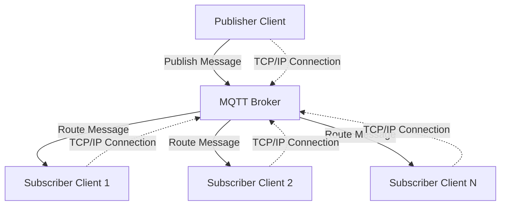
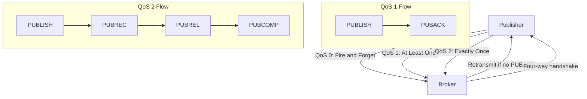
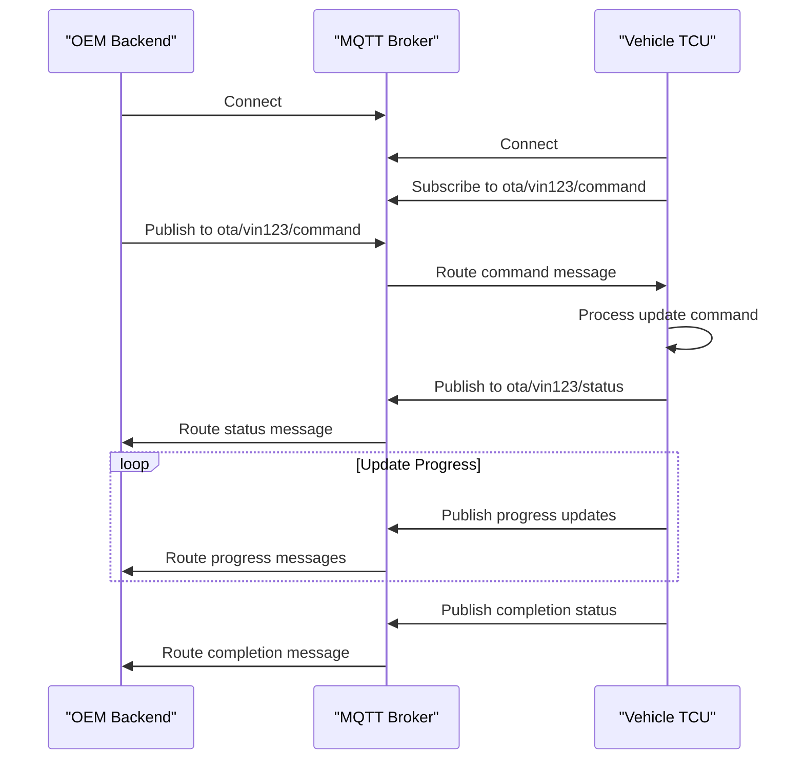

# MQTT Protocol in OTA OEM-Backend to TCU Connectivity

## Introduction to MQTT in OTA Systems

Message Queuing Telemetry Transport (MQTT) serves as a fundamental communication protocol in Over-The-Air (OTA) update systems, facilitating reliable messaging between the OEM backend and vehicle Telematics Control Units (TCUs). While HTTPS handles payload transfers, MQTT provides the lightweight, efficient messaging backbone essential for control and telemetry communications in automotive environments. The protocol's design specifically addresses the challenges inherent in vehicle-to-cloud communications, including constrained bandwidth, high latency, and potentially unreliable network conditions that characterize mobile vehicle connectivity.

MQTT operates at the application layer (Layer 7) of the OSI model, running over TCP/IP to ensure reliable transport while maintaining minimal overhead. Its adoption across automotive, manufacturing, logistics, and consumer electronics domains stems from its ability to support millions of connected devices simultaneously while maintaining efficiency and scalability. The protocol's lightweight design, low power consumption characteristics, and optimized network bandwidth usage make it particularly suitable for telematics units that must operate within the constraints of vehicle electrical systems and mobile network connectivity.

## MQTT Protocol Architecture

The MQTT architecture follows a publish-and-subscribe communication pattern that fundamentally differs from traditional request-response models. This architecture centers around an MQTT broker that acts as an intermediary between message publishers and subscribers. The broker manages message routing, filtering, and delivery, enabling decoupled communication between system components. This decoupling allows for flexible system design where publishers need not know about subscribers, and vice versa, facilitating dynamic and scalable system architectures.

The broker maintains persistent connections with clients and handles message distribution based on topic subscriptions. This centralized approach simplifies client implementation while providing robust message delivery guarantees. In automotive OTA implementations, the broker typically resides in the cloud infrastructure, with the OEM backend and vehicle TCUs connecting as MQTT clients. The broker's role in filtering and routing messages based on topic hierarchies enables efficient communication patterns essential for managing large vehicle fleets.

## Communication Model and Components

MQTT's publish-and-subscribe model revolutionizes message handling by eliminating direct coupling between message senders and receivers. In this model, clients can assume either publisher, subscriber, or both roles simultaneously. A publisher sends messages to specific topics without knowledge of which clients, if any, will receive them. Conversely, subscribers express interest in particular topics and receive all messages published to those topics, regardless of their source. This asynchronous communication pattern provides significant advantages in distributed systems, particularly in automotive environments where network connectivity may be intermittent.

Topics form the backbone of MQTT's message routing system, functioning as hierarchical strings that organize and filter messages. Topic levels are separated by forward slashes, creating a tree-like structure that enables both broad and specific message categorization. For example, a topic like "vehicle/VIN123/firmware/status" represents a hierarchical path from general to specific information. Unlike traditional message queues that require pre-creation, MQTT topics are created dynamically when first used, eliminating the need for explicit topic management and allowing flexible system evolution.

The broker maintains client sessions and subscription information, ensuring message delivery according to the specified Quality of Service levels. Each client establishes a TCP connection with the broker, maintaining this connection for the duration of the communication session. The broker tracks client subscriptions, queued messages, and delivery states, providing the infrastructure necessary for reliable message delivery even in the face of network interruptions or client reconnections.

## Message Structure and Topics

An MQTT message comprises three distinct components: a fixed header, a variable header, and a payload. The fixed header contains control information such as message type and Quality of Service flags, present in every MQTT message. The variable header contains protocol-specific information like topic names and packet identifiers, varying based on message type. The payload carries the actual application data, with a maximum size of up to 256 megabytes depending on broker configuration. This structure provides both consistency and flexibility, accommodating various message types while maintaining a compact, efficient format.

Messages are encoded using UTF-8 strings, ensuring broad compatibility across different platforms and programming environments. The payload content remains opaque to the MQTT broker, which treats it as binary data, allowing applications to encode information according to their specific requirements. This payload agnosticism enables MQTT to support diverse data formats, from simple status messages to complex binary data structures, making it suitable for various automotive telemetry and control applications.

Topic hierarchies enable sophisticated message filtering and routing capabilities. Topics support wildcard characters at both single-level and multi-level positions, allowing flexible subscription patterns. For instance, "vehicle/+/status" subscribes to status messages from all vehicles, while "vehicle/VIN123/#" subscribes to all topics under a specific vehicle identifier. This hierarchical organization, combined with wildcard support, provides powerful filtering capabilities that reduce unnecessary message traffic and enable efficient resource utilization in large-scale deployments.

## Quality of Service Levels

MQTT defines three distinct Quality of Service (QoS) levels that provide different guarantees for message delivery, allowing system designers to balance reliability, latency, and overhead according to application requirements. QoS 0, known as "at most once" delivery, implements a fire-and-forget approach where messages are sent without acknowledgment. The publisher receives no confirmation of message delivery, making this the fastest but least reliable option. This level suits applications where occasional message loss is acceptable, such as periodic sensor readings where subsequent messages will replace missed ones.

QoS 1 provides "at least once" delivery assurance through an acknowledgment mechanism. The publisher sends a message and expects a PUBACK acknowledgment packet from the broker. If no acknowledgment arrives within a defined timeout period, the publisher retransmits the message. This approach ensures message delivery but may result in duplicate messages when acknowledgments are delayed or lost. In automotive OTA systems, QoS 1 represents the most commonly chosen level for control messaging, as it provides reliable delivery while maintaining manageable protocol overhead.

QoS 2 offers "exactly once" delivery, the highest reliability level available in MQTT. This level implements a four-step handshake process involving PUBLISH, PUBREC, PUBREL, and COMP packets to ensure message delivery without duplication. The publisher initially sends a PUBLISH packet, which the broker acknowledges with PUBREC. The publisher then releases the message with PUBREL, and the broker confirms completion with PUBCOMP. This complex flow eliminates duplicates while ensuring delivery, making it suitable for critical commands where duplicate execution could cause system issues, though it comes with increased protocol overhead.

## MQTT in Automotive OTA Context

In automotive OTA implementations, MQTT typically serves as the control channel between the OEM backend and vehicle TCUs, complementing HTTPS which handles the actual firmware and software payload transfers. This division of responsibilities leverages MQTT's strengths in efficient, bidirectional messaging while utilizing HTTPS's robust capabilities for large file transfers. The protocol's lightweight nature and support for unreliable connectivity make it particularly suitable for vehicle environments where network conditions can vary significantly based on location, speed, and network availability.

OEMs commonly select QoS 1 for OTA control messaging due to its optimal balance between reliability and overhead. This choice ensures that critical commands, such as update initiation, status reporting, and error notifications, reach their destination while avoiding the complexity of QoS 2 or the unreliability of QoS 0. The at-least-once delivery guarantee, combined with duplicate detection mechanisms at the application layer, provides sufficient reliability for OTA operations without excessive resource consumption on vehicle telematics units.

The topic structure in automotive OTA systems typically follows a hierarchical organization that facilitates fleet management and individual vehicle targeting. Topics might include vehicle identification information, command types, and status categories, enabling both broadcast and targeted messaging. For instance, a topic like "ota/fleet/modelX/vin123/command/update" could target a specific vehicle, while "ota/fleet/modelX/status" might collect status information from all vehicles of a particular model. This hierarchical approach enables efficient message routing and filtering, essential for managing large vehicle fleets with diverse update requirements.

## Message Flow Example

Consider a typical OTA update scenario where the OEM backend initiates a firmware update on a specific vehicle. The backend, acting as an MQTT publisher, sends a command message to a topic specific to the target vehicle's TCU. The message contains update instructions, metadata, and authentication information, encoded in the payload according to the application's data format requirements. The MQTT broker receives this message and routes it to the subscribed TCU, which processes the command and begins the update process.

During the update process, the TCU publishes status messages to its status topic, providing the backend with real-time information about download progress, installation status, and any encountered errors. These status messages enable the backend to monitor update progress across the fleet and respond appropriately to failures or exceptions. The bidirectional nature of MQTT communication allows for dynamic command adjustment based on vehicle feedback, such as pausing updates when connectivity deteriorates or resuming when conditions improve.

This message flow demonstrates MQTT's efficiency in handling control and telemetry communications in OTA systems. The protocol's publish-subscribe model, combined with reliable QoS levels and hierarchical topic organization, provides a robust foundation for managing complex update operations across diverse vehicle fleets. The lightweight nature of MQTT ensures minimal impact on vehicle resources while maintaining the communication reliability essential for successful OTA deployments.
