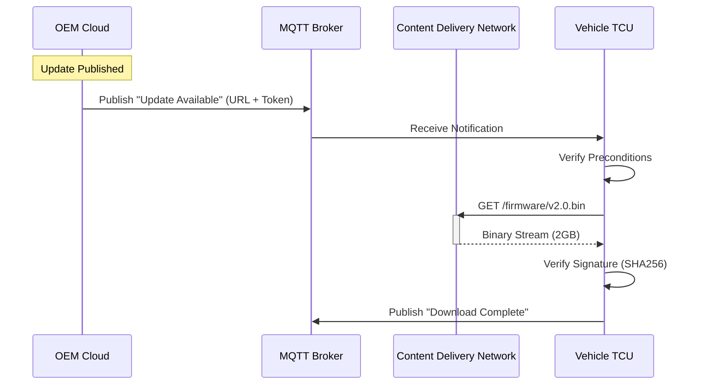

# HTTPS Protocol in OTA

While MQTT is used for signaling and control, **HTTPS (HyperText Transfer Protocol Secure)** is the workhorse for transferring the actual update payloads (firmware binaries).

!!! warning "Why not MQTT for Payloads?"
    MQTT Brokers are not designed to handle large binary blobs (hundreds of megabytes or gigabytes). Sending large files over MQTT can crash the broker or block other critical signaling traffic.

## Hybrid Approach

The **Hybrid Communication Model** is the industry standard for Automotive OTA:

1. **MQTT** for Signaling: "Hey, there's an update available."
2. **HTTPS** for Transport: "Okay, downloading the 2GB file now."



## Secure Download Flow

### 1. Pre-Signed URLs

Instead of embedding hardcoded credentials in the car, the backend generates **Pre-Signed URLs** (e.g., AWS S3 Presigned URLs). These URLs are valid for a short time (e.g., 60 minutes) and grant readonly access to the specific firmware file.

### 2. Range Requests (Resumability)

Cellular connections are unstable. The TCU **must** support HTTP Range Requests (`Range: bytes=500-999`).

- If the connection drops at 50%, the TCU can resume from byte X instead of restarting from zero.

!!! example "Code: Resumable Download (Python)"
    ```python
    import requests

    def download_firmware(url, file_path, start_byte=0):
        headers = {'Range': f'bytes={start_byte}-'}
        
        with requests.get(url, headers=headers, stream=True) as r:
            r.raise_for_status()
            with open(file_path, 'ab') as f:
                for chunk in r.iter_content(chunk_size=8192):
                    f.write(chunk)
    ```

### 3. Server-Side SSL Pinning

To prevent sophisticated intercept attacks, the TCU should "pin" the server's certificate public key. This ensures it is talking to the real OEM server, not a malicious proxy.

## Best Practices

- **Content Delivery Network (CDN):** Always serve firmware from a CDN (e.g., CloudFront, Akamai) to reduce latency and load on the origin server.
- **Compression:** Although binary deltas are already compressed, ensure the transport layer supports standard compression if applicable.
- **Integrity Check:** The download is not trusted until the **SHA256 Hash** matches the value sent in the MQTT metadata. HTTPS ensures transport security, but hashing ensures file integrity.
