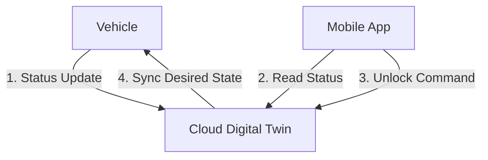

# Car-to-Cloud (C2C) Patterns

**Car-to-Cloud (C2C)** communication extends beyond simple OTA updates. It forms the backbone of the "Software Defined Vehicle," handling everything from remote diagnostics to fleet management.

## Communication Patterns

### 1. Telemetry Streaming (Firehose)

Vehicles generate gigabytes of sensor data. Streaming raw data is expensive.

- **Pattern:** Edge computing filters data. Only "events of interest" (e.g., hard braking, battery overheat) are uploaded.
- **Protocol:** MQTT (QoS 0 or 1).

### 2. Request / Response (RPC)

The Cloud needs to ask the car a question.

- **Example:** "What is your current GPS location?"
- **Pattern:** Cloud publishes to `cmd/get_location`. Car replies to `status/location`.
- **Protocol:** MQTT Correlated Messages (Request ID matching).

### 3. Big Data Uploads (Black Box)

After a crash or critical failure, the OEM needs the full log history (Black Box).

- **Pattern:** Car uploads a multi-megabyte log file.
- **Protocol:** HTTPS PUT (Direct transfer to S3/Object Storage).

!!! info "Optimization: Data Cost"
    Cellular data is expensive ($$/GB).
    -   **WiFi Offloading:** Vehicles often cache large logs and only upload when connected to Home WiFi or Service Center WiFi.
    -   **Compression:** Protocol Buffers or Avro are preferred over JSON for payload efficiency.

## Connectivity Challenges

Vehicles are not servers; they move, go through tunnels, and park in concrete basements.

| Challenge | Solution |
| :--- | :--- |
| **Intermittent Connection** | **Queuing:** Broker queues messages. **CleanSession=False** ensures delivery upon reconnection. |
| **Latency** | **Edge Computing:** Process time-critical decisions (e.g., "detect crash") on the car, not the cloud. |
| **Security** | **Zero Trust:** Every message must be authenticated. No implicit trust even inside the VPN. |

## Digital Twin

The **Digital Twin** is a cloud-side replica of the vehicle's state.

- **Vehicle:** Updates `shadow/state` to `{"door_locked": true}`.
- **Cloud:** Updates `shadow/state` to match.
- **App:** Reads `shadow/state` from Cloud (fast) instead of querying the sleeping car (slow).

This decoupling allows the App to respond instantly even if the car is temporarily offline. When the car wakes up, it syncs with the Digital Twin's desired state.
