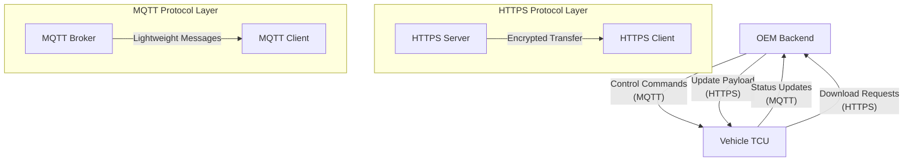
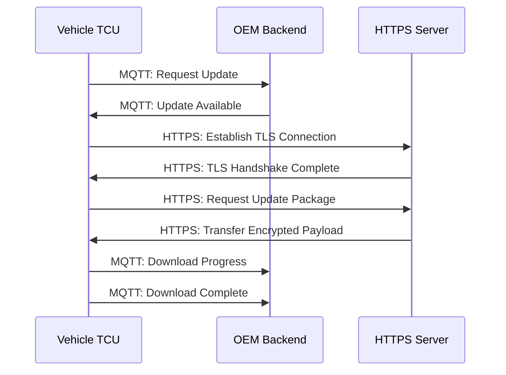

# HTTPS Protocol in OTA Systems

## Introduction to HTTPS in OTA Architecture

HTTPS, or Hypertext Transfer Protocol Secure, serves as a fundamental communication medium in Over-The-Air update systems. The protocol establishes a secure channel for data transmission between the OEM backend and vehicle components, specifically targeting the delivery of update payloads. HTTPS operates alongside MQTT within the OTA ecosystem, where each protocol fulfills distinct yet complementary roles in the update management process. The implementation of HTTPS addresses critical requirements for data integrity, security, and performance when transferring substantial software or firmware packages to vehicles.

## Protocol Characteristics and Technical Properties

HTTPS leverages the underlying HTTP protocol enhanced with TLS encryption to provide a secure communication layer. The protocol is particularly well-suited for OTA applications due to its inherent support for high-throughput data transfer and reliable delivery mechanisms. Unlike lightweight messaging protocols designed for frequent small message exchanges, HTTPS excels in handling large file transfers with minimal overhead. The protocol's widespread adoption and mature implementation across various platforms make it an ideal choice for automotive OTA systems where compatibility and reliability are paramount considerations.

## Role in OTA Update Delivery

The primary responsibility of HTTPS in OTA systems centers on the actual delivery of update payloads to vehicles. When an update campaign is initiated, the vehicle establishes an HTTPS connection to download the required software or firmware files from OEM-managed servers. This process involves the vehicle sending authenticated requests to retrieve specific update packages, which are then transferred over the encrypted HTTPS channel. The update files, which can range from megabytes to gigabytes in size, are hosted on infrastructure controlled by the device manufacturer or OEM, ensuring centralized control over the distribution of software updates.

## Security Properties and TLS Implementation

HTTPS provides comprehensive security features through its TLS encryption layer, which is essential for maintaining the integrity and confidentiality of OTA updates. The TLS protocol ensures that data transmitted between the server and vehicle remains protected against interception, modification, or tampering during transit. This security implementation addresses critical automotive cybersecurity requirements, particularly when transferring executable code or firmware that could potentially compromise vehicle safety or functionality if altered. The encryption process protects against man-in-the-middle attacks and ensures that only authenticated vehicles can access their designated update packages.

## Performance Considerations and Throughput Optimization

The selection of HTTPS for payload delivery stems from its superior performance characteristics for bulk data transfers. The protocol's ability to maintain high throughput while ensuring data integrity makes it particularly suitable for large OTA update packages. Speed and reliability become critical factors during update delivery, as vehicles may have limited connectivity windows or bandwidth constraints. HTTPS efficiently handles these scenarios through features like resumable downloads, connection persistence, and adaptive streaming, which collectively optimize the transfer process even under challenging network conditions.

## Complementary Integration with MQTT

HTTPS operates in conjunction with MQTT within the OTA ecosystem, creating a dual-protocol architecture that optimizes different aspects of the update process. While HTTPS handles the substantial payload transfers, MQTT manages control signaling, notifications, and status exchanges between the backend and vehicle. This separation of responsibilities allows each protocol to operate within its optimal use case. MQTT's lightweight nature makes it ideal for frequent status updates, command acknowledgments, and real-time monitoring, while HTTPS provides the robust foundation needed for reliable file delivery. The combined approach ensures efficient resource utilization and maintains system responsiveness throughout the update lifecycle.

## Data Flow and Communication Patterns

The OTA communication pattern follows a structured sequence where HTTPS and MQTT serve distinct phases of the update process. Initially, MQTT facilitates the negotiation and preparation phase, where the vehicle receives update notifications, confirms availability, and establishes the parameters for the upcoming transfer. Once the vehicle is ready to receive the update payload, HTTPS takes over to handle the actual file download. During this phase, the vehicle establishes secure connections to the OEM servers and retrieves the update packages in chunks or as complete files, depending on the implementation strategy. Throughout the download process, MQTT continues to provide status updates and progress reports, enabling the backend to monitor the transfer and respond to any issues that may arise.

## Server Infrastructure and Hosting Architecture

The hosting infrastructure for HTTPS-based OTA updates typically resides on servers managed directly by the OEM or their designated cloud service providers. This centralized hosting model provides several advantages, including controlled access to update packages, consistent availability, and simplified management of software versions. The servers are configured to handle high-volume download requests while maintaining security through proper certificate management and access controls. The infrastructure often incorporates content delivery networks or distributed caching mechanisms to optimize download speeds across different geographical regions, ensuring that vehicles worldwide can efficiently retrieve their updates regardless of their physical location.

## Security Implementation Details

The TLS implementation within HTTPS provides multiple layers of security protection for OTA communications. The encryption process utilizes industry-standard cryptographic algorithms to protect data confidentiality, while digital certificates authenticate the identity of both the server and, in some implementations, the vehicle. The integrity of transferred data is maintained through cryptographic hash functions that detect any unauthorized modifications during transit. This comprehensive security framework ensures that update packages arrive at the vehicle exactly as intended by the OEM, preventing the introduction of malicious code or corrupted software that could compromise vehicle operation or safety systems.

## System Reliability and Error Handling

HTTPS implementations in OTA systems incorporate robust error handling mechanisms to ensure reliable update delivery. The protocol supports features such as automatic retry logic, connection recovery, and partial download resumption, which collectively enhance the reliability of the update process. When network interruptions occur, the system can typically resume downloads from the last successful transfer point, minimizing the need to restart entire file transfers. Additionally, HTTPS provides mechanisms for verifying the integrity of received data through checksums and digital signatures, allowing the vehicle to confirm that downloaded packages are complete and uncorrupted before proceeding with installation.

## Scalability and System Performance

The HTTPS-based OTA architecture is designed to scale efficiently across large vehicle fleets. The protocol's stateless nature allows servers to handle numerous concurrent connections without maintaining extensive session state, enabling efficient resource utilization. Content delivery optimizations, including compression algorithms and caching strategies, further enhance system performance by reducing bandwidth requirements and minimizing transfer times. The scalable nature of HTTPS ensures that OEMs can support growing vehicle populations while maintaining consistent update delivery performance and reliability across their entire fleet.

## Conclusion and Protocol Synergy

HTTPS serves as a critical component in modern OTA systems, providing the secure and reliable foundation necessary for delivering software updates to vehicles. Its integration with MQTT creates a comprehensive communication framework that addresses the diverse requirements of automotive update management. While HTTPS handles the demanding task of payload delivery with its high-throughput capabilities and robust security features, MQTT manages the lightweight control and status communications that keep the update process coordinated and responsive. This complementary relationship between protocols enables OEMs to implement OTA solutions that are both efficient and secure, supporting the growing complexity of automotive software systems while maintaining the safety and reliability standards required in modern vehicles.