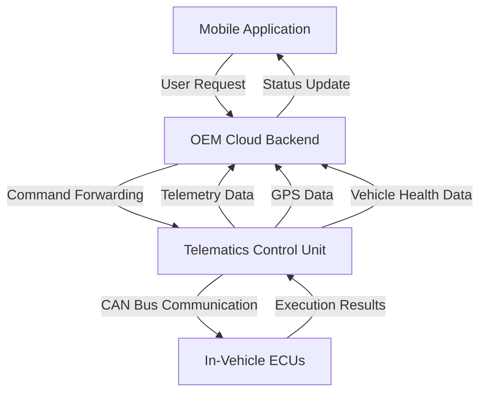
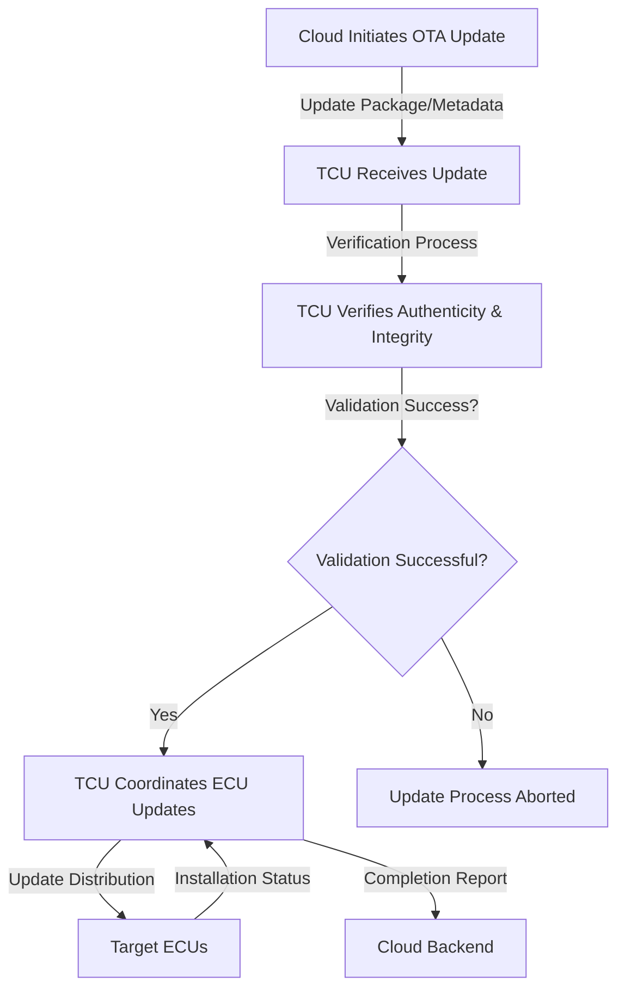
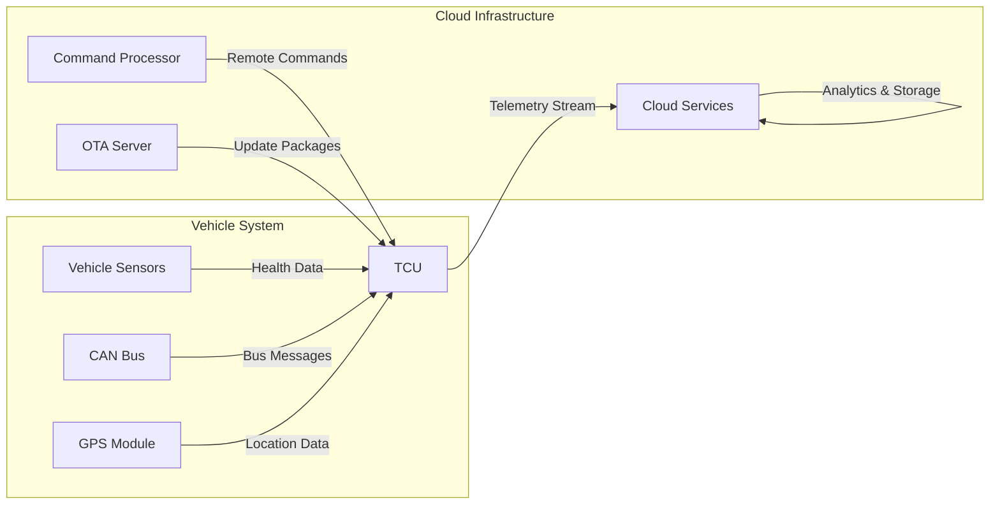

# Telematics Control Unit (TCU) Architecture and Functionality

## Introduction to the Telematics Control Unit

The Telematics Control Unit (TCU) serves as a critical Electronic Control Unit within modern vehicles, enabling seamless communication between the vehicle and external cloud services. As vehicles become increasingly connected, the TCU acts as the primary gateway for all vehicle-to-cloud interactions, facilitating remote control features, telemetry data collection, and Over-The-Air (OTA) update capabilities. The TCU operates as an intermediary component that bridges the gap between user-facing mobile applications, cloud backend services, and the various in-vehicle ECUs responsible for executing physical vehicle functions.

## System Architecture and Communication Flow

The TCU operates within a sophisticated multi-tier architecture that enables comprehensive vehicle connectivity. When a user initiates a remote function through a smartphone application, such as locking or unlocking doors, checking battery status, retrieving vehicle location, or remotely starting the vehicle, the request follows a defined path through the system. The mobile application communicates with the OEM cloud backend, which then forwards the command to the TCU installed in the vehicle. The TCU processes this command and communicates with the appropriate in-vehicle ECUs to execute the requested action. This architecture ensures that all remote commands are properly authenticated, routed, and executed through the vehicle's existing control systems.

## Data Collection and Management

The TCU continuously collects and manages various types of vehicle data to support connected services and maintain situational awareness. This data collection includes GPS location information, CAN bus data streams, vehicle health metrics, engine status parameters, and other operational telemetry. The TCU processes this information in real-time and uploads it to the cloud through its cellular connection, enabling remote monitoring and analysis. The continuous data stream supports various cloud-based services and provides the foundation for predictive maintenance, vehicle tracking, and fleet management applications. The TCU's data collection capabilities are essential for maintaining an accurate and up-to-date representation of the vehicle's state in the cloud backend.

## Over-The-Air Update Process

The TCU plays a central role in managing Over-The-Air updates for the vehicle's electronic systems. When an OTA update is initiated, the update package or metadata is first delivered to the TCU from the cloud backend. The TCU performs critical verification steps to ensure the authenticity and integrity of the software before allowing the update process to proceed. This verification process typically involves cryptographic signature validation and integrity checks to prevent unauthorized or corrupted updates from being installed. Once the update package is successfully validated, the TCU coordinates the update process for the target ECUs within the vehicle, managing the distribution and installation of software updates across the vehicle's electronic architecture.

## Connectivity Technologies

The TCU maintains continuous connectivity with cloud services using various cellular technologies depending on vehicle design and regional availability. Modern TCUs primarily utilize LTE networks for high-speed communication, with fallback support for legacy technologies including 2G, 3G, and 4G networks where necessary. This multi-technology approach ensures reliable connectivity across different geographical regions and network conditions. The TCU's cellular connection serves as the primary communication channel for both upstream telemetry data transmission and downstream command reception. The continuous or periodic connectivity maintained by the TCU enables real-time vehicle monitoring and immediate response to user commands, forming the backbone of the connected vehicle experience.

## Cloud-Enabled Services and Applications

Through its continuous data collection and communication capabilities, the TCU enables a wide range of cloud-based services that enhance the vehicle ownership experience. The comprehensive vehicle-level data accessible through the TCU supports predictive maintenance services that can anticipate component failures before they occur, enabling proactive service scheduling. Vehicle tracking capabilities leverage GPS data collected by the TCU for security and fleet management applications. The TCU's connectivity also enables various OTA-delivered services, including feature activation, software updates, and configuration changes that can be deployed remotely without requiring physical vehicle access. These cloud-enabled services transform the vehicle from a static mechanical device into a dynamic, continuously improving platform that can evolve throughout its lifecycle.

## Data Flow and Communication Patterns

The TCU establishes and maintains bidirectional communication patterns that support both continuous telemetry and event-driven command processing. From the vehicle perspective, the TCU continuously collects CAN bus data, GPS information, and vehicle health metrics, uploading this data to the cloud through its cellular connection. This upstream data flow provides the cloud backend with real-time insights into vehicle status and operation. From the cloud perspective, the TCU receives commands, configuration updates, and OTA instructions that are delivered to the vehicle as needed. This downstream communication enables remote control functionality and system updates. The dual-direction data flow ensures that the vehicle remains connected and responsive while maintaining accurate status reporting to cloud services.

## Future Development and Regulatory Considerations

The evolution of TCU technology continues to advance with increasing connectivity requirements and regulatory demands across different markets. Future developments in TCU hardware and software stacks will focus on enhanced security capabilities, improved processing power, and support for emerging communication technologies including 5G networks. Regulatory and regional standards significantly influence TCU implementation, with different markets imposing specific requirements for data privacy, security, and communication protocols. The TCU must comply with these varying regulatory frameworks while maintaining consistent functionality across global vehicle deployments. Understanding these regional requirements and technical constraints is essential for successful TCU implementation and operation in diverse automotive markets worldwide.