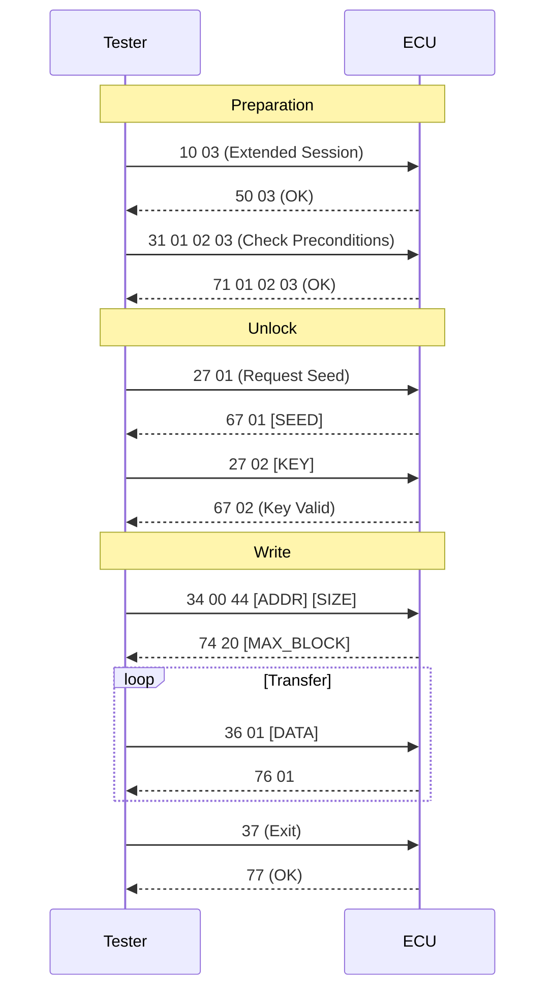

# Unified Diagnostic Services (UDS) - Application Layer

**Unified Diagnostic Services (UDS)**, specified in **ISO 14229-1**, is the universal language spoken by vehicle ECUs. It sits at the **Application Layer** of the OSI model and is independent of the underlying transport protocol (CAN, Ethernet, LIN, FlexRay).

!!! abstract "Core Concept"
    UDS defines *what* to say (e.g., "Reset yourself"), not *how* to transmit it (e.g., "Send CAN ID 0x7E0").

## Service Identifier (SID)

Every UDS request starts with a 1-byte **Service Identifier**.

- **Request SID:** `0xXX`
- **Positive Response SID:** `0xXX + 0x40`
- **Negative Response SID:** `0x7F`

| Service Type | SID (Hex) | Description |
| :--- | :--- | :--- |
| **Diagnostic Management** | `0x10` | Session Control (Default, Programming, Extended) |
| | `0x11` | ECU Reset (Hard, Soft) |
| | `0x27` | Security Access (Seed/Key) |
| | `0x28` | Communication Control (Silence Bus) |
| | `0x3E` | Tester Present (Keep-Alive) |
| **Data Transmission** | `0x22` | Read Data By Identifier (DID) |
| | `0x2E` | Write Data By Identifier (DID) |
| **Stored Data** | `0x19` | Read DTC Information (Fault Codes) |
| | `0x14` | Clear Diagnostic Information |
| **Upload/Download** | `0x34` | Request Download |
| | `0x36` | Transfer Data |
| | `0x37` | Request Transfer Exit |
| **Routine** | `0x31` | Routine Control (Start, Stop, Result) |

## Standard Flashing Workflow

A typical OTA update involves utilizing a specific sequence of these services.

## Negative Response Codes (NRC)

When things go wrong, the ECU replies with `7F [SID] [NRC]`.

| NRC (Hex) | Name | Meaning |
| :--- | :--- | :--- |
| `0x11` | Service Not Supported | "I don't know what 0x99 is." |
| `0x12` | Sub-function Not Supported | "I know 0x10, but I don't support mode 0x04." |
| `0x13` | Format Error | "Packet length is wrong." |
| `0x22` | Conditions Not Correct | "Engine is running, cannot flash." |
| `0x24` | Request Sequence Error | "You forgot to Request Download before Transfer Data." |
| `0x31` | Request Out Of Range | "Address 0xFFFFFFFF does not exist." |
| `0x33` | Security Access Denied | "You are locked. Do 0x27 first." |
| `0x35` | Invalid Key | "Wrong password." |
| `0x78` | Response Pending | "I'm busy, please wait (reset P2 timer)." |

!!! tip "Handling NRC 0x78"
    NRC `0x78` is not an error; it's a "Wait" signal. The Tester implies that the ECU is working on a long task (like erasing flash). The Tester must reset its timeout counter and wait for the final response.

## Data Identifiers (DIDs)

DIDs are 2-byte IDs used to read/write specific data elements.

- **Standard DIDs:** `0xF187` (Part Number), `0xF190` (VIN).
- **Manufacturer DIDs:** Defined by OEM (e.g., `0x1234` = Battery Health SOH).

## Routine Identifiers (RIDs)

RIDs are 2-byte IDs used with Service `0x31` to trigger functions.

- `0x0203`: Check Programming Preconditions.
- `0xFF00`: Erase Memory.
- `0xFF01`: Check Memory Checksum.

## Conclusion

UDS is the vocabulary of OTA. Whether over CAN (low bandwidth) or Ethernet (high bandwidth), the **Application Layer** logic remains identical. The Tester acts as the master, orchestrating the state of the ECU through these standardized services.
