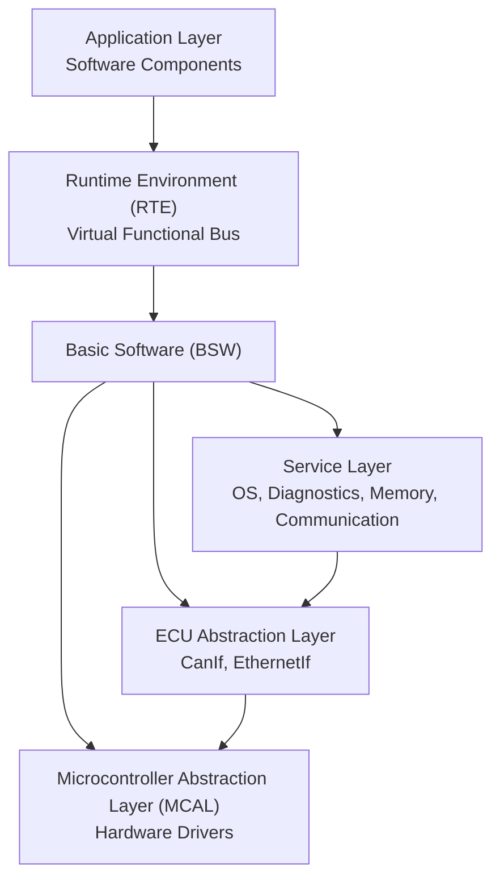
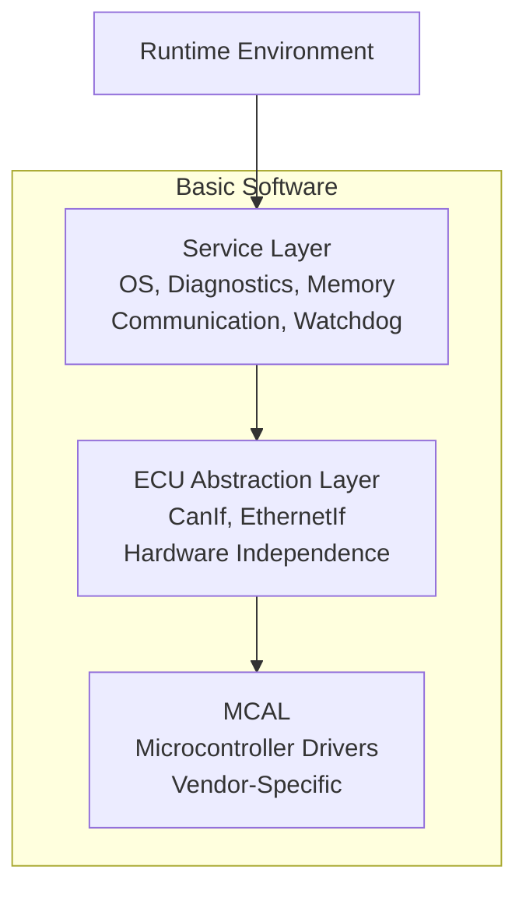
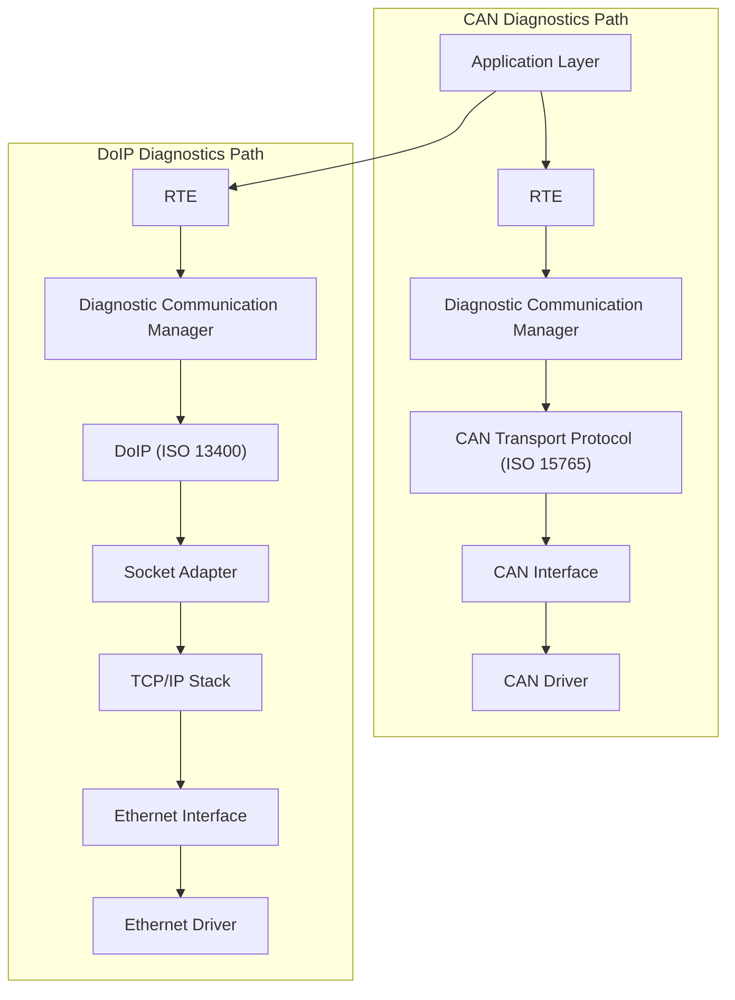

# AUTOSAR Architecture for Automotive Communication and Diagnostics

AUTOSAR, which stands for Automotive Open System Architecture, represents a global development partnership established in 2003 by leading automotive OEMs and suppliers including BMW, Volkswagen, Daimler, Bosch, and PSA. The fundamental objective of AUTOSAR is to define a standardized, open software architecture for automotive Electronic Control Units (ECUs). Historically, automotive software development suffered from tight coupling between software applications and specific hardware implementations or Tier-1 suppliers. AUTOSAR addresses this challenge by decoupling application software from underlying hardware, thereby enabling software portability, reuse across different platforms, and supplier independence. This architectural approach allows software components to be reused across various ECUs and hardware platforms with minimal modification requirements.

The AUTOSAR Classic Platform architecture is organized into three primary layers: the Application Layer, the Runtime Environment (RTE), and the Basic Software (BSW). The Application Layer contains software components that implement specific vehicle functions such as emergency braking, lane-keeping assist, cruise control, and infotainment features. Multiple software components can coexist within this layer, each contributing to the overall vehicle functionality. AUTOSAR facilitates standardized communication between application software and lower layers through the Virtual Functional Bus concept, which enables software components to communicate with each other in a hardware-independent manner via well-defined ports and interfaces.

The Runtime Environment serves as a middleware layer that provides communication services between software components, both within a single ECU and across multiple ECUs. The RTE abstracts ECU-specific implementation details from the application software, acting as a bridge between the Application Layer and the Basic Software. This abstraction allows application developers to focus on functional requirements without concerning themselves with underlying hardware complexities or communication protocols.

Below the RTE lies the Basic Software, which is structured into three distinct layers: the Service Layer, the ECU Abstraction Layer, and the Microcontroller Abstraction Layer (MCAL). The Service Layer represents the uppermost layer of the Basic Software and provides services to application software that remain independent of both the microcontroller and ECU hardware. These services encompass operating system functionality, diagnostic services including UDS, memory management services, ECU state management, communication services, and watchdog management. While security-related services such as cryptographic services are also part of this layer, they fall outside the current scope of discussion.

The ECU Abstraction Layer provides a hardware-independent interface to vehicle communication buses and peripheral devices. Modules such as CanIf and EthernetIf reside within this layer, enabling upper layers to access CAN or Ethernet communication without dependency on specific controller implementations. This abstraction allows for seamless integration of different communication hardware while maintaining consistent interfaces for application software. The Microcontroller Abstraction Layer offers direct access to microcontroller peripherals through low-level drivers typically supplied by silicon vendors including NXP, Renesas, Infineon, or Texas Instruments. In scenarios where AUTOSAR does not fully meet specific timing or hardware requirements, Complex Device Drivers (CDD) may be implemented to handle specialized sensors or actuators that demand direct hardware access.

From a diagnostics perspective, Ethernet-based communication leverages Diagnostics over Internet Protocol (DoIP), which plays a crucial role in modern vehicle architectures. DoIP is standardized under ISO 13400 and operates in conjunction with diagnostic services defined by ISO 14229 (UDS), ensuring that all diagnostic services available over CAN are also accessible over IP. DoIP operates over Automotive Ethernet, typically utilizing 100BASE-T1 technology today, with 1000BASE-T1 gaining increasing adoption. Compared to traditional CAN communication, DoIP provides substantially higher bandwidth, making it particularly well-suited for operations such as flashing large software images and supporting complex modern vehicle architectures.

DoIP supports several key capabilities including vehicle identification and announcement, routing activation, node information services, and alive-check mechanisms for maintaining active connections. Additionally, DoIP supports IP-level services such as address assignment, vehicle discovery, connection management, status reporting, and comprehensive error handling. Within the AUTOSAR Ethernet stack, the Socket Adapter (SoAd) module binds socket-based communication to AUTOSAR Protocol Data Units (PDUs). The SoAd interfaces upward with diagnostic and communication modules while connecting downward with the TCP/IP stack, facilitating seamless integration between application-level diagnostics and network transport.

The Ethernet Interface module (EthernetIf) resides within the ECU Abstraction Layer and provides a hardware-independent interface to Ethernet controllers and transceivers. EthernetIf does not access hardware directly but instead calls Ethernet driver modules, a design that allows multiple Ethernet controllers or switches to be used within the same ECU without impacting upper layer software. Similarly, for CAN-based communication, the CAN Interface (CanIf) operates in the ECU Abstraction Layer, providing analogous hardware abstraction for CAN communication.

CAN communication presents inherent limitations, particularly the restriction of carrying only up to 8 bytes of payload per frame. To transmit diagnostic data exceeding this limitation, the CAN Transport Protocol (CAN-TP), standardized under ISO 15765, is employed. CAN-TP operates across the Network and Transport layers of the OSI model and enables segmentation and reassembly of larger messages. This protocol supports payloads up to 4095 bytes per message and defines four distinct frame types: Single Frame, First Frame, Consecutive Frame, and Flow Control Frame. Flow Control frames regulate the transmission process by specifying flow status, block size, and separation time between frames. In standard CAN addressing configurations, a Single Frame can carry up to 7 bytes of payload, while extended addressing reduces this capacity to 6 bytes. CAN-TP ensures reliable transmission of larger diagnostic messages, such as firmware blocks during flashing operations, by managing the segmentation, transmission, and reassembly process transparently to upper layers.

This overview of AUTOSAR focuses specifically on communication and diagnostics aspects of the architecture. Other AUTOSAR modules related to cybersecurity, such as the Crypto Interface and Communication Security Module (CSM), are outside the current scope and are addressed separately in dedicated documentation. The architectural principles and communication patterns described here form the foundation for understanding how modern vehicles implement Over-The-Air updates and diagnostic capabilities within a standardized, maintainable software framework.