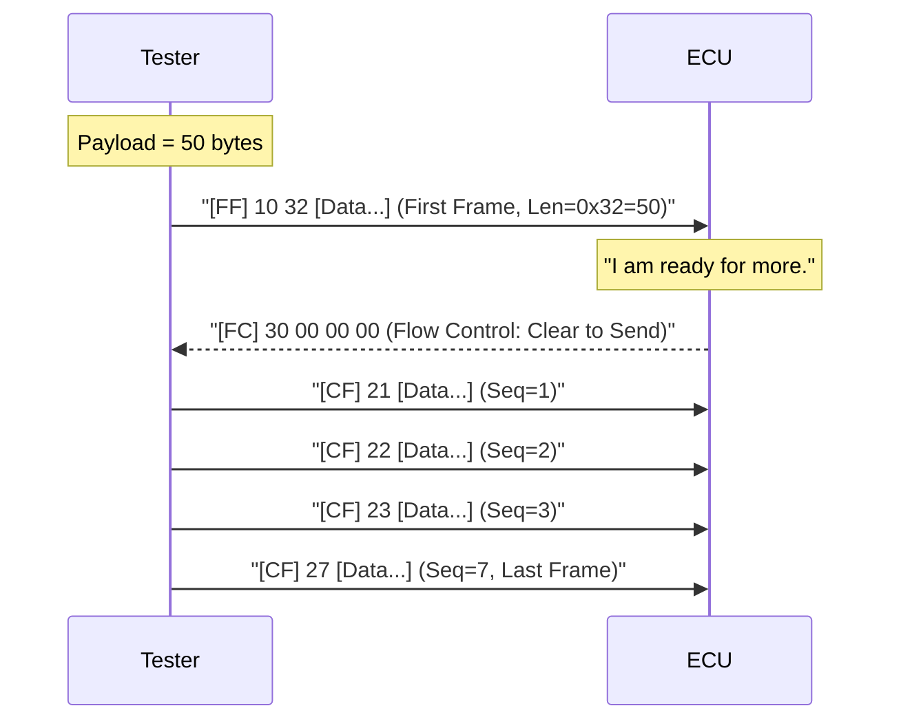

# UDS over CAN (ISO-TP)

While UDS defines the payload, **ISO 15765-2 (ISO-TP)** defines how to transport large UDS packets (up to 4095 bytes) over the **CAN Bus**, which has a payload limit of only **8 bytes** per frame.

## Addressing Scheme

In a typical Passenger Car:

- **Diagnostic Request ID:** `0x7E0` (Physical Request to ECU #1)
- **Diagnostic Response ID:** `0x7E8` (Response from ECU #1)
- **tFunctional Request ID:** `0x7DF` (Broadcast to ALL ECUs - "Tester Present")

## Protocol Control Information (PCI)

The first byte of the CAN payload (Process Control Information) defines the frame type.

| Frame Type | PCI (High Nibble) | Description |
| :--- | :--- | :--- |
| **Single Frame (SF)** | `0x0` | Payload fits in 1 frame (< 7 bytes). |
| **First Frame (FF)** | `0x1` | Start of multi-frame. Contains Total Length. |
| **Consecutive Frame (CF)** | `0x2` | Continuation data. Contains Sequence Index. |
| **Flow Control (FC)** | `0x3` | Receiver "Permission to Send". |

### 1. Single Frame (SF)

Payload <= 7 bytes.
`[0L] [Data] [Data] ...`

- **Example:** Tester sends "Read VIN" (`0x22 F1 90`). Length = 3.
- CAN Frame: `03 22 F1 90 00 00 00 00` (Padding with 0x00 or 0xAA).

### 2. Multi-Frame Sequence

Used when Payload > 7 bytes (e.g., Firmware Block).



## Flow Control Parameters

The **Flow Control (FC)** frame allows the receiver (ECU) to throttle the sender (Tester) if it is too slow to process data.

`30 [BS] [STmin] [Reserved]`

- **BS (Block Size):** How many CFs to send before waiting for another FC.
  - `0x00`: Send all frames without waiting.
  - `0x08`: Send 8 frames, then wait for FC.
- **STmin (Separation Time):** Minimum delay between frames.
  - `0x00` - `0x7F`: Time in milliseconds (ms).
  - `0xF1` - `0xF9`: Time in microseconds (100us - 900us).

!!! failure "Buffer Overflow"
    If the Tester ignores STmin and blasts frames too fast, the ECU's input buffer will overflow, causing a dropped message and a failed update. This is the #1 cause of OTA failures on CAN.

## CAN FD (Flexible Data-Rate)

Modern vehicles use **CAN FD**, which increases the payload from 8 bytes to **64 bytes**.
This drastically reduces overhead, as a Single Frame can hold 60+ bytes of UDS data, handling most requests without needing Multi-Frame ISO-TP.

## Implementation Example (Python / Scapy)

```python
# Utilizing Scapy's ISOTP layer
from scapy.all import *
from scapy.contrib.isotp import ISOTP

# Socket to talk Physical (7E0 -> 7E8)
sock = ISOTPSocket("can0", tx_id=0x7E0, rx_id=0x7E8, padding=True)

# Application Layer: "22 F1 90" (Read VIN)
req = b'\x22\xF1\x90'
sock.send(req)

# Transport Layer handles Segmentation/Reassembly automatically
resp = sock.recv()
print(f"Response: {resp.hex()}")
```

## Conclusion

UDS over CAN is the industry workhorse. While slower than Ethernet, its robustness and low cost mean it will remain the primary interface for body electronics (Door, Seat, Window ECUs) for years to come. OTA managers must strictly adhere to **Flow Control** timings to ensure stability.
