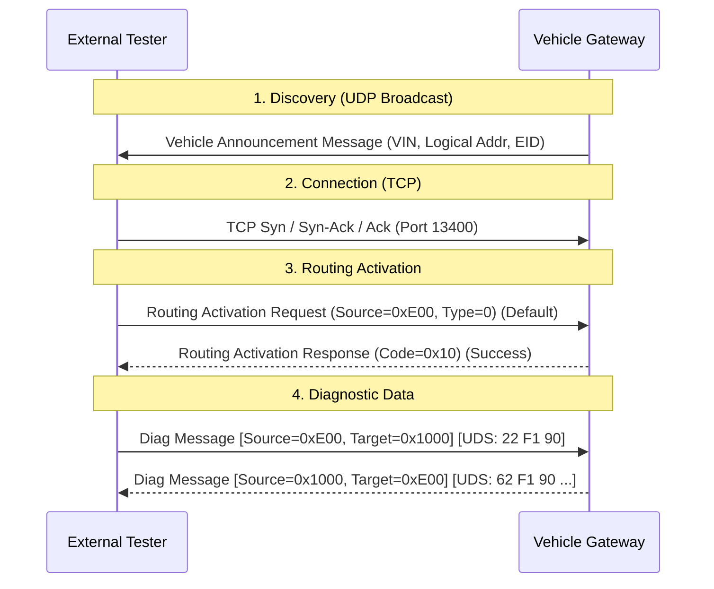

# UDS over IP (DoIP)

**Diagnostic over IP (DoIP)**, specified in **ISO 13400**, enables UDS communication over standard Ethernet (TCP/IP). It provides massive bandwidth (100 Mbps - 1 Gbps), making it mandatory for flashing Infotainment and ADAS systems.

## Architecture

DoIP wraps the UDS Packet in a specific **DoIP Header**.

`[DoIP Header] [UDS Message]`

### DoIP Header Structure (8 Bytes)

1. **Protocol Version:** `0x02` (ISO 13400-2:2012)
2. **Inverse Version:** `0xFD` (Bitwise inversion of 0x02)
3. **Payload Type:** e.g., `0x8001` (Diagnostic Message), `0x0001` (Vehicle Announcement)
4. **Payload Length (4 bytes):** Length of the data following.

## Comparison: CAN vs. DoIP

| Feature | CAN (ISO 15765) | DoIP (ISO 13400) |
| :--- | :--- | :--- |
| **Max Payload** | 4095 Bytes | ~4 GB (Limited only by TCP) |
| **Addressing** | 11-bit / 29-bit CAN ID | Source/Target Logical Address (16-bit) |
| **Reliability** | ACK by Hardware (CAN Ctrl) | TCP Handshake / IP Routing |
| **Discovery** | Static (dbc file) | Dynamic (Vehicle Announcement) |

## The DoIP Session Workflow

Unlike CAN (where you just blast valid IDs), DoIP requires a **Activation Handshake**.

### 1. Vehicle Identification (UDP)

When a Tester connects to the car's physical network, the car broadcasts a `Vehicle Announcement Message` on UDP Port 13400.

- Contains **VIN** and **EID** (Entity ID).
- Tells the Tester the Car's IP Address.

### 2. Routing Activation (TCP)

Before sending UDS, the Tester must "Log in".

- **Routing Activation Request:** "I am Tester 0xE00."
- **Gateway Response:** "OK, I know you." or "Authentication Required."

### 3. Diagnostic Message

Once activated, the Tester sends UDS payloads wrapped in DoIP.

- **Source Address:** `0x0E00` (Tester)
- **Target Address:** `0x1000` (ECU Gateway)
- **User Data:** `10 03` (UDS Session Control)

## External vs. Internal DoIP

- **External DoIP:** Diagnosing the car from an OBD-II dongle or Workshop Ethernet cable. The **Gateway** acts as the DoIP Edge Node/Firewall.
- **Internal DoIP:** The OTA Manager (TCU) inside the car talking to the Infotainment Unit (HU). No "Routing Activation" is typically needed for trusted internal links, but addressing concepts remain.

### Parallel Flashing

Because Ethernet is a switched network (not a shared bus like CAN), the DoIP Gateway can open parallel TCP sockets to multiple ECUs (e.g., Head Unit, Amp, Instrument Cluster) and flash them **simultaneously**.

- *CAN Limit:* ~500 KB/s total (Serial).
- *DoIP Limit:* ~100 MB/s per link (Parallel).

## Conclusion

DoIP is the logic for high-speed OTA. It treats the car like a Local Area Network (LAN). The OTA Manager utilizes DoIP to deliver massive map updates or ADAS model files that would take days on CAN.
