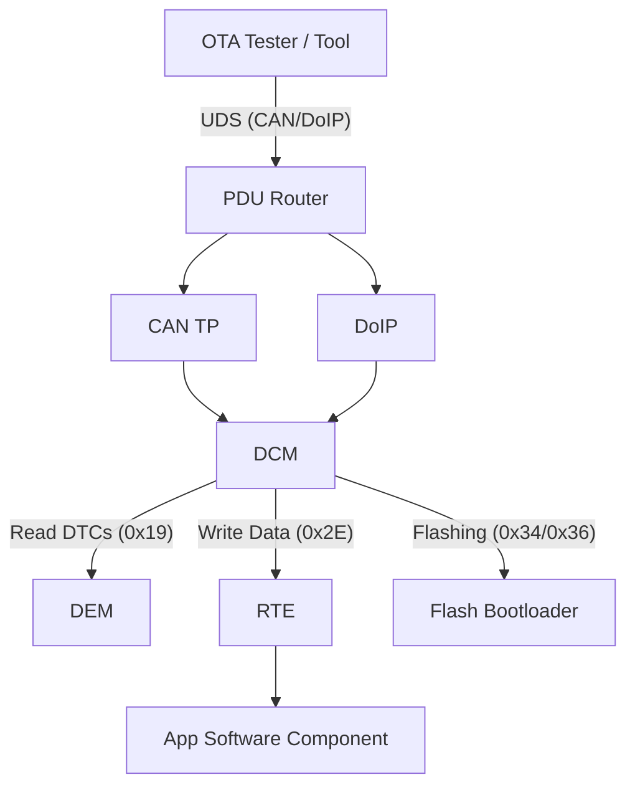

# AUTOSAR in OTA

**AUTOSAR (Automotive Open System Architecture)** is the standardized software architecture used by almost all major OEMs. Understanding how OTA interacts with the AUTOSAR stack is crucial for implementing compliant updates.

## The Diagnostic Stack

In AUTOSAR, diagnostics are handled by two main modules in the **Basic Software (BSW)**:

1. **DCM (Diagnostic Communication Manager):** Handles the "Conversation". It parses UDS requests (Side 0x10, 0x19, 0x27) and manages the session state.
2. **DEM (Diagnostic Event Manager):** Handles the "Memory". It stores Fault Codes (DTCs) and Freeze Frame data.

## DCM Responsibilities in OTA

When the UDS Tester sends a request, the **DCM** is the module that processes it.

- **Session State Machine:** DCM ensures you cannot jump to "Programming Session" without first passing "Extended Session" and strict checks.
- **Security Access:** DCM calls the `SecurityAccess_GetSeed()` and `CompareKey()` functions (often implemented by the OEM's security module).
- **Timing:** DCM manages the **P2Client** and **S3Server** timers automatically.

## BSW Modules for Flashing

### 1. Fee / Fls (Flash Drivers)

To write the new firmware, the BSW uses the **Fee (Flash EEPROM Emulation)** and **Fls (Flash SPI)** drivers.

- **Constraint:** You cannot execute code from the same Flash Bank you are erasing. The code must run from RAM or a separate Bootloader partition.

### 2. CanTp / DoIP

The Transport Layer (ISO-TP or DoIP) reassembles the segmented firmware blocks into a linear buffer before passing it to the DCM.

### 3. CryIf (Crypto Interface)

Before writing data to flash, the DCM calls the **Crypto Stack** to verify the signature of the firmware block.

## Mode Management (BswM)

The **BswM (Basic Software Mode Manager)** controls the vehicle mode.

- **Run Mode:** Normal operation.
- **Shutdown Mode:** Prepare for sleep.
- **Reprogramming Mode:** BswM detects the `DiagnosticSessionControl(0x02)` request and switches the BSW into a special mode where:
  - Non-essential tasks are stopped.
  - Network Management (NM) keeps the bus awake.
  - Watchdogs are kicked differently to prevent reset during long erase operations.

## Conclusion

In an AUTOSAR ECU, you don't write "UDS Code" from scratch. You **configure** the DCM (via ARXML) to support specific services and callbacks. The OTA workflow is essentially a sequence of interactions triggering these pre-configured DCM behaviors.
