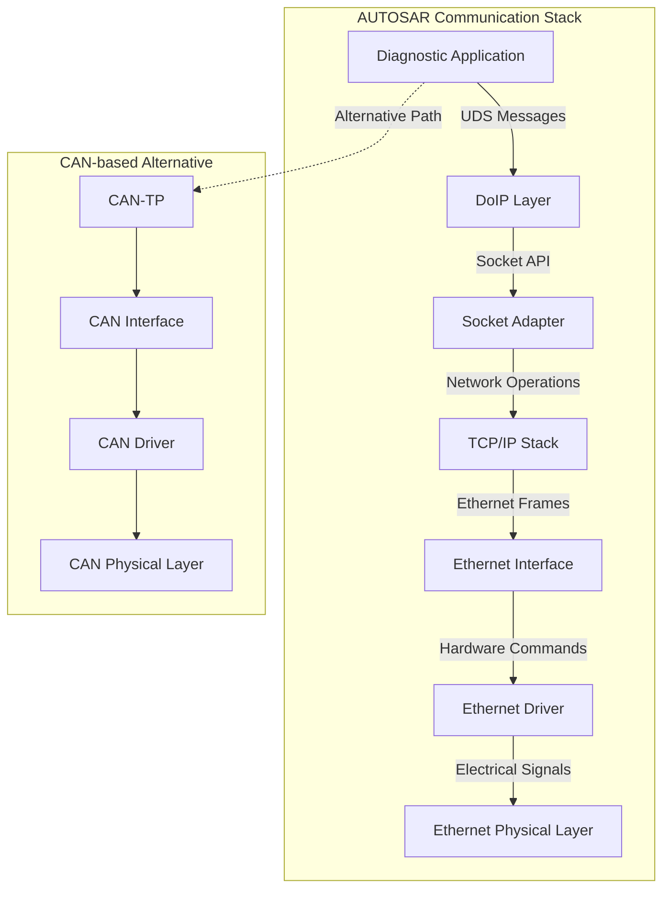
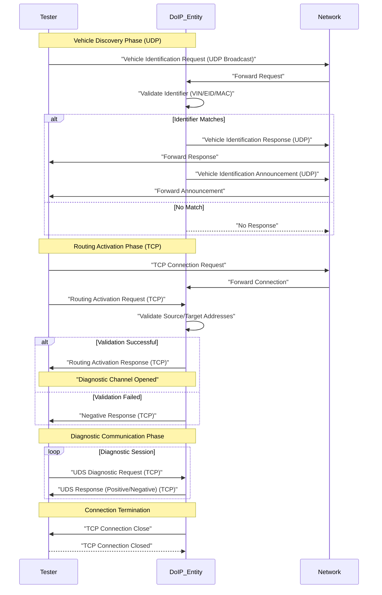

# Diagnostics over IP (DoIP) Technical Documentation

## Introduction to DoIP Architecture

Diagnostics over IP (DoIP) serves as the transport layer protocol for Ethernet-based diagnostics in modern automotive systems. Within the AUTOSAR communication stack, DoIP occupies a position analogous to CAN-TP in CAN-based systems, but interfaces with Ethernet-specific components rather than CAN hardware. The protocol enables high-speed, scalable diagnostic communication while maintaining full compatibility with existing UDS (Unified Diagnostic Services) as defined in ISO 14229.

DoIP operates as a bridge between the diagnostic application layer and the underlying Ethernet transport infrastructure. The protocol communicates with the Socket Adapter component, which in turn interfaces with the TCP/IP stack. Below this layer, the Ethernet Interface and Ethernet driver manage the physical network communication. This layered architecture ensures clean integration within the AUTOSAR framework while providing the necessary abstraction for diagnostic applications.

## System Architecture and Component Integration

The DoIP implementation fits into the broader AUTOSAR communication stack as a specialized transport protocol. Unlike CAN-TP, which interacts with CAN Interface, CAN driver, and CAN physical layer components, DoIP is designed specifically for Ethernet-based communication. The protocol leverages the Socket Adapter for network operations, utilizes the TCP/IP stack for reliable data transport, and relies on the Ethernet Interface and driver for physical layer connectivity.

This architectural separation allows diagnostic applications to remain protocol-agnostic while the underlying transport handles the medium-specific details. The choice between CAN-TP and DoIP is determined by the communication medium, with DoIP providing the necessary capabilities for high-bandwidth Ethernet diagnostics and flashing operations.

## DoIP Connection Establishment Process

The establishment of a DoIP connection between an external diagnostic tester and a vehicle ECU follows a standardized sequence that ensures proper identification and secure communication. This process consists of three main phases: vehicle discovery, routing activation, and diagnostic communication.

### Vehicle Discovery Phase

The connection process begins with vehicle discovery, where the external diagnostic tester attempts to identify compatible DoIP entities within the vehicle network. The tester broadcasts a Vehicle Identification Request message using UDP (User Datagram Protocol). UDP is specifically chosen for this phase because it is connectionless and requires minimal overhead, making it ideal for discovery and announcement purposes where reliability is not critical.

Upon receiving the Vehicle Identification Request, each DoIP entity in the vehicle compares the received identifier with its internally stored values. The identifier may be an Entity ID (EID), MAC address, or Vehicle Identification Number (VIN), depending on the specific configuration. If a match occurs, the DoIP entity responds with a Vehicle Identification Response message. If no match is found, the entity remains silent, and the discovery process terminates for that particular entity.

When a successful match occurs, the DoIP entity sends a Vehicle Identification Announcement message. This announcement confirms to the tester that a valid DoIP entity is available and ready for communication. At this point, the tester has successfully identified a compatible diagnostic target and can proceed to the next phase.

### Routing Activation Phase

Following successful vehicle discovery, the tester initiates the routing activation phase using TCP (Transmission Control Protocol). Unlike UDP, TCP provides a reliable, connection-oriented communication channel suitable for sustained diagnostic sessions. The tester sends a Routing Activation Request to the identified DoIP entity, establishing a TCP connection for subsequent communication.

During the routing activation process, the DoIP entity performs security validation by checking the source address of the tester against preconfigured values stored in the ECU. Additionally, the entity validates the target address of the ECU to ensure proper routing. These validation steps help prevent unauthorized diagnostic access and maintain system security.

If the validation succeeds, the DoIP entity responds with a Routing Activation Response message and opens a dedicated diagnostic communication channel. This channel remains active throughout the diagnostic session and provides the transport mechanism for all subsequent diagnostic messages.

### Diagnostic Communication Phase

Once routing is successfully activated, the tester can begin sending diagnostic messages over the established TCP connection. These messages are standard UDS requests, identical in content and structure to those used in CAN-based diagnostics. The diagnostic services include session control, diagnostic trouble code (DTC) readout, programming services, and all other operations defined in ISO 14229.

DoIP serves purely as a transport mechanism, encapsulating the UDS messages within TCP packets for reliable delivery. The ECU processes these UDS requests according to standard diagnostic procedures and responds with either positive or negative responses as defined by the UDS specification. The TCP connection remains active throughout the entire diagnostic or flashing session, ensuring continuous and reliable communication between the tester and the ECU.

### Connection Termination

After all diagnostic or programming activities are completed, the DoIP entity initiates connection termination. The TCP connection is gracefully closed, releasing network resources and ending the diagnostic session. No further communication can occur until a new discovery and routing activation sequence is initiated, ensuring that each diagnostic session is properly authenticated and authorized.

## Protocol Characteristics and Benefits

DoIP combines the reliability of TCP-based communication with the flexibility of IP networking to provide superior diagnostic capabilities compared to traditional CAN-based diagnostics. The protocol supports significantly higher data transfer rates, enabling faster diagnostic operations and more efficient software flashing. Additionally, the IP-based nature of DoIP allows for easier integration with modern network infrastructure and supports advanced features such as remote diagnostics and over-the-air updates.

The preservation of UDS compatibility ensures that existing diagnostic applications and procedures can be migrated to DoIP with minimal modification. This backward compatibility, combined with the enhanced performance capabilities, makes DoIP the preferred choice for next-generation automotive diagnostic systems, particularly for electric vehicles and advanced driver-assistance systems that require high-bandwidth communication for diagnostic and programming operations.