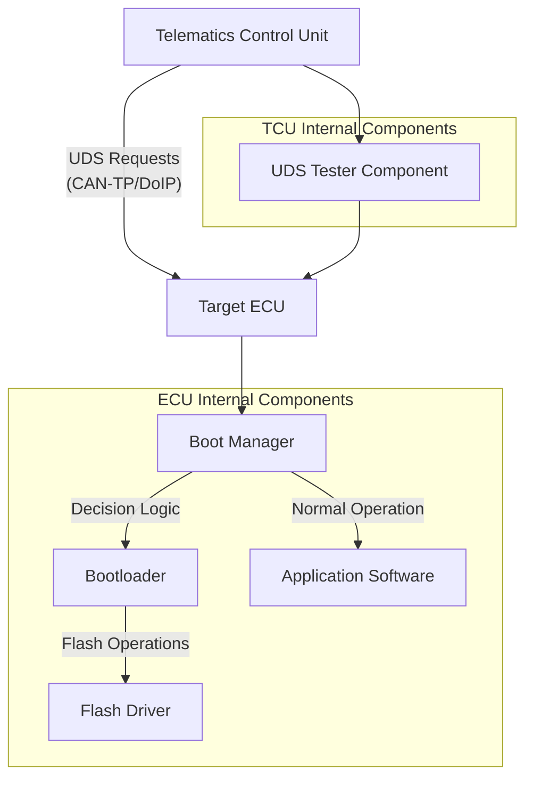
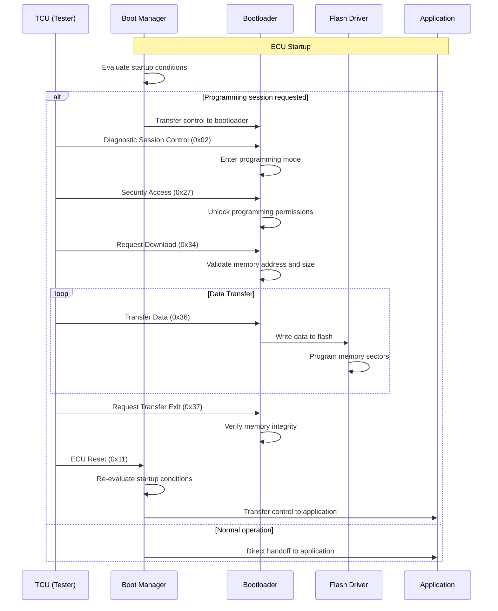

# ECU Programming Architecture and Bootloader Implementation

## System Architecture Overview

The Electronic Control Unit programming process involves a clear separation of responsibilities between external and internal entities. The Telematics Control Unit functions as the gateway-side tester that initiates and orchestrates the programming process, while the actual memory programming operations are executed entirely within the target ECU. This architectural separation ensures that the TCU maintains control over the programming sequence through diagnostic communication, while the ECU retains full authority over its internal flash memory operations.

The communication between these entities utilizes standardized protocols, with CAN-TP employed for CAN-based architectures and DoIP (Diagnostics over IP) for Ethernet-based vehicle networks. The TCU contains a UDS tester component that generates diagnostic and programming requests, which are transported over these protocols to reach the target ECU.

## Internal ECU Components

### Boot Manager

The boot manager serves as the critical decision-making component within the ECU's firmware architecture. Every time the ECU powers up or experiences a reset, execution begins in the boot manager. This component evaluates predefined conditions to determine whether the system should operate in application mode or transition to programming mode. The boot manager's decision is based on factors such as the presence of an active programming session request, system status flags, and the integrity of the existing application software.

When the boot manager receives a Diagnostic Session Control request with sub-function 0x02 (programming session), it recognizes this as a directive to enter programming mode. In response, the boot manager transfers control from the application software to the bootloader component, enabling the ECU to handle subsequent programming-related operations.

### Bootloader

The bootloader represents the primary component responsible for executing all ECU programming operations. Unlike the TCU, which only sends commands and data, the bootloader actively manages the programming process within the ECU. It handles various UDS services specifically related to programming, including Security Access (0x27) for unlocking programming permissions, Write Data By Identifier (0x2E) for fingerprint writing, and Routine Control services for memory management operations.

The bootloader validates all incoming programming requests, ensuring that target memory addresses and data sizes are within acceptable ranges. During the data transfer phase, the bootloader receives data blocks from the TCU and coordinates with the flash driver to write this data to the appropriate memory locations. Upon completion of the programming process, the bootloader performs integrity verification using checksums or hash algorithms to ensure the programmed data is correct and complete.

### Flash Driver

The flash driver operates as the low-level component that directly interfaces with the ECU's flash memory hardware. This component provides hardware-specific application programming interfaces that the bootloader utilizes to perform actual erase and write operations on the flash memory. The flash driver abstracts the complexities of flash memory technology, handling sector management, write timing requirements, and error correction mechanisms.

When the bootloader needs to erase memory regions or write new data, it calls the appropriate flash driver APIs. The flash driver then executes these operations at the hardware level, managing the physical programming of memory cells sector by sector. This separation of concerns allows the bootloader to focus on high-level programming logic while the flash driver handles the intricacies of flash memory technology.

## Programming Workflow Sequence

The ECU programming process follows a well-defined sequence of operations that begins with session establishment and concludes with application startup. The workflow is initiated when the TCU sends a Diagnostic Session Control request with sub-function 0x02, signaling the intent to enter programming mode. This request is processed by the boot manager, which transitions control to the bootloader.

During the programming session, the bootloader processes various UDS services in sequence. Security Access services must be successfully completed to unlock programming capabilities, ensuring that only authorized entities can modify the ECU's software. The Request Download service specifies the target memory address and size for the new software image, which the bootloader validates against the ECU's memory map.

The Transfer Data phase involves the systematic transmission of data blocks from the TCU to the ECU. Each data block is received by the bootloader and forwarded to the flash driver for programming. The flash driver writes these blocks to the appropriate memory sectors, managing the physical programming operations according to the flash memory's specifications.

Upon completion of data transfer, the Request Transfer Exit service signals the end of the download phase. The bootloader then performs memory integrity verification, typically using checksums or cryptographic hash functions, to ensure the programmed data is complete and uncorrupted. This verification step is critical for maintaining system reliability and safety.

## Reset and Application Startup

Following successful programming completion, the TCU issues an ECU Reset service to restart the system. This reset causes the ECU to restart its execution sequence, beginning again in the boot manager. However, this time the boot manager's evaluation yields different results, as the programming session has concluded and no programming mode request is active.

The boot manager determines that normal operation should resume and transfers control to the application software. The newly programmed application then begins execution, utilizing the updated software image that was programmed during the previous session. This transition ensures a smooth return to normal ECU operation with the updated software.

This architecture maintains a clear distinction between orchestration and execution responsibilities. The TCU serves as the external orchestrator that controls the programming sequence through diagnostic communication, while the bootloader, with support from the flash driver, executes the actual memory programming operations within the ECU. This separation provides both security and reliability, as the ECU retains ultimate control over its internal memory operations while accepting commands from authorized external testers.