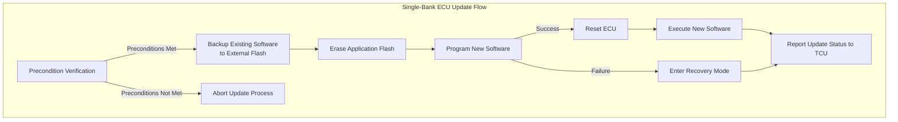
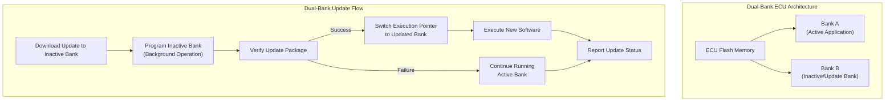

# Target Device Architecture in OTA Updates

## Introduction to Target Devices in OTA Systems

Target devices represent the Electronic Control Units (ECUs) within a vehicle that are the actual recipients of over-the-air updates. While OTA infrastructure, communication protocols, and backend systems form the delivery mechanism, target ECUs are the endpoints where software updates are ultimately installed and executed. The evolution of OTA technology has necessitated significant advancements in ECU hardware design, particularly concerning memory layout, update duration, safety mechanisms, and system reliability. These requirements stem from the fundamental constraint that vehicles cannot remain inoperative for extended periods during updates, and certain ECUs cannot be reprogrammed while actively controlling critical vehicle functions. To address these challenges, the automotive industry has developed distinct memory architectures for ECUs, primarily categorized as single-bank and dual-bank systems.

## Single-Bank ECU Architecture

In a single-bank ECU architecture, both the bootloader and application software coexist within a single contiguous flash memory region. This design represents a cost-effective approach to ECU design but imposes significant constraints on the update process. When a Telematics Control Unit (TCU) initiates an OTA update to a single-bank ECU, the system must first satisfy stringent preconditions before proceeding with the flashing operation. These preconditions are particularly critical for ECUs managing safety-critical functions such as engine management, brake systems, or powertrain control. For such ECUs, the vehicle must be in a non-running, non-driving state to ensure safe update execution.

The update process for single-bank ECUs follows a sequential pattern that begins with precondition verification. If the ECU is actively operating when an update command is received, the TCU will immediately abort the process regardless of user approval. The update can only proceed after all safety and operational preconditions are met, which may include vehicle ignition state, battery charge level, and other system status checks. Once these conditions are satisfied, the ECU typically creates a backup of the existing application software, often storing it in external flash memory through communication interfaces such as Serial Peripheral Interface (SPI) or Inter-Integrated Circuit (I2C). This backup serves as a recovery mechanism in case the update process encounters failures.

Following the backup operation, the ECU erases the existing application from its flash memory and proceeds to program the new software into the same memory region. This sequential erase-and-program operation contributes to extended update times, as the ECU cannot execute any application code during the flashing process. After the programming operation completes successfully, the ECU undergoes a reset sequence and begins executing the newly installed software. The update status, including success or failure indicators, is then communicated back to the TCU and subsequently to the OEM backend systems for record-keeping and further processing.

The single-bank architecture, while economically advantageous due to its minimal flash memory requirements, presents several operational challenges. The sequential nature of the update process results in extended vehicle downtime, which may be unacceptable for certain use cases. The requirement for the vehicle to remain in a safe, non-operational state throughout the update process limits flexibility in update scheduling. Furthermore, the risk of ECU unavailability during a failed update event necessitates robust recovery mechanisms and may result in temporary loss of vehicle functionality until recovery procedures can be completed.

## Dual-Bank ECU Architecture

Dual-bank ECU architecture addresses many limitations inherent in single-bank designs by implementing a divided flash memory structure. In this configuration, the total flash memory is partitioned into two independent regions, commonly designated as Bank A and Bank B. One bank contains the currently executing application software, while the second bank remains reserved for receiving and validating update packages. This architectural approach enables simultaneous execution of the current application while preparing the new software version in the background.

The OTA update process for dual-bank ECUs leverages this parallel capability to significantly improve update flexibility and reduce vehicle downtime. When an update is triggered, the new software image is downloaded and programmed into the inactive bank while the active bank continues to execute the existing application. This concurrent operation allows certain updates to proceed even while the vehicle remains operational, though the actual feasibility depends on the ECU's criticality level and the OEM's specific update policies. The ability to perform background programming without interrupting vehicle functionality represents a substantial improvement over single-bank systems.

Once the new software is completely programmed into the inactive bank, the ECU performs verification procedures to ensure the integrity and authenticity of the update package. These verification steps typically include checksum validation, digital signature verification, and other integrity checks to confirm that the new software is complete and uncorrupted. After successful verification, the TCU sends a command to the ECU to switch the execution pointer from the active bank to the newly updated bank. The timing of this switch operation varies according to OEM-defined conditions and may occur immediately upon verification completion, during the next ignition cycle, or based on other predetermined criteria.

Following the execution switch, the previously active bank transitions to an inactive state. The disposition of this bank depends entirely on OEM design decisions and system requirements. Some implementations may immediately erase the old bank to prepare for future updates, while others might retain the previous version as a fallback option for potential rollback scenarios. This retention capability provides an additional safety net, allowing the system to revert to the previous software version if critical issues are discovered in the new implementation. The flexibility in managing bank states after updates enables OEMs to implement various recovery and maintenance strategies according to their specific requirements.

## Comparative Analysis and Trade-offs

The selection between single-bank and dual-bank ECU architectures involves careful consideration of multiple factors, with each approach presenting distinct advantages and limitations. Single-bank ECUs offer significant cost advantages due to their reduced flash memory requirements and simpler hardware design. The minimal memory footprint translates to lower component costs and reduced board space requirements, making this approach attractive for cost-sensitive applications and non-critical vehicle systems. However, these economic benefits come at the expense of operational flexibility and increased update-related risks.

Dual-bank ECUs provide substantial improvements in update safety, reliability, and flexibility. The ability to program updates in the background while maintaining vehicle operation significantly reduces the impact of updates on vehicle availability. This architecture inherently supports rollback capabilities, as the previous software version remains available in the inactive bank until explicitly overwritten. The enhanced safety profile of dual-bank systems makes them particularly suitable for critical vehicle functions where update reliability is paramount. Additionally, the reduced dependency on strict vehicle preconditions enables more flexible update scheduling and improved user experience.

The primary disadvantage of dual-bank architecture lies in its increased hardware requirements and associated costs. The need for double the flash memory capacity directly impacts component costs and may require more complex memory management algorithms. The increased silicon area and additional circuitry may also affect the physical dimensions and power consumption of the ECU. These cost implications must be weighed against the benefits of improved update reliability and reduced vehicle downtime.

## OEM Selection Criteria

The decision to implement single-bank or dual-bank architecture ultimately depends on various factors specific to each OEM's requirements and vehicle architecture. ECU criticality serves as a primary consideration, with safety-critical systems typically warranting the enhanced reliability of dual-bank implementations. Cost targets and volume considerations also play significant roles, as high-volume, cost-sensitive applications may favor the economic advantages of single-bank designs.

OTA requirements, including update frequency, timing constraints, and reliability expectations, further influence architecture selection. Vehicles requiring frequent updates or those targeting minimal service intervals may benefit from dual-bank implementations despite their higher costs. Additionally, the overall vehicle network architecture and communication capabilities may impact the feasibility of implementing certain update strategies.

OEMs must also consider their long-term product strategies and regulatory requirements when selecting ECU architectures. As vehicles become increasingly software-defined and OTA-dependent, the flexibility and reliability advantages of dual-bank systems may outweigh their initial cost premiums. The selection process ultimately represents a balance between immediate economic considerations and long-term operational requirements, with each OEM making decisions based on their specific market position, technical requirements, and business objectives.