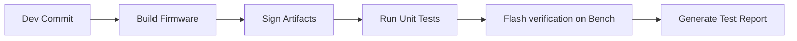

# OTA Testing Strategy

OTA is a safety-critical function. A bad update can brick thousands of vehicles instantly. Therefore, testing follows the strict **Automotive V-Model**.

## The Testing Pyramid

### 1. Software-in-the-Loop (SIL) / Unit Tests

**Scope:** The OTA Agent code running on a Linux PC or Docker container.

- **Checks:** Logic verification (e.g., manifest parsing, dependency resolution, signature verification).
- **Tools:** `gtest` (C++), `pytest` (Python).
- **Mocking:** Cloud interfaces and Hardware abstraction.

### 2. Hardware-in-the-Loop (HIL)

**Scope:** Real TCU and Real Gateway on a test bench ("Yellowboard").

- **Checks:** Flash drivers, UDS protocol timing, Sleep/Wake behavior, Voltage drops during flashing.
- **Tools:** Vector CANoe, dSPACE, VT System.
- **Simulation:** Use VT System to cut power (BAT+) mid-update to verify rollback.

### 3. System Integration / Lab Car

**Scope:** Complete vehicle electronics on a rack.

- **Checks:** Interaction between 30+ ECUs. Does flashing the Engine ECU trigger a fault in the Transmission ECU?
- **Focus:** Bus load, Network Management (NM), quiescent current.

### 4. Field Testing (Beta Fleet)

**Scope:** Real vehicles on the road.

- **Checks:** Cellular coverage issues, roaming, real-world user interaction (HMI).
- **Risk:** High. Only deployed to employee lease vehicles first.

## Flashing Validation Plan

Every ECU update must pass these standard tests:

| ID | Test Name | Description | P/F Criteria |
| :--- | :--- | :--- | :--- |
| **TEST-01** | **Happy Path** | Standard update from v1.0 to v1.1. | Update success, Version = v1.1. |
| **TEST-02** | **Power Loss (Erase)** | Cut VBAT during "Erase Memory". | ECU stays in Bootloader. Recoverable. |
| **TEST-03** | **Power Loss (Write)** | Cut VBAT during "Data Transfer". | ECU stays in Bootloader. Recoverable. |
| **TEST-04** | **Corrupt Binary** | Modify 1 bit of the payload. | Signature check fails. Update rejected. |
| **TEST-05** | **Downgrade Attack** | Try to install v0.9 over v1.0. | Rejected (Anti-Rollback check). |
| **TEST-06** | **Preconditions** | Try to flash while Engine RPM > 0. | Rejected (NRC 0x22). |

## Automated Regression Pipeline

We use **Jenkins** or **GitLab CI** to orchestrate the test bench.

