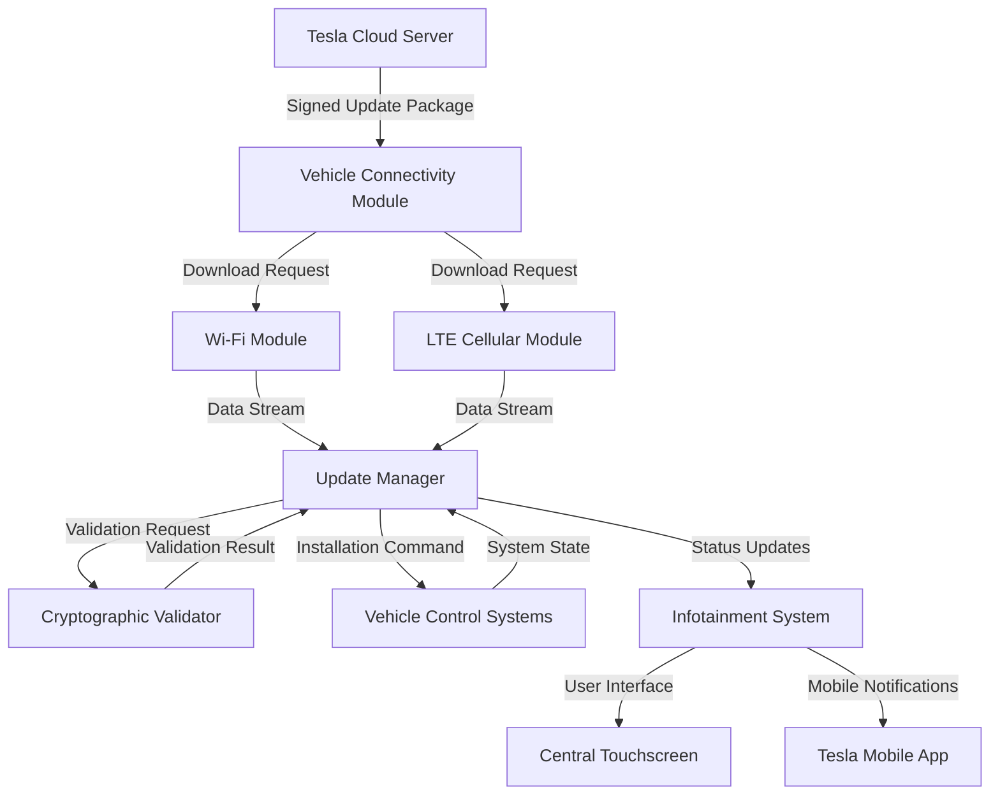
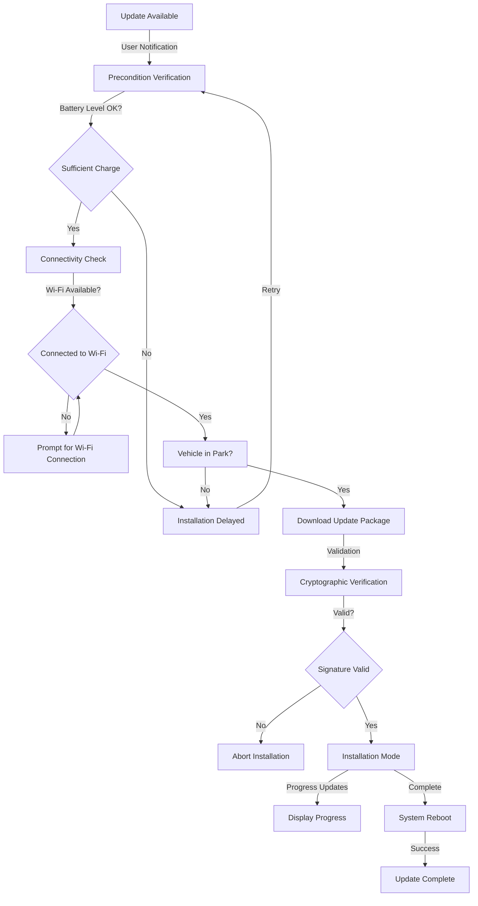
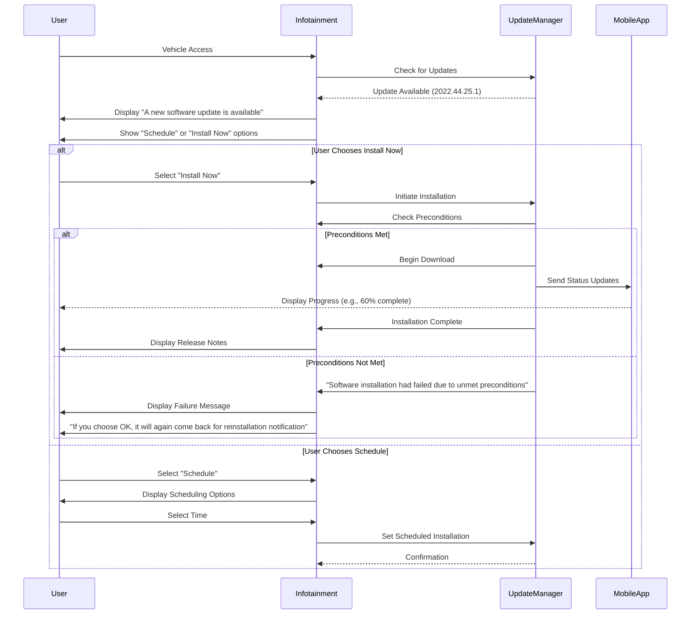
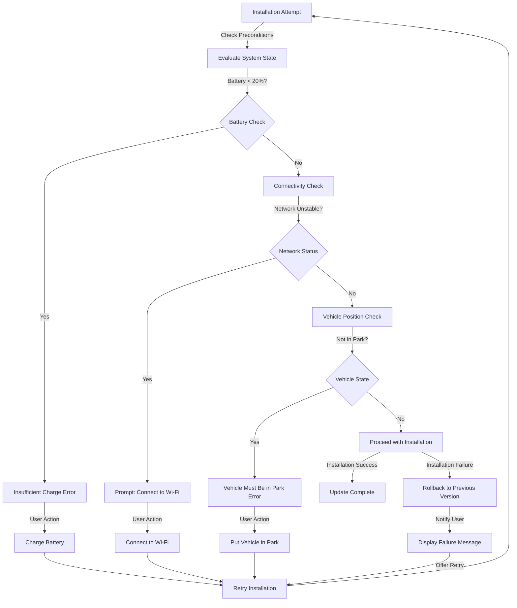

# Tesla Over-The-Air Update System

## Introduction

Tesla has established itself as a pioneer in automotive Over-The-Air (OTA) update technology, enabling vehicles to receive continuous software enhancements, new features, and performance improvements remotely. This documentation provides a comprehensive technical analysis of Tesla's OTA update system, detailing the architecture, workflow, security mechanisms, and user interaction patterns based on the provided technical transcripts and system behavior descriptions.

## System Architecture Overview

The Tesla OTA update system operates through a sophisticated multi-layered architecture that integrates vehicle connectivity, validation frameworks, and user interface components. The system leverages dual connectivity options through built-in Wi-Fi and cellular LTE modules, ensuring flexible update delivery regardless of vehicle location. The infotainment system serves as the primary user interface, displaying real-time update status, version information, and release notes while coordinating with the vehicle's core control systems for update execution.

## Update Workflow Process

The Tesla OTA update process follows a structured workflow that ensures reliable delivery and installation of software updates. The process begins when the vehicle detects an available update from Tesla's cloud servers. The system then initiates a series of pre-installation checks to verify that all necessary conditions are met for a successful update. These preconditions include verifying adequate battery charge levels, ensuring stable network connectivity, and confirming that the vehicle is in Park. The update manager coordinates these checks and proceeds only when all requirements are satisfied.

## User Interaction Flow

The user interaction sequence for Tesla OTA updates demonstrates a user-centric approach that provides flexibility and control throughout the update process. The system initiates contact with users through multiple channels, including the vehicle's central touchscreen and the Tesla mobile application. When an update becomes available, users receive a notification indicating the presence of new software version 2022.44.25.1 or similar version identifiers. The infotainment system presents users with clear options to either install the update immediately or schedule it for a more convenient time, such as overnight hours.

## Technical Implementation Details

The technical implementation of Tesla's OTA system incorporates several sophisticated mechanisms to ensure reliable and secure update delivery. The system employs a modular design architecture where individual features such as Apple Music integration, interior camera access, dark mode enhancements, Zoom meetings, and AR cards manager are packaged as discrete modules. This modular approach enables selective installation and updating of specific components without requiring full system updates. The update manager maintains detailed version tracking and dependency resolution to ensure module compatibility.

The validation process represents a critical component of the technical implementation. Tesla employs cryptographic signing for all update packages, with the vehicle performing signature verification before installation. This security measure prevents unauthorized software installation and ensures update integrity. The system implements comprehensive integrity checks for downloaded packages, with the ability to detect and handle corrupted downloads through automatic retry mechanisms.

## Security and Validation Framework

Tesla's OTA security framework operates on a multi-layered validation approach that protects against unauthorized modifications and ensures system integrity. All update packages are cryptographically signed using Tesla's private keys, with the corresponding public keys embedded in the vehicle's secure storage. During the update process, the vehicle verifies the digital signature of each package before proceeding with installation. This verification process occurs within a secure execution environment that is isolated from the main vehicle systems to prevent potential tampering.

The validation framework includes additional security measures such as secure boot processes, rollback protection, and secure key storage. The system maintains a record of installed versions and prevents installation of older software versions that might reintroduce previously addressed vulnerabilities. In the rare event of a failed installation or detected corruption, the system can revert to a known good state through an automated rollback mechanism that preserves vehicle functionality.

## Feature Management and Delivery

Tesla frequently releases themed updates that bundle multiple features into comprehensive packages. The Holiday Updates exemplify this approach, delivering collections of enhancements that may include Apple Music integration, interior camera access from the mobile app, dark mode visual improvements, Zoom meeting capabilities, and new AR cards manager functionality for supported vehicle variants. Each feature within these packages undergoes individual testing and validation before being bundled into the larger update package.

The modular architecture enables Tesla to deliver features efficiently while maintaining system stability. Features are developed and tested independently, allowing for faster iteration and deployment of new capabilities. The update system manages dependencies between modules, ensuring that all required components are present and compatible before installation. This approach also facilitates targeted updates for specific vehicle models or configurations, allowing Tesla to optimize the update experience for different hardware variants.

## Failure Handling and Recovery Mechanisms

The Tesla OTA system incorporates comprehensive failure handling and recovery mechanisms to ensure reliable update delivery. When preconditions are not met, such as insufficient battery charge or unstable connectivity, the system gracefully aborts the installation and provides clear guidance to users. The failure handling process includes detailed error reporting that helps users understand the specific conditions that prevented successful installation.

The recovery process includes automatic retry mechanisms that attempt installation once the identified issues are resolved. Users receive clear notifications about failure reasons and specific actions needed to resolve the problems. The system maintains detailed logs of installation attempts and failures, which can be used for diagnostic purposes and to improve future update reliability. In cases where repeated failures occur, the system may escalate the issue to Tesla support services while maintaining vehicle functionality through the previously installed software version.

## Practical Implementation Considerations

The successful execution of Tesla OTA updates requires attention to several practical considerations that optimize the update experience. Battery level management represents a critical factor, with Tesla recommending maintaining charge levels above twenty to thirty percent to prevent mid-update failures. Network stability significantly impacts download speeds and reliability, with Wi-Fi connections providing superior performance compared to cellular LTE connections for large update packages.

Scheduling strategies play an important role in minimizing disruption to vehicle usage. Tesla provides flexible scheduling options that allow users to plan updates during periods of low vehicle utilization, typically during overnight hours. This approach prevents interference with daily transportation needs while ensuring the vehicle remains available when required. The system provides estimated installation times to help users plan accordingly, with actual duration varying based on update size and vehicle configuration.

The retry mechanism offers robustness in handling transient failures. When updates fail due to unmet conditions, the system provides specific guidance for resolution and enables users to manually trigger reinstallation once the issues are addressed. This user-controlled retry process ensures that users maintain agency over the update timeline while benefiting from automated assistance in resolving common issues.

## Conclusion

Tesla's OTA update system represents a comprehensive and sophisticated approach to vehicle software management that combines technical robustness with user-centric design. The system's architecture leverages dual connectivity options, modular feature delivery, and comprehensive security measures to ensure reliable and secure update delivery. The user interaction framework provides flexibility and control while maintaining clear communication throughout the update process. Through continuous refinement based on collected telemetry data and user feedback, Tesla has established an OTA ecosystem that continually enhances vehicle capabilities long after the initial purchase, delivering ongoing value to owners while maintaining the highest standards of safety and reliability.
