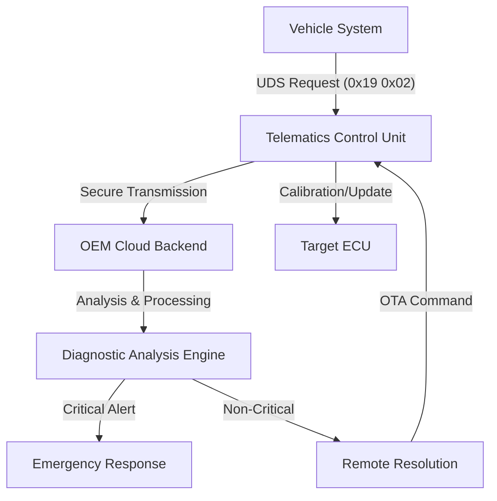
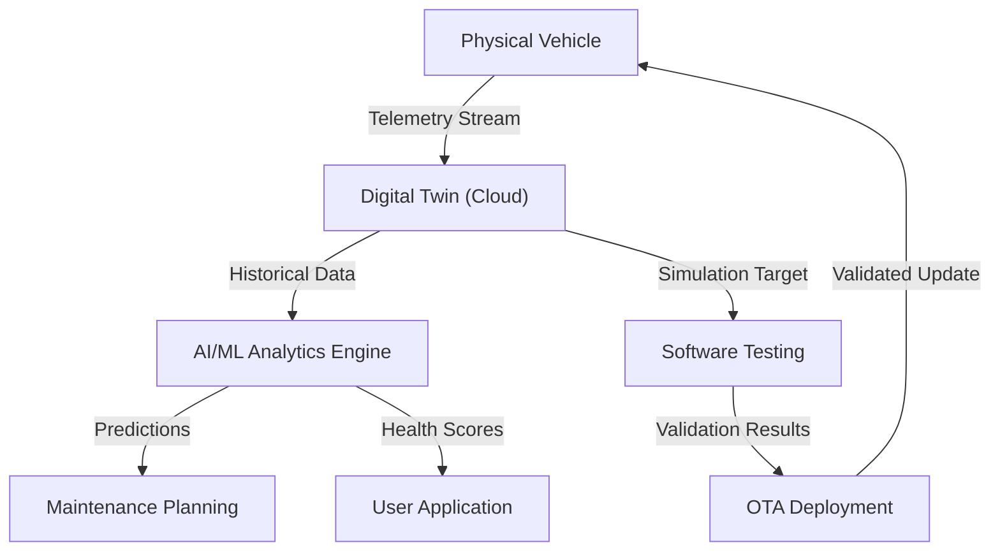
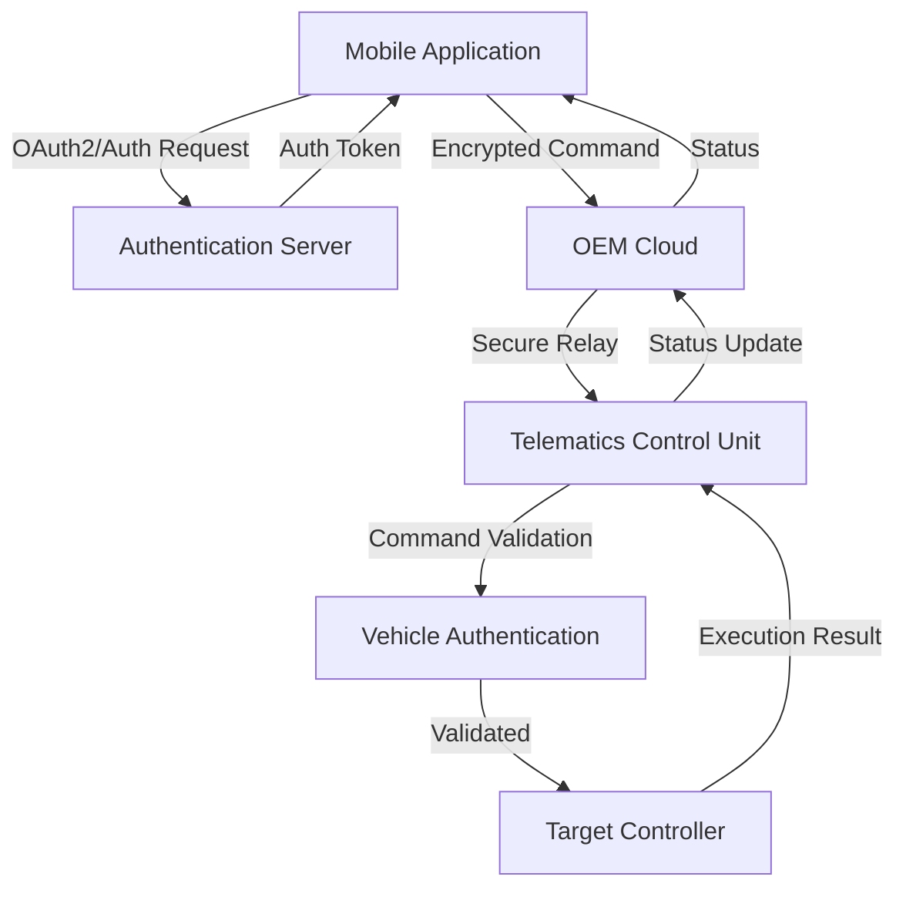

# Over-The-Air Vehicle Systems: Architecture and Implementation

## Introduction

Modern automotive Over-The-Air (OTA) systems have transformed vehicle maintenance and user interaction from a reactive, dealership-dependent model to a proactive, cloud-integrated ecosystem. This documentation explores the technical architecture and implementation of three core OTA capabilities: Remote Diagnostics, Predictive Maintenance through Digital Twins, and Remote Commands. Each system leverages cloud connectivity, vehicle telemetry, and secure communication channels to enable unprecedented levels of vehicle management and user convenience.

## Remote Diagnostics System

The Remote Diagnostics system, often referred to as the "Tele-Doctor" capability, represents a fundamental shift in how vehicle issues are detected and resolved. When a vehicle's onboard systems detect a potential fault, instead of simply illuminating a warning light and waiting for manual intervention, the system automatically initiates a comprehensive diagnostic workflow.

### Diagnostic Workflow Architecture

The process begins when the vehicle's onboard diagnostics system detects an anomaly or a Diagnostic Trouble Code (DTC) is triggered. The Telematics Control Unit (TCU) immediately captures a comprehensive snapshot of the vehicle's state, including critical parameters such as vehicle speed, engine RPM, coolant temperature, and system voltage. This "freeze frame" data provides context for the fault condition, enabling remote analysis without requiring the vehicle to remain in the fault state.

The captured diagnostic packet is transmitted to the OEM cloud infrastructure using secure protocols such as MQTT or HTTPS. The choice of protocol depends on the data size and transmission requirements, with MQTT being preferred for its lightweight nature and efficient handling of intermittent connectivity. The backend systems receive this data and perform automated analysis of the DTC and associated telemetry.

The analysis phase involves correlating the received data with known fault patterns, vehicle-specific parameters, and historical data. Based on this analysis, the system determines the severity and appropriate response. For critical issues that pose immediate safety risks, the system can dispatch emergency services or towing assistance automatically. For non-critical issues, such as sensor drift or calibration requirements, the system can often resolve the problem remotely by initiating OTA calibration procedures.

### Implementation Architecture

The technical implementation relies on the TCU serving as a transparent gateway between the vehicle's internal networks and the cloud infrastructure. The OEM diagnostic tester, operating in the cloud, periodically sends Unified Diagnostic Services (UDS) requests to the vehicle. These requests follow standard automotive diagnostic protocols, with ReadDTC requests using the specific service identifier `0x19 0x02` to retrieve diagnostic information from various Electronic Control Units (ECUs) within the vehicle.

## Predictive Maintenance and Digital Twin Technology

Predictive maintenance represents the evolution from reactive fault handling to proactive failure prevention. By leveraging artificial intelligence and machine learning algorithms, the system can identify patterns that precede actual failures, enabling maintenance to be scheduled before problems occur.

### Digital Twin Architecture

The foundation of predictive maintenance is the "Digital Twin" concept, where each physical vehicle has a corresponding virtual representation in the cloud. This digital twin is continuously updated with real-time telemetry data from the physical vehicle, creating a synchronized virtual model that accurately reflects the current state of all vehicle systems and components.

The digital twin serves multiple purposes in the OTA ecosystem. It provides a sandbox environment for testing software updates and configuration changes before deployment to physical vehicles. OEMs can run simulations on the digital twin to evaluate the impact of new software versions on vehicle performance, efficiency, and reliability. This capability significantly reduces the risk associated with OTA updates by enabling thorough virtual testing.

### Predictive Analytics Implementation

The predictive maintenance system analyzes long-term trends and patterns in vehicle telemetry to identify early warning signs of component degradation. For battery health monitoring, the system analyzes charging curves over extended periods, tracking parameters such as charging rate, voltage profiles, and temperature variations. By comparing these patterns against degradation models, the system can predict battery failure weeks before it becomes critical, allowing for proactive replacement or maintenance scheduling.

Similarly, for mechanical components like the starter motor, the system analyzes electrical signatures during operation. The voltage drop profile during engine cranking provides insights into the condition of the starter motor brushes and electrical connections. Changes in this profile over time can indicate wear patterns that precede actual failure, enabling predictive maintenance interventions.

## Remote Command System

The remote command capability enables users to interact with their vehicles through mobile applications, providing convenience and enhanced user experience. This system encompasses a range of functions from basic vehicle access control to advanced features like remote preconditioning and vehicle summoning.

### Command Architecture and Flow

The remote command system follows a client-server architecture where the mobile application serves as the user interface, the OEM cloud handles authentication and command routing, and the vehicle receives and executes commands through the TCU. Common commands include door lock/unlock operations, climate control preconditioning, and advanced features like remote valet or summon capabilities.

When a user initiates a command through the mobile application, the request is first authenticated using OAuth2/OpenID Connect protocols. This authentication process ensures that only authorized users can send commands to their vehicles. The authenticated command is then routed through the OEM cloud to the target vehicle's TCU, which forwards the command to the appropriate vehicle controller for execution.

### Security Implementation

Security is paramount in the remote command system, as it represents the highest risk vector in the OTA ecosystem. The implementation requires end-to-end encryption of all command communications, ensuring that commands cannot be intercepted or modified during transmission. The authentication process must be verified by the vehicle itself, not just the cloud infrastructure, preventing man-in-the-middle attacks and unauthorized command execution.

The security model implements multiple layers of protection. User authentication is handled through standard OAuth2/OpenID Connect flows, providing secure token-based authentication. Command messages are encrypted using strong cryptographic algorithms, and each command includes cryptographic signatures that the vehicle can verify to ensure command authenticity. The vehicle maintains its own authentication state and validates all incoming commands against this state before execution.

## System Integration and Data Flow

The three OTA capabilities—Remote Diagnostics, Predictive Maintenance, and Remote Commands—operate within an integrated ecosystem that shares common infrastructure and components. The TCU serves as the central communication hub, managing all data flows between the vehicle and cloud infrastructure. This integration enables synergistic capabilities, such as using diagnostic data to improve predictive maintenance models or leveraging remote command capabilities to initiate diagnostic procedures.

Data flows through the system following established protocols and security patterns. Telemetry data for predictive maintenance and diagnostic snapshots use efficient transmission protocols optimized for the vehicle's connectivity conditions. Remote commands, given their security requirements, use encrypted channels with additional authentication layers. The cloud infrastructure processes these different data types through specialized microservices, each optimized for its specific function while maintaining data consistency and security across the entire system.

The integration of these capabilities creates a comprehensive vehicle management platform that transforms the relationship between vehicle owners, manufacturers, and service providers. By enabling proactive maintenance, remote problem resolution, and enhanced user interaction, OTA systems represent a fundamental advancement in automotive technology and service delivery.