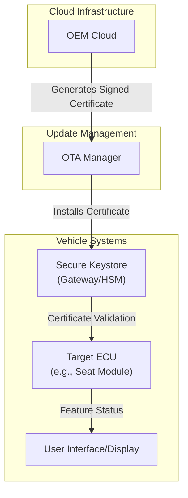
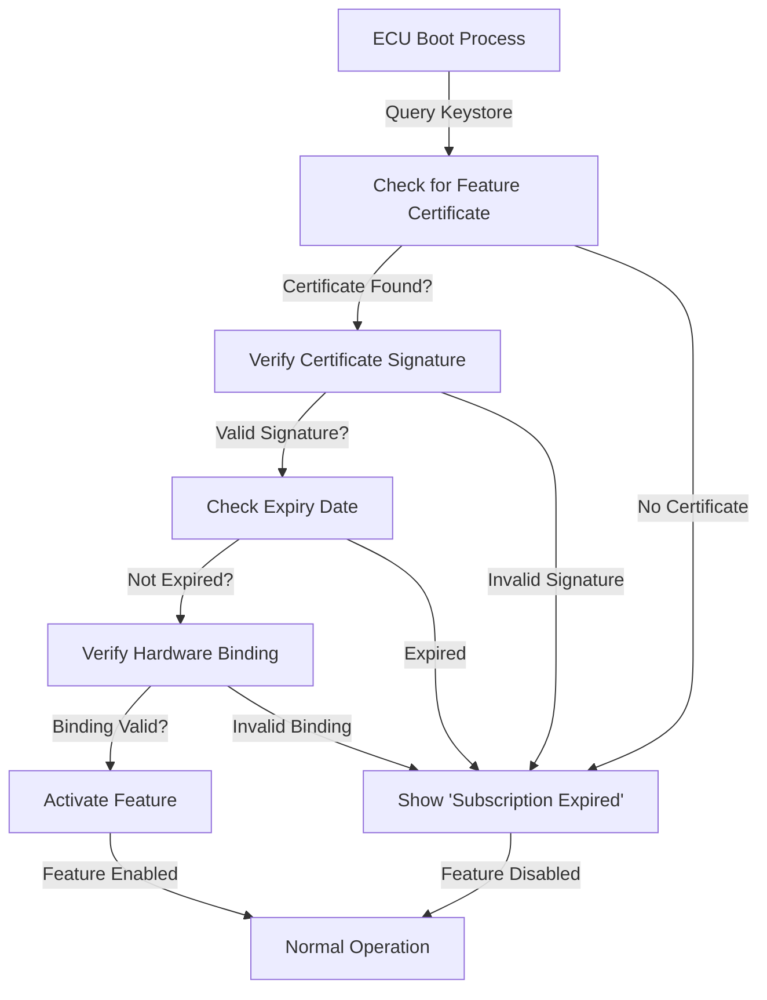

# Features on Demand (FoD)

## Introduction

The automotive industry is undergoing a fundamental transformation from a traditional hardware-sales model to a Software-as-a-Service (SaaS) paradigm. This shift enables manufacturers to ship vehicles with dormant hardware capabilities that can be activated and managed through Over-The-Air (OTA) updates. This documentation provides an in-depth technical analysis of the Features on Demand (FoD) system, its architecture, implementation, and security framework.

## Business Model Evolution

The transition to a SaaS model in automotive introduces new revenue streams and customer engagement patterns. Manufacturers can now offer flexible purchasing options that align with modern consumer expectations. The primary business models include trial periods, subscription services, and micro-transactions. In the trial model, customers receive temporary access to premium features such as Full Self Driving or Premium Sound systems, typically for a one-month duration. The subscription model provides ongoing access to services like Live Traffic updates or connectivity features for a recurring monthly fee. Micro-transactions enable temporary feature activation for specific use cases, such as a Weekend Power Boost for track day events.

Several manufacturers have already implemented these models successfully. Tesla offers an Acceleration Boost feature that unlocks additional current from the vehicle's inverter, enhancing performance capabilities. BMW has introduced subscription-based heated seat functionality, allowing customers to activate this comfort feature on-demand. Polestar provides a Performance Upgrade option that increases the vehicle's kilowatt output through software activation.

## Technical Architecture

The FoD system architecture consists of several interconnected components that work together to enable secure feature activation and management. The system relies on a secure keystore infrastructure, typically implemented within the vehicle's Gateway module or Hardware Security Module (HSM). This secure storage serves as the foundation for entitlement management and certificate validation.

The OEM Cloud infrastructure is responsible for generating and signing feature certificates that contain specific entitlement information. These certificates include details such as the FeatureID (e.g., HEATED_SEATS), expiration dates, and usage constraints. The OTA Manager serves as the intermediary between cloud services and vehicle systems, handling the secure installation of certificates into the vehicle's keystore.

## Entitlement Management System

The entitlement management process forms the core of the FoD system, ensuring that only authorized features can be activated on specific vehicles. The process begins when the OEM Cloud generates a digitally signed feature certificate containing the entitlement details. This certificate is then transmitted to the vehicle through secure OTA channels and installed by the OTA Manager into the secure keystore.

The certificate structure contains critical information for feature validation, including the specific feature identifier, validity period, and vehicle-specific binding parameters. The secure keystore maintains a repository of all active certificates for the vehicle, providing a centralized point of authority for feature entitlement verification. Each certificate is cryptographically signed using the OEM's private key, ensuring authenticity and preventing unauthorized modifications.

## Feature Activation Process

The feature activation mechanism operates through a systematic validation process that occurs during ECU initialization. When a target ECU boots, it initiates a certificate verification sequence to determine its feature entitlement status. The ECU queries the secure keystore for relevant certificates and performs cryptographic validation to ensure the certificate's authenticity and validity.

The validation process includes multiple security checkpoints. The ECU first verifies the cryptographic signature of the certificate using the OEM's public key, ensuring that the certificate was issued by a trusted authority. Subsequently, the ECU checks the certificate's expiration date to confirm that the entitlement is still valid. Finally, the system verifies the hardware binding parameters to ensure the certificate is authorized for the specific vehicle and ECU combination.

If all validation checks pass, the ECU proceeds to activate the corresponding feature functionality. For example, a seat module would enable heating capabilities when a valid HEATED_SEATS certificate is present. If any validation step fails, the ECU denies feature activation and typically displays an appropriate message to the user, such as indicating that the subscription has expired.

## Security Framework

The security of the FoD system is paramount, as it directly impacts revenue protection and system integrity. The framework implements multiple layers of security to prevent unauthorized feature activation and certificate manipulation. The foundation of this security model is the Root of Trust established through the OEM's Certificate Authority (CA) hierarchy.

All feature certificates must be signed by the OEM Root CA, creating a chain of trust that can be verified by vehicle ECUs. This cryptographic signing prevents attackers from creating fraudulent certificates or modifying existing ones. The system employs hardware binding mechanisms that associate each certificate with specific vehicle identifiers, including the Vehicle Identification Number (VIN) and target ECU serial numbers. This binding prevents certificate copying between vehicles, as a certificate issued for one vehicle will fail validation on another due to mismatched hardware identifiers.

The secure keystore implementation provides tamper-resistant storage for certificates and cryptographic keys. Typically implemented within a Hardware Security Module or trusted gateway component, the keystore protects against physical and software-based attacks. The OTA communication channels utilize end-to-end encryption to protect certificate transmission from interception or modification during the update process.

## Software-Defined Vehicle Paradigm

The Features on Demand system represents a fundamental shift in vehicle architecture and lifecycle management, embodying the Software-Defined Vehicle (SDV) concept. This paradigm separates the hardware and software lifecycles, enabling independent evolution and optimization cycles. Hardware components follow traditional automotive development cycles of five to seven years, while software features can be updated on weekly or monthly schedules.

This decoupling creates significant advantages for both manufacturers and customers. Vehicles can continuously improve their functionality and performance over time through software updates, similar to smartphone evolution patterns. This ongoing enhancement capability increases vehicle residual value and strengthens customer loyalty through regular feature additions and improvements. The SDV approach also enables manufacturers to respond quickly to market demands and customer feedback, deploying new features and optimizations without requiring hardware changes.

The technical implementation of SDV through FoD systems requires robust infrastructure for continuous integration and deployment of vehicle software. This includes automated testing pipelines, secure update distribution mechanisms, and comprehensive rollback capabilities to ensure update reliability. The system must maintain strict separation between safety-critical and non-critical features, applying appropriate validation and certification processes based on the criticality level of each component.

## Conclusion

The Features on Demand system represents a transformative approach to automotive product and service delivery. By implementing secure entitlement management, robust feature activation processes, and comprehensive security frameworks, manufacturers can successfully transition to SaaS business models while maintaining system integrity and customer trust. The Software-Defined Vehicle paradigm enabled by FoD technology creates new opportunities for continuous innovation and customer value enhancement throughout the vehicle lifecycle.
