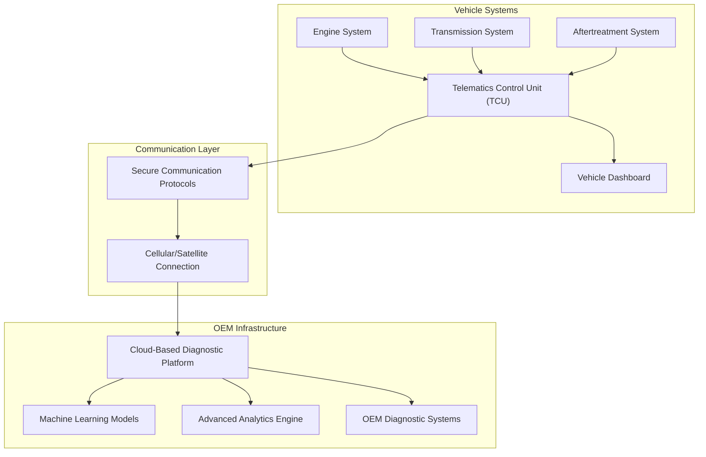
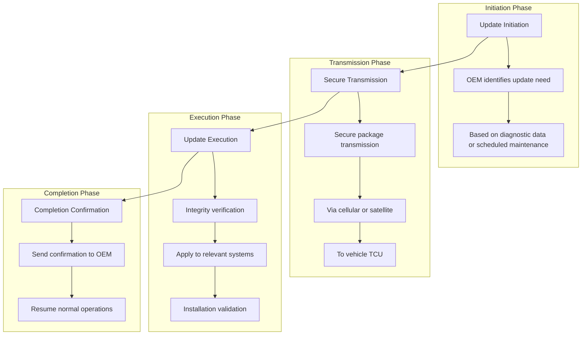

# Remote Diagnostics

## Introduction

Remote diagnostics represents a transformative approach to vehicle maintenance and management, leveraging over-the-air (OTA) technologies to enable comprehensive monitoring, analysis, and resolution of vehicle issues without requiring physical intervention. This technology paradigm significantly enhances vehicle uptime, optimizes maintenance scheduling, and improves the overall user experience by minimizing service-related disruptions and operational downtime.

## System Architecture

The remote diagnostics ecosystem is built upon a robust OTA infrastructure that establishes seamless communication pathways between the vehicle and the OEM's diagnostic systems. This architecture integrates multiple critical components working in concert to deliver continuous monitoring and remote intervention capabilities.

## Core Components and Responsibilities

### Telematics Control Unit (TCU)

The TCU serves as the primary communication hub within the vehicle's architecture, functioning as the central interface between various vehicle subsystems and external OEM systems. This component is responsible for collecting telemetry data from critical vehicle systems including the engine, transmission, and aftertreatment components. The TCU manages bidirectional communication, ensuring that diagnostic data is transmitted to OEM platforms while simultaneously receiving and executing remote commands and update packages.

### Secure Communication Protocols

The communication layer employs robust security measures to ensure data integrity and confidentiality during transmission between the vehicle and OEM servers. These protocols implement advanced encryption mechanisms and multi-factor authentication processes to protect sensitive vehicle data and prevent unauthorized access. The secure channels facilitate both continuous telemetry streaming and discrete update package transmission, maintaining constant connectivity while adhering to stringent security standards.

### Cloud-Based Diagnostic Platforms

OEM cloud platforms host sophisticated analytics engines and machine learning models that process incoming telemetry data in real-time. These platforms perform complex data analysis, identify patterns and anomalies, and generate predictive insights regarding potential vehicle failures. The cloud infrastructure enables scalable processing of vast amounts of vehicle data from multiple sources, providing OEMs with comprehensive visibility into their fleet's operational status and health metrics.

## Flashing Mechanism

The OTA flashing mechanism enables remote updating of vehicle firmware and software through a structured four-phase process that ensures reliability and security throughout the update lifecycle.

### Phase 1: Initiation

The flashing process begins when the OEM identifies the necessity for a software or firmware update. This determination can be triggered by various factors, including diagnostic data indicating system vulnerabilities, performance optimization opportunities, or scheduled maintenance protocols. The OEM's diagnostic systems analyze vehicle telemetry and historical data to assess update requirements and prioritize updates based on criticality and impact.

### Phase 2: Transmission

Once an update is initiated, the update package is securely transmitted to the target vehicle's TCU through established communication channels. The transmission utilizes cellular or satellite connectivity to ensure reliable delivery regardless of vehicle location. The update package is encrypted and digitally signed to maintain security and integrity during transit, with the TCU verifying the authenticity of the source before accepting the transmission.

### Phase 3: Execution

Upon successful receipt, the TCU performs comprehensive integrity verification of the update package, ensuring that the software has not been corrupted or tampered with during transmission. The TCU then applies the update to the relevant vehicle systems, following manufacturer-specified procedures to maintain system stability. Throughout the installation process, the TCU monitors system responses and performs validation checks to ensure successful implementation.

### Phase 4: Completion

Following successful installation, the TCU transmits a completion confirmation to the OEM's systems, providing detailed status information about the update process. The vehicle then resumes normal operations with the updated software, with all systems restored to full functionality. This confirmation mechanism ensures traceability and enables OEMs to maintain accurate records of vehicle software versions and update histories.

## Remote Diagnostics Features

### Failure Prediction

The remote diagnostics system employs advanced machine learning algorithms to analyze both historical and real-time vehicle data, enabling the prediction of potential failures before they manifest as critical issues. These algorithms identify subtle patterns and anomalies in vehicle performance metrics that may indicate impending component failures. By processing vast datasets including engine parameters, transmission behavior, and aftertreatment system performance, the system can forecast maintenance needs with remarkable accuracy, enabling proactive intervention that prevents unexpected downtime and reduces maintenance costs.

### Error Analysis and Rectification

When the system detects an error or anomaly, it initiates a comprehensive analysis process to determine the root cause of the issue. OEM-specific diagnostic modules interpret error codes and correlate them with vehicle telemetry data to provide precise insights into system malfunctions. The analysis considers multiple data points including sensor readings, system performance history, and environmental conditions to build a complete picture of the issue. In many scenarios, the remote diagnostics system can rectify issues without physical intervention by adjusting system parameters, recalibrating components, or initiating corrective procedures that restore normal operation.

### User Interface and Alert Management

The vehicle's dashboard serves as the primary interface for communicating diagnostic information to users, displaying relevant error messages and warnings when issues are detected. However, the system employs intelligent filtering to ensure that users are not overwhelmed by frequent non-critical alerts. Users can activate remote diagnostics directly from the dashboard interface, which triggers a comprehensive remote assessment by the OEM's diagnostic systems. This user-controlled approach ensures that drivers remain informed about critical issues while maintaining focus on driving operations, with the option to request detailed analysis when needed.

## Technical Implementation

### Continuous Monitoring Systems

The foundation of effective remote diagnostics lies in the implementation of 24/7 monitoring systems that maintain constant surveillance of critical vehicle components. These systems continuously collect and analyze data from the engine, transmission, and aftertreatment systems, establishing baseline performance metrics and detecting deviations from normal operation patterns. The monitoring infrastructure employs sophisticated sensor networks and data acquisition systems that capture high-frequency telemetry data, enabling the detection of subtle changes that may indicate emerging issues.

### Machine Learning Integration

Machine learning models form the analytical core of the remote diagnostics system, processing enormous volumes of telemetry data to identify trends and predict potential failures. These models are trained on extensive historical datasets encompassing millions of vehicle operating hours, enabling them to recognize complex patterns that may escape traditional rule-based systems. The machine learning algorithms continuously improve their accuracy through feedback loops, learning from confirmed failures and successful interventions to refine their predictive capabilities over time.

### Data Communication Architecture

The data communication infrastructure employs a multi-layered security approach to protect sensitive vehicle information during transmission. All communication channels utilize end-to-end encryption protocols, ensuring that telemetry data and remote commands remain confidential and protected from interception. Authentication mechanisms verify the identity of both vehicle and OEM systems before establishing communication sessions, preventing unauthorized access to vehicle systems. The communication architecture supports both continuous telemetry streaming for real-time monitoring and discrete data packet transmission for specific diagnostic requests and updates.

## Security Framework

The remote diagnostics system implements a comprehensive security framework designed to protect against cyber threats and ensure the integrity of vehicle systems. This framework encompasses multiple security layers including network security, application security, and physical security measures. The system employs public key infrastructure (PKI) for digital signatures and certificate management, ensuring that all software updates and remote commands originate from authenticated sources. Regular security audits and penetration testing help identify and address potential vulnerabilities, maintaining the system's resilience against evolving cyber threats.

## Performance Benefits

### Diagnostic Efficiency

Remote diagnostics technology delivers substantial improvements in diagnostic efficiency, reducing average diagnostic times by up to 70% compared to traditional manual processes. This efficiency gain stems from immediate access to comprehensive vehicle data and advanced analytical tools that enable rapid issue identification. The reduction in diagnostic time directly translates to decreased vehicle downtime and improved service throughput, benefiting both OEMs and vehicle operators through enhanced operational efficiency.

### Repair Optimization

The implementation of remote diagnostics has demonstrated a 22% reduction in average repair times, achieved through improved diagnostic accuracy and better preparation for service interventions. By providing detailed information about vehicle issues before service initiation, the system enables service centers to prepare appropriate parts and resources in advance, minimizing the time required for actual repair procedures. This optimization of the repair process contributes significantly to improved vehicle uptime and reduced maintenance costs.

### User Experience Enhancement

Vehicle users experience substantial benefits through the convenience of remote diagnostics, which eliminates the need for physical service station visits for many common issues. The system provides real-time insights into vehicle health status, enabling users to make informed decisions about maintenance scheduling and operational planning. This transparency and convenience reduce the stress and disruption typically associated with vehicle maintenance, contributing to higher user satisfaction and improved brand loyalty.

### Operational Uptime Improvement

For commercial vehicle applications, particularly in the trucking industry, operational uptime represents a critical success factor. Remote diagnostics technology helps maximize vehicle availability by preventing unexpected breakdowns through predictive maintenance capabilities and enabling rapid resolution of issues when they do occur. The system's ability to identify and address problems before they cause operational failures ensures that vehicles remain in service for longer periods, supporting supply chain efficiency and reducing the total cost of ownership.

## Case Study: Volvo Trucks Implementation

### System Integration

Volvo Trucks has successfully integrated comprehensive remote diagnostics capabilities into their vehicle management systems, demonstrating the practical application of this technology in commercial vehicle operations. The implementation focuses on continuous monitoring of critical systems including engine performance, I-shift transmission, and aftertreatment components. The system combines deep engineering expertise with advanced machine learning algorithms to analyze vehicle data in real-time, identifying potential service issues before they escalate into significant problems that could affect vehicle operation.

### Performance Metrics

The Volvo Trucks remote diagnostics implementation has delivered measurable improvements in maintenance efficiency and vehicle uptime. Average diagnostic times have been reduced by 70%, enabling faster identification of issues and more rapid initiation of appropriate service procedures. Additionally, average repair times have decreased by 22%, reflecting the benefits of improved diagnostic accuracy and better service preparation. These performance improvements directly contribute to enhanced vehicle availability and reduced operational costs for fleet operators.

### Service Delivery Model

Volvo's remote diagnostics system enhances the user experience through a comprehensive service delivery model that provides detailed analyses for repair planning and enables immediate service communication. Users receive streamlined service procedures and actionable instructions from Volvo's uptime experts at Volvo Action Service, who are available around the clock to provide support and guidance. This service model empowers users to make informed decisions about whether immediate service is necessary or if they can continue their journey without interruption, optimizing both safety and operational efficiency.

## Conclusion

Remote diagnostics technology, powered by advanced OTA infrastructure and machine learning capabilities, represents a fundamental shift in vehicle maintenance and management paradigms. The integration of continuous monitoring, predictive maintenance, and remote error rectification capabilities significantly enhances vehicle uptime, operational efficiency, and user satisfaction. The successful implementation by industry leaders such as Volvo Trucks demonstrates the transformative potential of this technology in the automotive landscape, establishing new standards for vehicle service and support that prioritize proactive maintenance and minimal operational disruption. As the technology continues to evolve, remote diagnostics will play an increasingly central role in shaping the future of vehicle ownership and fleet management, delivering tangible benefits to OEMs, service providers, and end users alike.
