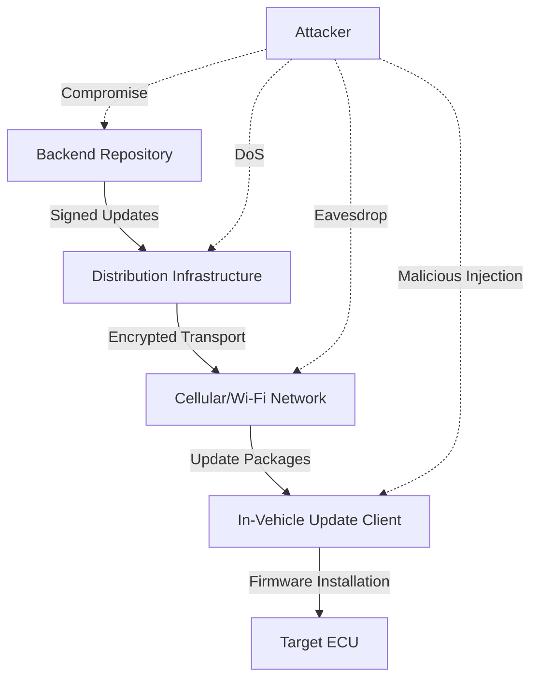
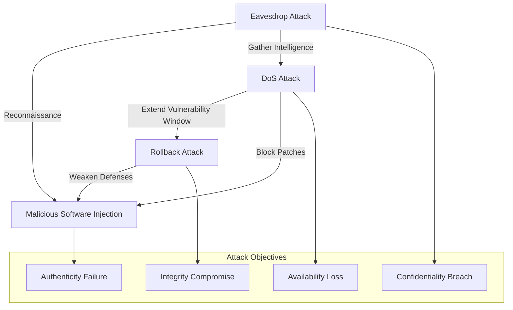

# OTA Security and Attack Analysis in Automotive Systems

## Introduction to OTA Security in Modern Vehicles

Automotive software complexity has experienced significant growth characterized by an increasing number of Electronic Control Units (ECUs), expanding codebases, enhanced connectivity features, and more sophisticated backend services. Over-the-Air (OTA) updates have emerged as a primary mechanism for deploying security patches and new features to vehicles. However, this connectivity introduces a substantial distributed attack surface encompassing backend repositories, distribution infrastructure, cellular and Wi-Fi communication links, and in-vehicle update clients. The security of the update process is explicitly recognized as security-critical by regulatory bodies and industry guidance frameworks.

The UNECE WP.29 threat and mitigation documentation specifically addresses threats such as compromise of OTA update procedures including fabricated firmware, and denial-of-service attacks against update servers or networks. This regulatory framework mandates the implementation of secure software update procedures and robust cryptographic key protection mechanisms. The automotive industry has widely adopted the Uptane security model as a practical framework for OTA security, which documents attacker capabilities including traffic interception and modification, repository compromise, and ECU compromise. Uptane enumerates update-related threats across categories including reading updates, denying installation, replaying old bundles, and other attack vectors.

## OTA System Architecture and Attack Surface

The automotive OTA ecosystem comprises multiple interconnected components that collectively form the update delivery pipeline. This architecture creates numerous potential attack points that malicious actors can exploit. The system begins with backend repositories where firmware images and metadata are stored, followed by distribution infrastructure that manages the secure delivery of updates to vehicles. The communication layer typically utilizes cellular or Wi-Fi networks to transport update packages to in-vehicle components, where update clients receive and process the incoming data before ultimately installing firmware on target ECUs.

## Core Attack Classes in OTA Systems

### Eavesdrop Attacks: Confidentiality Breaches

Eavesdrop attacks represent a fundamental threat to OTA update confidentiality, where attackers passively intercept and read OTA traffic to extract sensitive or proprietary information from update packages or their associated metadata. The Uptane framework explicitly defines an eavesdrop attack as one where an attacker reads sensitive or confidential information from an update that was intended to be encrypted for a specific ECU. The primary assets at risk during eavesdrop attacks include proprietary firmware logic and intellectual property, embedded secrets that may be accidentally present in firmware images, and update structure information that could assist attackers in crafting subsequent attacks. These attacks are particularly concerning because they can provide attackers with detailed knowledge of system internals, firmware architecture, and potential vulnerabilities that can be exploited in later active attacks.

### Denial of Service Attacks: Availability Disruption

Denial of Service (DoS) attacks against OTA update systems aim to prevent the installation of updates or make the update process impractically slow, thereby leaving vehicles unpatched and potentially unsafe. The Uptane framework documents multiple deny installation strategies including blocking network traffic, slowing update retrieval, replaying old update bundles, blocking selected updates, and conducting direct DoS attacks against update infrastructure. Similarly, UNECE WP.29 material includes denial of service attacks against update servers or networks as explicit update-process threats. The consequences of successful DoS attacks include delayed security patches that extend vulnerability windows, fleet fragmentation where some vehicles receive updates while others remain stuck on old versions, and operational disruption if updates are mandatory for critical vehicle functions or features.

### Rollback Attacks: Integrity and Safety Regression

Rollback attacks target the integrity of software versioning by forcing ECUs to install older, vulnerable firmware versions, thereby re-enabling known exploits that were addressed in subsequent releases. Firmware rollback protection is a fundamental requirement in secure update systems, as without it, attackers can reintroduce old vulnerabilities by systematically downgrading vehicle software. This attack vector is particularly dangerous because it can re-expose vehicles to previously fixed Common Vulnerabilities and Exposures (CVEs), introduce safety or functionality regressions if older logic returns to operation, and effectively bypass security posture improvements that were implemented in newer firmware releases. Rollback attacks often exploit weaknesses in version enforcement mechanisms, inadequate key management practices, or insufficient validation of update sequence integrity.

### Malicious Software Injection: Authenticity Failure

Malicious software injection attacks represent one of the most severe OTA threats, where attackers deliver and install attacker-controlled firmware by compromising repositories, stealing credentials or cryptographic keys, or manipulating the update transport process. Automotive OTA threat discussions consistently include malicious update injection scenarios where attackers compromise servers or intercept communications to distribute malware, along with update tampering techniques that modify legitimate updates in transit. The UNECE WP.29 framework addresses these threats through its focus on fabricated firmware and compromised OTA update procedures, emphasizing the need for secure update procedures and robust cryptographic key protection. The potential impact of successful malicious injection attacks includes remote code execution inside vehicle ECUs, establishment of persistence mechanisms for long-term access, and lateral movement across in-vehicle networks to compromise additional systems.

## Attack Chain Relationships and Interdependencies

The four core OTA attack classes are not isolated threats but rather interconnected components of a broader attack methodology. Eavesdropping attacks often serve as reconnaissance activities that reveal update structure and operational details, making subsequent active attacks more feasible and effective. The Uptane framework explicitly separates read update threats from deny installation threats, indicating that attackers may employ different techniques and have distinct goals for each attack type. Denial of service attacks extend the time window during which known vulnerabilities remain exploitable by blocking the delivery of security patches, effectively maintaining attack opportunities for longer periods.

Rollback and malicious injection attacks both target the integrity and authenticity of the update process, often exploiting similar weaknesses such as inadequate version enforcement, poor key management practices, or repository compromise. These attacks can be combined in sophisticated attack chains where eavesdropping provides the intelligence needed for targeted malicious injection, while DoS attacks prevent legitimate updates from removing the malicious firmware. The interconnected nature of these threats underscores the importance of comprehensive security controls that address all attack vectors rather than focusing on isolated threats.

## Security Framework Alignment and Control Implementation

A comprehensive approach to OTA security requires alignment with established frameworks and regulatory requirements while implementing controls that address the full spectrum of identified threats. The progression from threat identification to control implementation typically follows a structured methodology that begins with understanding the attack landscape, defining security objectives, and implementing corresponding controls. The primary security objectives for OTA systems include confidentiality to protect sensitive update content, integrity to ensure updates remain unmodified, authenticity to verify update sources, availability to ensure reliable update delivery, and non-repudiation or auditability to maintain traceability of update operations.

Security controls must be mapped directly to these objectives, with encryption and secure transport mechanisms addressing confidentiality requirements, digital signatures and cryptographic hashes ensuring integrity and authenticity, anti-rollback policies maintaining integrity over time, and resilience controls combined with infrastructure hardening ensuring availability. The Uptane framework provides particularly valuable guidance as it offers a concrete threat model with enumerated attacks that align closely with real-world OTA security challenges. Similarly, UNECE R155/R156 requirements for update-process mitigations provide regulatory direction that helps ensure compliance while improving security posture. The integration of these frameworks with practical security controls creates a defense-in-depth approach that can effectively protect against the diverse and evolving threats facing automotive OTA systems.