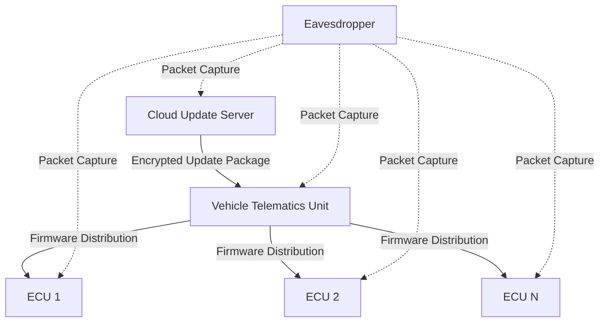

# OTA Security: Eavesdrop Attack

## Introduction

The eavesdrop attack represents a significant security concern in Over-The-Air (OTA) update systems, functioning as a passive network attack where adversaries intercept and monitor data transmission between the OTA update server and target vehicle ECUs. This attack methodology parallels traditional network eavesdropping or packet sniffing, wherein unauthorized parties "listen" to network traffic without consent. The fundamental characteristic of this attack is its passive nature; the adversary captures and examines data without modifying the transmission flow, making detection particularly challenging.

In OTA ecosystems, the communication pathway typically extends from backend cloud servers to vehicle telematics units, which subsequently distribute firmware updates to various Electronic Control Units. The wireless nature of these communications, often utilizing cellular or Wi-Fi networks, creates an inherently observable medium where attackers positioned within radio range or network paths can capture packets without disrupting the OTA service.

## Attack Mechanism

The eavesdrop attack exploits vulnerabilities in the communication medium through which OTA updates are transmitted. Attackers can gain access through unsecured radio links, improperly configured network interfaces, or compromised infrastructure components. Once positioned appropriately, the adversary can passively capture firmware packets as they traverse from the cloud to the vehicle, maintaining complete stealth while gathering valuable intelligence about the OTA update process.

The attack's effectiveness stems from its non-intrusive nature. Unlike active attacks that modify or disrupt communications, eavesdropping preserves the normal operation of the OTA system, allowing the attacker to remain undetected while accumulating data over extended periods. This passive approach enables comprehensive reconnaissance of the OTA ecosystem, providing foundational knowledge for potential future active attacks.

## OTA Communication Architecture

The OTA update system architecture establishes a hierarchical communication flow that begins with cloud-based update servers and terminates at individual vehicle ECUs. The telematics control unit serves as an intermediary, receiving updates from the cloud and managing distribution to downstream components. This architecture creates multiple potential interception points for eavesdrop attacks.

The communication medium's wireless characteristics introduce inherent vulnerabilities, as radio transmissions propagate through open space where unauthorized receivers can capture signals without physical access to network infrastructure. The broadcast nature of wireless communications means that any entity within range equipped with appropriate receiving capabilities can intercept OTA update packets.

## Information Disclosure

Through eavesdropping activities, attackers can extract substantial information about the OTA update ecosystem. The intercepted data reveals the structure and composition of update packages, including both firmware code and associated metadata. This information encompasses proprietary algorithms, configuration parameters, and system-specific implementations that manufacturers typically consider confidential.

Beyond package contents, eavesdropping exposes the underlying update mechanisms, including timing patterns, protocol implementations, and authentication procedures. Attackers can analyze communication patterns to understand update scheduling, retry mechanisms, and error handling procedures. This comprehensive view of the OTA process enables attackers to identify potential weaknesses or vulnerabilities that could be exploited in subsequent active attacks.

The captured information serves multiple purposes for attackers. It provides reconnaissance for designing replay attacks, where previously captured legitimate updates are retransmitted to manipulate system behavior. It also facilitates spoofing attacks, where attackers impersonate legitimate update sources, and injection attacks, where malicious code is introduced into the update stream. The intelligence gathered through eavesdropping essentially creates a roadmap for planning and executing more sophisticated attacks.

## Risk Assessment

The primary risk associated with eavesdrop attacks stems from the information they reveal rather than immediate system compromise. While the attack itself does not modify OTA processes or directly impact vehicle functionality, it establishes a foundation for future exploit attempts. The passive nature of eavesdropping makes it particularly dangerous, as it can continue undetected for extended periods, allowing attackers to accumulate comprehensive knowledge of the OTA system.

The confidentiality of OTA communications becomes paramount in mitigating eavesdrop risks. Systems employing weak encryption or transmitting sensitive data in plaintext become especially vulnerable to information disclosure. The attack's effectiveness correlates directly with the security measures implemented in the communication channel, with unencrypted or poorly protected transmissions offering attackers complete access to update contents and system behaviors.

The reconnaissance value of eavesdropped data cannot be overstated. Attackers gain insights into system architectures, update frequencies, and security implementations that inform the development of targeted exploits. This intelligence gathering phase often precedes active attacks, making eavesdropping a critical component in sophisticated attack chains against OTA systems.

## Attack Classification

Eavesdrop attacks fall within the standard classification of network attacks targeting information confidentiality. The attack methodology aligns with traditional network eavesdropping techniques, adapted for the specific context of OTA update systems. The passive nature of the attack distinguishes it from active interference methods, as it focuses solely on information capture without transmission modification.

In the broader context of network security, eavesdropping represents a fundamental threat to any system transmitting sensitive data over vulnerable channels. The OTA domain's reliance on wireless communications amplifies this threat, as the broadcast medium inherently exposes transmissions to unauthorized monitoring. The attack's classification as a passive reconnaissance technique underscores its role as an intelligence-gathering operation rather than a direct system compromise.

The attack's positioning within the network attack taxonomy highlights its focus on confidentiality violations rather than integrity or availability breaches. This distinction is crucial for understanding the attack's immediate impact and its role in potential multi-stage attack scenarios. While not directly harmful to system operation, the information disclosed through eavesdropping creates opportunities for subsequent attacks targeting system integrity and availability.
