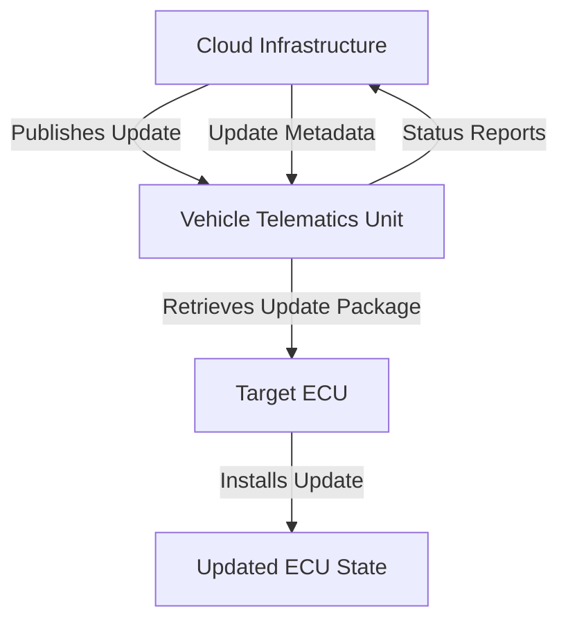
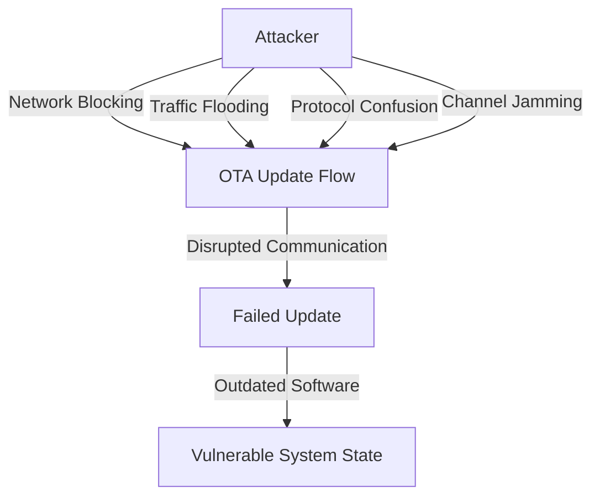

# OTA Security: Denial of Service Attack Analysis

## Introduction

The Denial of Service (DoS) attack in Over-The-Air (OTA) update systems represents a critical threat to vehicle software maintenance and security. Unlike attacks that attempt to read or modify update packets, DoS attacks specifically target the availability of the update mechanism by preventing ECUs from receiving or installing legitimate software updates. This comprehensive analysis examines the technical mechanisms, attack vectors, and operational impacts of DoS attacks within automotive OTA systems.

## OTA Update Architecture and Normal Operation

The OTA update ecosystem follows a structured architectural pattern where cloud infrastructure serves as the authoritative source for software updates. The vehicle's telematics unit or OTA client establishes communication with the cloud server to retrieve update packages, which are then installed on the target Electronic Control Units (ECUs). This process relies on continuous network connectivity and proper protocol handling to ensure successful update delivery and installation.

The normal update flow involves several critical phases including update discovery, authentication, download, verification, and installation. Each phase requires successful completion before proceeding to the next, creating multiple potential points of failure that can be exploited by DoS attacks.

## DoS Attack Mechanisms in OTA Context

A DoS attack disrupts the OTA update flow by interfering with network communication at various stages. The attack prevents update traffic from reaching the vehicle, causes connection failures or timeouts, results in partial or slow retrieval that prevents timely updates, or triggers protocol errors that force repeated retries. These disruptions can be achieved through multiple technical approaches including packet dropping, network flooding, wireless channel jamming, or injection of conflicting packets that confuse protocol state.

The attack does not require modification of the update payload itself but rather focuses on preventing the normal transfer and installation processes. By targeting the availability aspect of the CIA triad (Confidentiality, Integrity, Availability), DoS attacks effectively maintain the system in a vulnerable state by preventing security patches and critical updates from being applied.

## Attack Vectors and Implementation Techniques

DoS attacks in OTA systems employ several distinct vectors that target different aspects of the update process. Network blocking or filtering represents the most straightforward approach, where attackers suppress legitimate update traffic at network boundaries using firewalls, intrusion prevention systems, or network access control mechanisms. This vector effectively creates a black hole for update traffic, preventing any communication between the vehicle and update servers.

Traffic congestion and flooding attacks overwhelm communication channels by generating excessive traffic that saturates available bandwidth. These attacks can be launched from compromised botnets or through amplification techniques that multiply the attack traffic volume. The resulting congestion prevents timely delivery of update packages, causing timeouts and failed update attempts.

Protocol confusion attacks exploit the stateful nature of OTA communication protocols by injecting malformed or spoofed packets that disrupt session management. These attacks can force the OTA client into error states, trigger unnecessary retransmissions, or cause the update process to restart repeatedly. By manipulating protocol state machines, attackers can effectively prevent successful update completion without necessarily blocking all network traffic.

Freeze and slow retrieval attacks represent a more subtle DoS approach where attackers deliberately delay or throttle update traffic. By slowing the delivery of update packets below the threshold required for successful installation within timeout windows, these attacks can cause updates to fail even when network connectivity appears functional. This vector is particularly insidious as it may evade detection by simple connectivity tests while still preventing successful updates.

## Operational Impact and Consequences

The consequences of successful DoS attacks against OTA systems extend far beyond the immediate failure to install updates. Over time, the inability to apply security patches leaves systems vulnerable to known exploits that may have been addressed in newer software versions. This prolonged vulnerability exposure increases the attack surface and provides a B

[TRUNCATED]