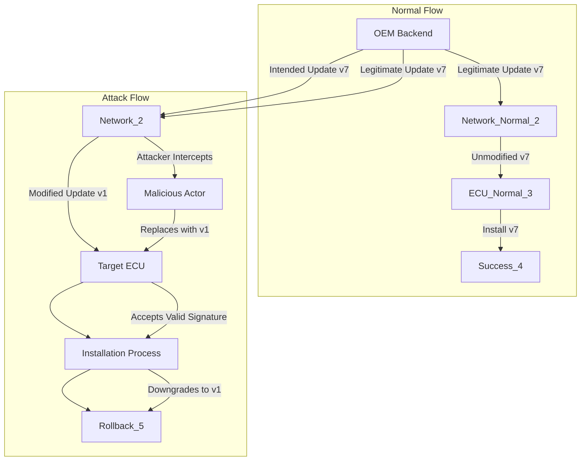
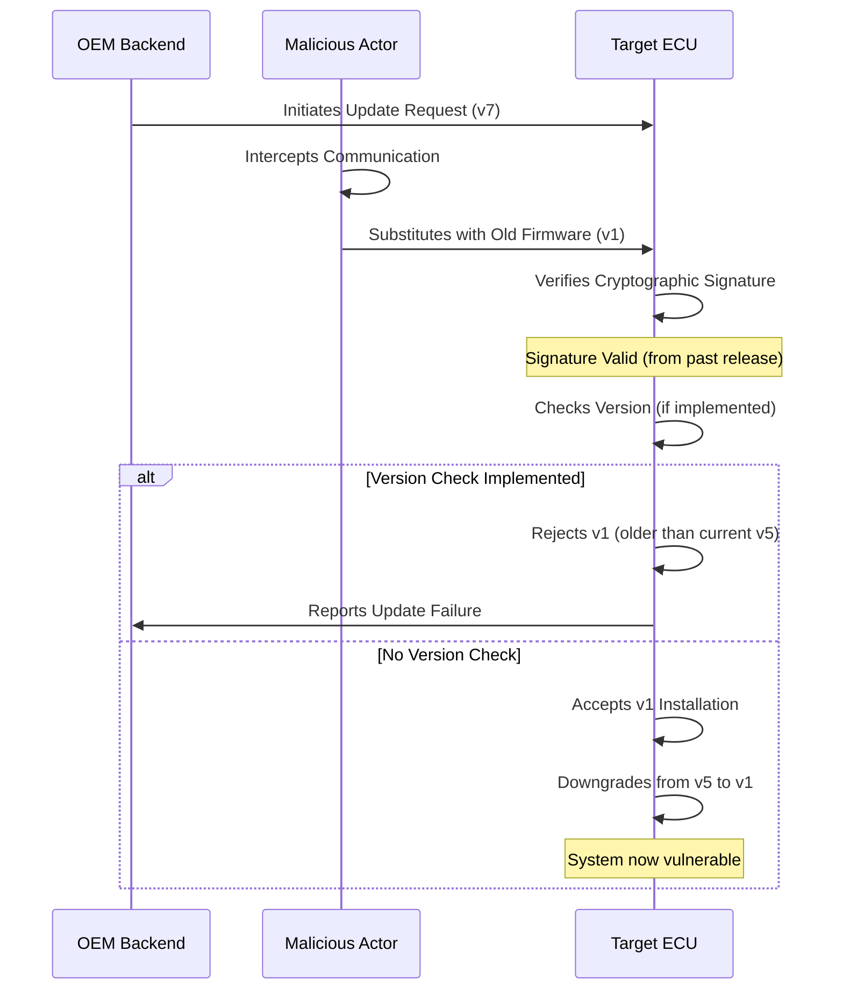

# OTA Security Analysis: Rollback Attack

## Introduction to Rollback Attacks in OTA Systems

Rollback attacks represent a sophisticated form of downgrade manipulation specifically targeting Over-The-Air update mechanisms in modern vehicle systems. Unlike conventional denial-of-service attacks that merely prevent update delivery, rollback attacks actively subvert the update process by replacing intended firmware versions with older, vulnerable iterations. This attack vector fundamentally compromises the integrity of version progression, which serves as a cornerstone of secure OTA deployment strategies. The attack exploits the temporal dimension of software security, where newer versions typically contain critical security patches and vulnerability remediations that older versions lack.

## Technical Architecture and Attack Mechanism

The rollback attack operates by intercepting or manipulating the OTA communication channel between the OEM backend infrastructure and the target Electronic Control Unit. In a standard OTA deployment scenario, an ECU running firmware version 5 would receive and install version 7, which contains essential security enhancements. During a rollback attack, however, the malicious actor substitutes this legitimate update with version 1, an antiquated firmware build with known security deficiencies. The technical sophistication of this attack lies in its ability to present a cryptographically valid but outdated firmware image, thereby bypassing integrity verification mechanisms that may not incorporate explicit version validation.

The attack sequence typically begins with the attacker gaining access to the OTA communication pathway, either through network interception, compromised update servers, or manipulation of the update package distribution system. Once positioned to influence the update flow, the attacker substitutes the intended firmware package with an older, previously released version. This older version maintains valid cryptographic signatures because it was legitimately released by the OEM in the past, thus passing standard integrity checks that only verify signature authenticity without considering version progression requirements.

## Security Impact and Vulnerability Exposure

The consequences of a successful rollback attack extend far beyond mere version regression. When an ECU is downgraded from version 5 to version 1, it effectively reverses the security evolution that occurred across intermediate versions. This regression reintroduces vulnerabilities that were previously addressed and patched, creating an attack surface that was considered mitigated. The security impact manifests through multiple vectors: previously patched authentication bypasses may become exploitable again, encryption implementations may revert to weaker algorithms, and protocol-level vulnerabilities may resurface.

The attack's danger is amplified by its stealthy nature. Unlike denial-of-service attacks that are immediately apparent through service disruption, rollback attacks may go undetected as the device continues to function with what appears to be legitimate, albeit outdated, firmware. This subtlety allows attackers to maintain persistent access to vulnerable systems while security teams remain unaware of the regression. The cumulative effect can be devastating, as attackers may chain multiple vulnerabilities across the downgraded firmware to achieve complete system compromise.

## Attack Flow Analysis and System Interactions

The rollback attack exploits a critical gap in OTA security frameworks: the separation between cryptographic integrity verification and version progression enforcement. Many OTA implementations correctly verify firmware signatures to ensure authenticity but fail to implement robust version validation mechanisms. This architectural weakness allows attackers to replay old, legitimately signed firmware packages without triggering security alerts.

## Comparative Analysis with Attack Vectors

Rollback attacks occupy a distinct position in the taxonomy of OTA security threats, differing fundamentally from denial-of-service attacks in both methodology and objectives. While DoS attacks prevent updates by blocking communication or disrupting service availability, rollback attacks permit the update process to proceed but subvert its content. This distinction is crucial because rollback attacks maintain the appearance of normal operation while actively compromising security, whereas DoS attacks are typically more conspicuous through their disruptive nature.

The sophistication of rollback attacks also distinguishes them from simple replay attacks. While replay attacks involve retransmitting previously captured messages, rollback attacks specifically target version progression and require understanding of the OTA update mechanism and version history. This knowledge requirement makes rollback attacks more targeted and potentially more damaging, as they can be tailored to exploit specific known vulnerabilities present in older firmware versions.

## Security Framework Implications and Mitigation Requirements

Industry best practices and secure OTA frameworks explicitly identify rollback attacks as a critical threat vector requiring dedicated countermeasures. The fundamental mitigation strategy involves implementing strict version progression enforcement within the OTA client architecture. This requires the ECU to maintain awareness of its current firmware version and to reject any update package that does not represent a forward progression in version numbering.

Effective rollback protection necessitates a multi-layered security approach. The first layer involves cryptographic verification to ensure firmware authenticity, while the second layer implements version validation to prevent regression. Additional layers may include monotonic counters, secure element storage of version history, and communication with backend systems to verify update legitimacy. These controls must be implemented with careful consideration of potential edge cases, such as emergency rollback scenarios or legitimate reversion to previous firmware versions for compatibility reasons.

The persistence of rollback vulnerabilities in OTA systems highlights the importance of comprehensive security testing that specifically targets version progression mechanisms. Security assessments must include scenarios involving old firmware packages, version number manipulation, and attempts to bypass version checks through various attack vectors. This focused testing approach helps ensure that OTA systems can maintain their security posture throughout their operational lifecycle and resist attempts to undermine their security evolution through version regression attacks.
