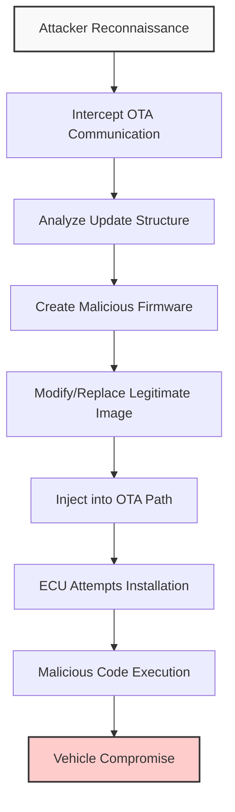

# OTA Security Attack: Injection of Malicious Software

## Overview

An injection attack in the context of Over-The-Air (OTA) updates represents an active, integrity-breaking attack where an adversary attempts to replace a legitimate firmware update with malicious software. Unlike passive attacks such as eavesdropping or denial of service, this attack seeks to insert unauthorized code into the OTA delivery path, causing the vehicle's ECU to install modified software that can provide unauthorized control or compromise functionality. This type of attack specifically targets the authenticity and integrity of the update process itself.

## Attack Methodology

The execution of an injection attack on OTA systems follows a systematic approach that begins with reconnaissance and culminates in the successful deployment of malicious firmware. The attacker first observes or intercepts OTA communication between the server and the target device. This reconnaissance phase can be accomplished through various means including network sniffing setups, compromised network infrastructure, or establishing a man-in-the-middle position. During this phase, passive observation provides the attacker with critical information about the structure and content of update packets, which serves as the foundation for subsequent attack stages.

Following the reconnaissance phase, the attacker proceeds to modify or replace the legitimate firmware image with a malicious version. This modification process involves embedding unauthorized functionality, backdoors, or control logic into the firmware. For instance, the attacker might incorporate code that misreports system status, disables safety mechanisms, or grants remote control privileges to unauthorized entities. The creation of such malicious firmware requires understanding of the target system's firmware structure and update mechanisms.

The final stage involves injecting the manipulated firmware into the OTA delivery path, ensuring that the target ECU attempts to install this malicious version instead of the legitimate one. If successful, the vehicle will execute unauthorized code that can compromise safety, privacy, or control. The impact can affect various vehicle modules including engine control units, braking systems, infotainment systems, or telematics units, depending on the specific target of the attack.

## Attack Severity and Impact

Injection attacks are considered among the most dangerous OTA threats due to their direct subversion of the update chain and their potential for severe consequences. A successful injection attack can result in remote code execution inside safety-critical ECUs, enabling unauthorized manipulation of vehicle behavior including engine operations, braking systems, and steering controls. The malicious firmware can maintain persistence across update cycles, making detection and remediation particularly challenging.

The impact extends beyond individual vehicle compromise, as malicious firmware can facilitate lateral movement into internal vehicle networks, potentially compromising multiple ECUs and systems. Perhaps most concerning is the ability of such attacks to bypass the integrity guarantees provided by the OEM's legitimate update process. Even a single successful malicious OTA update can circumvent internal safeguards and authenticate as though it were a genuine update, effectively undermining the entire security framework of the OTA system.

## Technical Challenges and Implementation Barriers

While creating and replicating firmware images presents technical complexity, well-resourced attackers with access to internal update formats, electrical interfaces, or cryptographic key materials can engineer malicious images that appear valid to the target ECU. Automotive firmware structures are often proprietary and complex, but once understood, they provide attackers with the necessary template to create plausible payloads that can pass validation checks.

Injecting malicious updates typically requires defeating multiple layers of security protections. These include secure transport channels such as TLS, cryptographic signatures on update packages, anti-rollback mechanisms and version enforcement systems, and robust key management implementations on both server and device sides. Without these protections, an attacker with network access or local physical access combined with network manipulation capabilities could forge update responses or insert tainted binaries into the update stream.

## Industry Context and Threat Framework Integration

Secure OTA threat frameworks, such as Uptane, explicitly include attacker capabilities like fabricating update artifacts or installing unauthorized software as primary threats. These frameworks operate under the assumption that attackers may control repositories or network paths, and therefore specify controls including signed metadata and multiple root signing keys to resist such injection attempts. The design of these frameworks reflects the industry's recognition of injection attacks as a critical threat vector that requires comprehensive mitigation strategies.

Automotive cybersecurity standards and regulations, including ISO/SAE 21434 and UNECE WP.29 requirements, treat unauthorized software injection as a key threat that must be mitigated through safeguards ensuring update authenticity and integrity. These standards mandate the implementation of robust security controls throughout the OTA update process, from creation and signing to delivery and installation, to prevent the successful injection of malicious software.

## Attack Lifecycle and System Behavior

The lifecycle of an OTA injection attack begins with the attacker establishing a position to observe or manipulate network traffic. This could involve compromising network infrastructure, exploiting vulnerabilities in network protocols, or leveraging physical access to network components. Once positioned, the attacker conducts passive observation to understand the OTA communication patterns, packet structures, and security mechanisms in place.

Following this reconnaissance phase, the attacker develops malicious firmware tailored to the target system. This development process may involve reverse engineering legitimate firmware, understanding the ECU's validation mechanisms, and creating code that can bypass security checks while achieving the attacker's objectives. The malicious firmware is then packaged to appear legitimate, potentially using stolen or forged cryptographic signatures.

The injection phase involves replacing the legitimate update with the malicious version at an appropriate point in the delivery path. This could occur through man-in-the-middle attacks, DNS spoofing, or compromise of update servers. The target ECU receives the malicious update and, if security controls are insufficient, validates and installs the compromised firmware. Once installed, the malicious code can execute its intended functions, which may range from data exfiltration to vehicle control manipulation.

## Mitigation Strategies and Security Controls

Effective protection against OTA injection attacks requires a multi-layered security approach that addresses each stage of the update process. Cryptographic protections must be enforced at every stage, beginning with the signing of update packages using strong asymmetric cryptography and extending to the verification of signatures on the target ECU. The implementation of secure boot chains and hardware security modules can provide additional protection against the execution of unauthorized code.

Network security measures including TLS encryption, certificate pinning, and mutual authentication can help prevent man-in-the-middle attacks and ensure the integrity of the communication channel. Version control and anti-rollback mechanisms prevent the installation of older, potentially vulnerable firmware versions. Comprehensive key management practices, including the use of Hardware Security Modules (HSMs) and secure key storage, protect against the compromise of cryptographic keys.

Regular security audits, penetration testing, and code reviews help identify and address vulnerabilities in the OTA update system before they can be exploited. The implementation of defense-in-depth strategies, where multiple independent security controls protect against injection attacks, provides resilience even if individual controls are compromised. Continuous monitoring and anomaly detection can help identify suspicious update activities and potential injection attempts in progress.