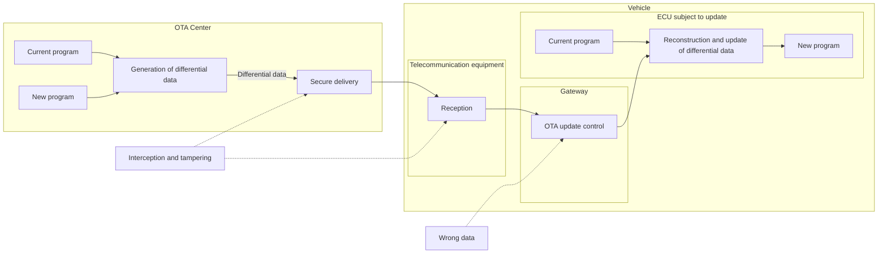

```mermaid
flowchart LR
    %% OTA Center
    subgraph OTA["OTA Center"]
        CP["Current program"]
        NP["New program"]

        GEN["Generation of differential data"]
        SEC["Secure delivery"]

        CP --> GEN
        NP --> GEN
        GEN -->|Differential data| SEC
    end

    %% Threats on transmission
    T1["Interception and tampering"]
    WD["Wrong data"]

    %% Vehicle side
    subgraph VEH["Vehicle"]
        subgraph TEL["Telecommunication equipment"]
            REC["Reception"]
        end

        subgraph GW["Gateway"]
            OTACTL["OTA update control"]
        end

        subgraph ECU["ECU subject to update"]
            CP2["Current program"]
            NP2["New program"]
            RECON["Reconstruction and update of differential data"]

            CP2 --> RECON
            RECON --> NP2
        end
    end

    %% Main data flow
    SEC --> REC
    REC --> OTACTL
    OTACTL --> RECON

    %% Threat paths
    T1 -.-> SEC
    T1 -.-> REC
    WD -.-> OTACTL

```